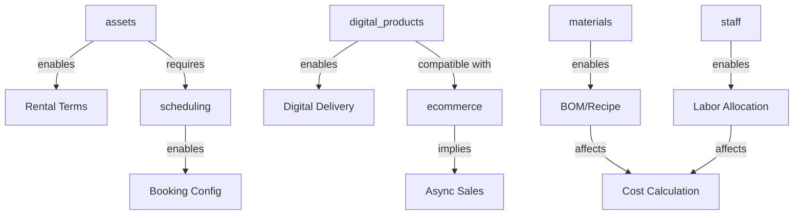

# Products Form UX Design - Living Document

**Status**: 🚧 IN PROGRESS - Design Phase
**Date**: 2025-01-08
**Purpose**: Definir la experiencia de usuario del formulario de productos considerando capabilities dinámicas, composabilidad, y casos edge complejos

---

## 🎯 OBJETIVO DEL DISEÑO

Crear un formulario de productos que:
- ✅ Se adapte dinámicamente a capabilities activas
- ✅ Soporte composabilidad y combinaciones de capabilities
- ✅ Mantenga coherencia lógica entre configuraciones
- ✅ Sea intuitivo para usuarios no técnicos
- ✅ Permita flexibilidad para casos edge complejos
- ✅ Evite inconsistencias y configuraciones inválidas

---

## 🧩 PRINCIPIO FUNDAMENTAL: COMPOSABILIDAD

### El Problema con Categorías Estáticas

❌ **MAL**: Categorías fijas como "Comida y Bebida", "Servicios"
- Viola abstracción
- No escala con nuevas capabilities
- Crea rigidez en el sistema
- No refleja la realidad de negocios híbridos

✅ **BIEN**: Sistema composable basado en **características** y **capabilities**
- Un producto es una **composición de características**
- Las características disponibles dependen de **capabilities activas**
- Las características interactúan entre sí creando **comportamientos emergentes**

### Definición: Product = Composition of Features

```typescript
// Un producto NO es una categoría fija
// Un producto ES una composición de características

Product {
  // Core attributes (siempre)
  name: string
  description: string
  price: decimal

  // Characteristics (composable)
  characteristics: {
    has_materials: boolean           // Capability: materials
    has_staff_requirements: boolean  // Capability: staff
    has_duration: boolean            // Implied by many
    requires_booking: boolean        // Capability: scheduling
    is_digital: boolean              // Capability: digital_products
    is_rental: boolean               // Capability: assets
    is_async_sellable: boolean       // Capability: ecommerce
    // ... más según capabilities
  }

  // Configuration (conditional on characteristics)
  config: ProductConfig
}
```

---

## 🗺️ MAPPING: CAPABILITIES → PRODUCT CHARACTERISTICS

### Tabla de Relaciones

| Capability | Product Characteristic(s) | UI Impact | Business Logic Impact |
|-----------|---------------------------|-----------|---------------------|
| **materials** | `has_materials` | Material selector, BOM, cost calculation | Stock validation, availability |
| **staff** | `has_staff_requirements` | Staff allocation section | Labor cost, availability |
| **scheduling** | `requires_booking` | Booking config section | Slot management, capacity |
| **assets** | `is_rental`, `requires_asset` | Asset selection, rental terms | Asset availability, condition tracking |
| **digital_products** | `is_digital` | Digital delivery config | File/access management |
| **ecommerce** | `is_async_sellable` | Async sales toggle | 24/7 availability, auto-fulfillment |
| **production** | `requires_production` | Production config | Kitchen display, queue |
| **memberships** | `is_recurring` | Membership terms | Billing cycles, access |

### Capability Dependencies



---

## 🤔 PREGUNTAS CRÍTICAS A RESPONDER

### 1. Interacción: Ecommerce (Async Store) × Product Types

**Pregunta**: ¿Qué pasa cuando `ecommerce` capability está activa?

#### Escenario A: Producto Digital (Curso grabado)
```typescript
{
  has_materials: false,
  is_digital: true,
  is_async_sellable: true  // ✅ Compatible
}
```
**Comportamiento**:
- ✅ Se puede vender 24/7 automáticamente
- ✅ Entrega instantánea tras pago
- ✅ No requiere intervención manual

#### Escenario B: Servicio con Booking (Corte de cabello)
```typescript
{
  requires_booking: true,
  has_staff_requirements: true,
  is_async_sellable: true  // ❓ ¿Qué significa esto?
}
```
**Pregunta**: ¿Qué sucede?
- **Opción A**: Cliente reserva turno automáticamente fuera de horario
  - ✅ Pro: Conveniencia 24/7
  - ❌ Contra: ¿Cómo valida disponibilidad sin staff activo?

- **Opción B**: Cliente agenda "intención de compra" para confirmar después
  - ✅ Pro: Evita conflictos de agenda
  - ❌ Contra: No es venta real, más complejidad

- **Opción C**: Solo bookeable durante horario de atención
  - ✅ Pro: Simple, sin edge cases
  - ❌ Contra: Limita conveniencia del ecommerce

**Decisión pendiente**: ¿Cuál opción implementamos?

#### Escenario C: Asset Rental (Alquiler de herramienta)
```typescript
{
  is_rental: true,
  requires_asset: true,
  is_async_sellable: true  // ❓ ¿Puede alquilarse fuera de horario?
}
```
**Pregunta**: ¿Validación de disponibilidad?
- ¿Cómo sabe el sistema si el asset está disponible a las 2am?
- ¿Quién entrega el asset si la tienda está cerrada?
- ¿Separamos "reserva async" de "retiro programado"?

#### Escenario D: Comida preparada (Hamburguesa)
```typescript
{
  has_materials: true,
  requires_production: true,
  has_staff_requirements: true,
  is_async_sellable: true  // ❓ Dark kitchen? Pedidos programados?
}
```
**Pregunta**: ¿Qué tipo de async sales?
- **Opción A**: Dark kitchen (producción on-demand, entrega 24/7)
  - Requiere: Staff disponible, materiales en stock
  - Implica: Sistema de turnos, delivery integration

- **Opción B**: Pre-orders (pedidos programados para recoger)
  - Cliente ordena ahora, recoge en horario de apertura
  - Más simple pero menos "async"

**Decisión pendiente**: ¿Tipos de async sales según producto?

---

### 2. Interacción: Assets × Otros Capabilities

**Pregunta**: ¿Cómo difiere un asset rental de otros productos?

#### Asset = Producto + Estado + Condición
```typescript
// Asset rental es fundamentalmente diferente
AssetProduct {
  // Hereda características de Product
  name: string
  price: decimal  // ← Precio por hora/día/semana

  // Asset-specific
  is_rental: true
  requires_asset: true
  asset_type: "equipment" | "space" | "vehicle"

  // Tracking adicional
  tracks_condition: boolean       // ¿Inspección pre/post?
  requires_deposit: boolean       // ¿Depósito de garantía?
  maintenance_schedule: Schedule  // Mantenimiento preventivo

  // Puede TAMBIÉN tener:
  has_materials: true  // ← Consumibles (ej: combustible)
  has_staff_requirements: true  // ← Operador requerido
}
```

#### Casos de Uso de Assets

**Caso 1: Alquiler de sala de conferencias**
```typescript
{
  is_rental: true,
  requires_booking: true,
  asset_type: "space",

  // Puede incluir:
  has_materials: true,  // ← Café, papelería
  has_staff_requirements: true,  // ← Personal de soporte

  // Pricing
  pricing_model: "hourly",
  min_rental_duration: 2,  // horas
  max_rental_duration: 8
}
```

**Caso 2: Alquiler de auto con chofer**
```typescript
{
  is_rental: true,
  requires_booking: true,
  asset_type: "vehicle",

  has_materials: true,  // ← Combustible
  has_staff_requirements: true,  // ← Chofer OBLIGATORIO
  staff_included_in_rental: true,  // ← Nuevo concepto

  tracks_condition: true,  // ← Inspección pre/post
  requires_deposit: true
}
```

**Caso 3: Herramienta de construcción (sin operador)**
```typescript
{
  is_rental: true,
  requires_booking: true,
  asset_type: "equipment",

  has_materials: false,  // ← No consumibles
  has_staff_requirements: false,  // ← Self-service

  tracks_condition: true,
  requires_deposit: true,
  requires_training_certification: true  // ← Safety
}
```

**Pregunta**: ¿Cómo el formulario adapta la UI para estos casos?

---

### 3. Interacción: Digital Products × Materials/Staff

**Pregunta**: ¿Un producto digital puede tener costos físicos?

#### Caso: Curso Online Grabado

**Escenario A: Solo digital (simple)**
```typescript
{
  is_digital: true,
  digital_delivery: {
    type: "course",
    platform: "Moodle",
    access_duration_days: 90
  },

  has_materials: false,
  has_staff_requirements: false,

  // Costos = Solo plataforma + hosting
  base_cost: 5.00  // USD/alumno
}
```

**Escenario B: Digital + Kit Físico (híbrido)**
```typescript
{
  is_digital: true,
  digital_delivery: {
    type: "course",
    platform: "Moodle",
    access_duration_days: 90
  },

  // ¡TAMBIÉN tiene componentes físicos!
  has_materials: true,
  components: [
    { item: "workbook_printed", quantity: 1 },
    { item: "certificate_frame", quantity: 1 }
  ],

  // ¿Y si se envía por correo?
  requires_shipping: true,

  // ¿Y si necesita soporte humano?
  has_staff_requirements: true,
  staff_allocation: [
    { role: "tutor", hours_per_student: 2 }
  ]
}
```

**Pregunta**: ¿El formulario muestra materials/staff para digitales?
- **Opción A**: Sí, siempre (máxima flexibilidad)
- **Opción B**: Solo si el usuario lo activa explícitamente
- **Opción C**: Sugerir basado en `digital_delivery.type`

**Decisión pendiente**: ¿Asumimos pureza o permitimos híbridos desde el inicio?

---

### 4. Casos Edge: Combinaciones Complejas

#### Caso: Webinar en Vivo + Grabación + Materiales

```typescript
{
  // Es digital
  is_digital: true,
  digital_delivery: {
    type: "event",  // ← Webinar en vivo
    platform: "Zoom",
    max_participants: 100,
    access_url: "zoom.us/xxx"
  },

  // Pero TAMBIÉN incluye:
  includes_recording: true,  // ← Post-event access
  recording_access_days: 30,

  // Y materiales físicos
  has_materials: true,
  components: [
    { item: "workbook", quantity: 1 },
    { item: "swag_kit", quantity: 1 }
  ],

  // Y requiere staff
  has_staff_requirements: true,
  staff_allocation: [
    { role: "instructor", duration: 120 },
    { role: "moderator", duration: 120 }
  ],

  // Y tiene booking constraints
  requires_booking: true,
  booking_window_days: 7,
  concurrent_capacity: 100,

  // Y puede venderse async
  is_async_sellable: true  // ← Hasta llenar capacidad
}
```

**Preguntas**:
1. ¿Cómo validar que todos los requirements se cumplen?
2. ¿Cómo calcular el costo total (digital + físico + labor)?
3. ¿Cómo manejar fulfillment (envío físico + acceso digital)?
4. ¿Qué pasa si materiales no llegan a tiempo pero webinar sí?

---

### 5. Validaciones Cruzadas Entre Capabilities

#### Regla 1: Booking × Staff
```typescript
// Si requires_booking = true Y has_staff_requirements = true
// → ENTONCES staff debe tener duration_minutes definido
{
  requires_booking: true,
  has_staff_requirements: true,
  staff_allocation: [
    { role: "chef", count: 1, duration_minutes: null }  // ❌ INVALID
  ]
}
```
**Validación**: `duration_minutes` obligatorio cuando ambos activos

#### Regla 2: Rental × Duration
```typescript
// Si is_rental = true
// → ENTONCES pricing_model debe ser temporal (hourly/daily/weekly)
{
  is_rental: true,
  pricing_model: "one_time"  // ❌ INVALID (debería ser "hourly")
}
```

#### Regla 3: Async Sales × Production
```typescript
// Si is_async_sellable = true Y requires_production = true
// → ENTONCES debe especificar production_capacity
{
  is_async_sellable: true,
  requires_production: true,
  production_capacity: null  // ❌ INVALID
}
```
**Razón**: Necesitamos saber cuántos podemos producir async

#### Regla 4: Digital × Materials (Shipping)
```typescript
// Si is_digital = true Y has_materials = true
// → ENTONCES debe especificar fulfillment_method
{
  is_digital: true,
  has_materials: true,
  fulfillment_method: null  // ❌ INVALID
}
```
**Opciones**:
- `"digital_only"`: No enviar físicos (¿por qué tiene materials entonces?)
- `"physical_only"`: Enviar solo físicos
- `"hybrid"`: Digital inmediato + envío posterior

---

## 🎨 PROPUESTAS DE DISEÑO

### Propuesta 1: Wizard Basado en Capabilities

```
┌─────────────────────────────────────────────┐
│ Paso 1: ¿Qué características tiene?          │
├─────────────────────────────────────────────┤
│                                              │
│ Selecciona todas las que apliquen:          │
│                                              │
│ ☐ Usa materiales o ingredientes             │
│   Ejemplo: Comida, tinte, repuestos         │
│                                              │
│ ☐ Requiere personal                          │
│   Ejemplo: Chef, estilista, instructor      │
│                                              │
│ ☐ Requiere reserva/cita                      │
│   Ejemplo: Consulta, tratamiento, clase     │
│                                              │
│ ☐ Es digital (online/descargable)           │
│   Ejemplo: Curso, ebook, webinar            │
│                                              │
│ ☐ Es alquiler/renta de activo                │
│   Ejemplo: Sala, auto, herramienta          │
│                                              │
│ ☐ Puede venderse fuera de horario (async)   │
│   Ejemplo: Tienda online 24/7               │
│                                              │
│                              [Siguiente →]   │
└─────────────────────────────────────────────┘

                    ↓

┌─────────────────────────────────────────────┐
│ Paso 2: Configuración detallada             │
├─────────────────────────────────────────────┤
│                                              │
│ [Secciones dinámicas según selección]       │
│                                              │
│ ✓ Información Básica (siempre)              │
│ ✓ Materiales (seleccionado)                 │
│ ✓ Personal (seleccionado)                   │
│ ⚠️ Validación: Personal requiere duración   │
│                                              │
└─────────────────────────────────────────────┘
```

**Pros**:
- Guía al usuario paso a paso
- Valida combinaciones antes de continuar
- Explica cada característica

**Contras**:
- Más pasos = más fricción
- No muestra "templates" comunes

---

### Propuesta 2: Templates Inteligentes (Capability-Aware)

```
┌─────────────────────────────────────────────┐
│ Crear Producto                               │
├─────────────────────────────────────────────┤
│                                              │
│ Templates disponibles (según capabilities):  │
│                                              │
│ [IF materials + staff + production active]   │
│ ┌─────────────┐                             │
│ │ 🍔 Comida   │ Materials ✓ Staff ✓         │
│ │  Preparada  │ Production ✓                │
│ └─────────────┘                             │
│                                              │
│ [IF scheduling + staff active]               │
│ ┌─────────────┐                             │
│ │ 💇 Servicio │ Staff ✓ Booking ✓          │
│ │  Belleza    │                             │
│ └─────────────┘                             │
│                                              │
│ [IF assets + scheduling active]              │
│ ┌─────────────┐                             │
│ │ 🚗 Alquiler │ Assets ✓ Booking ✓         │
│ │  Activo     │                             │
│ └─────────────┘                             │
│                                              │
│ [IF digital_products active]                 │
│ ┌─────────────┐                             │
│ │ 💻 Producto │ Digital ✓                   │
│ │  Digital    │                             │
│ └─────────────┘                             │
│                                              │
│ ┌─────────────┐                             │
│ │ ✨ Desde    │ (Configuración manual)      │
│ │  Cero       │                             │
│ └─────────────┘                             │
│                                              │
└─────────────────────────────────────────────┘
```

**Lógica**:
```typescript
// Templates se generan dinámicamente
const availableTemplates = generateTemplates(activeCapabilities)

function generateTemplates(capabilities: Capability[]) {
  const templates = []

  // Template: Comida
  if (capabilities.includes('materials') &&
      capabilities.includes('staff') &&
      capabilities.includes('production')) {
    templates.push({
      id: 'prepared_food',
      label: 'Comida Preparada',
      icon: '🍔',
      config: {
        has_materials: true,
        has_staff_requirements: true,
        requires_production: true
      }
    })
  }

  // Template: Servicio con cita
  if (capabilities.includes('scheduling') &&
      capabilities.includes('staff')) {
    templates.push({
      id: 'appointment_service',
      label: 'Servicio con Cita',
      icon: '💇',
      config: {
        requires_booking: true,
        has_staff_requirements: true
      }
    })
  }

  // Template: Asset rental
  if (capabilities.includes('assets') &&
      capabilities.includes('scheduling')) {
    templates.push({
      id: 'asset_rental',
      label: 'Alquiler de Activo',
      icon: '🚗',
      config: {
        is_rental: true,
        requires_booking: true,
        requires_asset: true
      }
    })
  }

  // Template: Digital product
  if (capabilities.includes('digital_products')) {
    templates.push({
      id: 'digital_product',
      label: 'Producto Digital',
      icon: '💻',
      config: {
        is_digital: true
      }
    })
  }

  // Siempre disponible: Desde cero
  templates.push({
    id: 'custom',
    label: 'Desde Cero',
    icon: '✨',
    config: {}
  })

  return templates
}
```

**Pros**:
- Reactivo a capabilities activas
- Muestra solo opciones válidas
- Rápido para casos comunes

**Contras**:
- ¿Qué pasa con combinaciones no contempladas?
- ¿Cómo agregar características después?

---

### Propuesta 3: Formulario Adaptativo con HookPoints

```tsx
// ProductFormModal.tsx
export function ProductFormModal() {
  const { activeCapabilities } = useCapabilities()
  const [formData, setFormData] = useState<ProductFormData>({})

  return (
    <Dialog>
      {/* Siempre visible */}
      <BasicInfoSection data={formData} onChange={setFormData} />

      {/* Inyección dinámica de secciones según capabilities */}
      <HookPoint
        name="products.form.sections"
        data={{ formData, setFormData, activeCapabilities }}
      />

      {/* Materiales: Solo si capability activa */}
      {activeCapabilities.includes('materials') && (
        <MaterialsSection
          data={formData}
          onChange={setFormData}
          optional={true}  // Usuario decide si lo activa
        />
      )}

      {/* Staff: Solo si capability activa */}
      {activeCapabilities.includes('staff') && (
        <StaffSection
          data={formData}
          onChange={setFormData}
          optional={true}
        />
      )}

      {/* Scheduling: Solo si capability activa */}
      {activeCapabilities.includes('scheduling') && (
        <BookingSection
          data={formData}
          onChange={setFormData}
          optional={true}
        />
      )}

      {/* Assets: Solo si capability activa */}
      {activeCapabilities.includes('assets') && (
        <RentalSection
          data={formData}
          onChange={setFormData}
          optional={true}
        />
      )}

      {/* Digital: Solo si capability activa */}
      {activeCapabilities.includes('digital_products') && (
        <DigitalSection
          data={formData}
          onChange={setFormData}
          optional={true}
        />
      )}

      {/* Validaciones cruzadas */}
      <ValidationSummary errors={validateProduct(formData)} />
    </Dialog>
  )
}
```

**Sistema de Validación**:
```typescript
function validateProduct(data: ProductFormData): ValidationError[] {
  const errors: ValidationError[] = []

  // Validación 1: Booking + Staff → Duration required
  if (data.requires_booking && data.has_staff_requirements) {
    if (!data.staff_allocation?.every(s => s.duration_minutes > 0)) {
      errors.push({
        field: 'staff_allocation',
        message: 'Staff duration required when booking is enabled',
        severity: 'error'
      })
    }
  }

  // Validación 2: Rental → Pricing model temporal
  if (data.is_rental && data.pricing_model === 'one_time') {
    errors.push({
      field: 'pricing_model',
      message: 'Rentals must use temporal pricing (hourly/daily/weekly)',
      severity: 'error'
    })
  }

  // Validación 3: Async Sales + Production → Capacity
  if (data.is_async_sellable && data.requires_production) {
    if (!data.production_capacity) {
      errors.push({
        field: 'production_capacity',
        message: 'Production capacity required for async sales',
        severity: 'warning',
        suggestion: 'Set daily production limit to enable async sales'
      })
    }
  }

  // Validación 4: Digital + Materials → Fulfillment method
  if (data.is_digital && data.has_materials) {
    if (!data.fulfillment_method) {
      errors.push({
        field: 'fulfillment_method',
        message: 'How will physical materials be delivered?',
        severity: 'error',
        options: ['digital_only', 'physical_only', 'hybrid']
      })
    }
  }

  return errors
}
```

---

## 🎯 DECISIONES PENDIENTES

### Nivel 1: Arquitectura de UI

- [ ] **¿Wizard vs Form adaptativo vs Templates?**
  - Wizard: Guiado, más pasos
  - Form: Directo, capabilities-aware
  - Templates: Rápido, menos flexible

- [ ] **¿HookPoints para secciones de capabilities?**
  - Permite que módulos inyecten sus configs
  - Ejemplo: Assets module inyecta RentalSection
  - ¿O hard-coded en Products?

### Nivel 2: Comportamiento de Capabilities

- [ ] **Ecommerce × Booking: ¿Cómo funciona?**
  - Opción A: Booking automático 24/7
  - Opción B: Intención de compra + confirmación
  - Opción C: Solo horario de atención

- [ ] **Ecommerce × Assets: ¿Validación de disponibilidad?**
  - ¿Cómo valida disponibilidad fuera de horario?
  - ¿Separar "reserva" de "retiro"?

- [ ] **Digital × Materials: ¿Asumimos pureza?**
  - Opción A: Digital puro por defecto, híbrido opcional
  - Opción B: Siempre preguntar por materiales

### Nivel 3: Validaciones y Constraints

- [ ] **¿Validaciones síncronas o asíncronas?**
  - Síncrona: Feedback inmediato, más complejo
  - Asíncrona: Al submit, más simple

- [ ] **¿Permitir configuraciones "incompletas"?**
  - Guardar como draft
  - O forzar validación completa

- [ ] **¿Mostrar advertencias o bloquear?**
  - Warnings: Más flexible, riesgo de datos malos
  - Blocking: Más rígido, mejor calidad

### Nivel 4: Templates y Defaults

- [ ] **¿Cuántos templates pre-definidos?**
  - Uno por capability combination
  - Solo los más comunes
  - Ninguno (100% manual)

- [ ] **¿Templates editables o punto de partida?**
  - Editable: Templates vivos
  - Punto de partida: Solo para inicializar

---

## 📊 MATRIZ DE COMBINACIONES VÁLIDAS

| Characteristics | Valid? | Use Cases | Special Validations |
|-----------------|--------|-----------|---------------------|
| `has_materials` only | ✅ | Retail goods | Price ≥ material cost |
| `has_staff` only | ✅ | Professional services | Duration required |
| `requires_booking` only | ❌ | Invalid | Must have staff or asset |
| `is_digital` only | ✅ | Pure digital (ebook) | Delivery method required |
| `is_rental` only | ❌ | Invalid | Must have asset |
| `materials + staff` | ✅ | Prepared food | Production config |
| `materials + staff + booking` | ✅ | Beauty service w/ materials | Duration required for staff |
| `staff + booking` | ✅ | Professional service | Duration + capacity |
| `digital + materials` | ✅ | Hybrid course | Fulfillment method |
| `digital + staff` | ✅ | Live webinar | Event config |
| `rental + asset` | ✅ | Asset rental | Pricing model temporal |
| `rental + staff` | ✅ | Asset w/ operator | Staff included in rental? |
| `async_sales + booking` | ⚠️ | Complex | How to handle availability? |
| `async_sales + production` | ⚠️ | Dark kitchen | Capacity limits required |

---

## 🚀 PRÓXIMOS PASOS

### Fase 1: Decisiones de Diseño (Esta Sesión)
- [ ] Decidir approach de UI (Wizard/Form/Templates)
- [ ] Definir comportamiento de capability combinations
- [ ] Establecer reglas de validación

### Fase 2: Prototipo de UX
- [ ] Wireframes de flujo completo
- [ ] Mockups de interacciones
- [ ] Validar con casos de uso reales

### Fase 3: Implementación
- [ ] Componentes reactivos a capabilities
- [ ] Sistema de validaciones cruzadas
- [ ] HookPoints para extensibilidad

---

## 📝 NOTAS Y DECISIONES

### ✅ Decisión 1: Async Store × Booking - Enfoque Híbrido con Control del Administrador
**Contexto**: ¿Qué pasa cuando async_store está activa y el producto requiere booking?

**Decisión**: Sistema híbrido con control del administrador
- Cliente ve calendario y puede seleccionar slots
- **Durante horario de atención**: Confirmación automática inmediata
- **Fuera de horario**: "Reserva pendiente" que requiere confirmación manual del staff
- **Futuro**: Permitir configurar confirmación automática con:
  - Seña/pago adelantado obligatorio
  - Políticas de cancelación más estrictas
  - Validación automática de disponibilidad

**Rationale**:
- Da control al administrador sobre operación fuera de horario
- Previene doble-booking sin intervención humana
- Permite evolucionar hacia automatización completa cuando el negocio esté listo
- Async store da CAPACIDAD de vender 24/7, pero no fuerza automatización completa

---

### ✅ Decisión 2: Rentals (Assets) - Formulario Especializado
**Contexto**: Los assets son fundamentalmente diferentes (tienen estado, condición, requieren inspección)

**Decisión**: Separar formulario de productos en dos flujos principales:
1. **Productos estándar**: Comida, servicios, digitales, etc.
2. **Rentals (Assets)**: Formulario especializado con tracking de condición

**Flujo propuesto**:
```
Paso 1: ¿Qué tipo de producto?
├─ Producto/Servicio estándar → Form adaptativo (reutiliza secciones)
└─ Alquiler de Activo → Form especializado de Rentals
```

**Reutilización de secciones**:
- ✅ **Staff section**: Reutilizable (ej: auto con chofer)
- ✅ **Materials section**: Reutilizable (ej: combustible, consumibles)
- ✅ **Booking section**: Reutilizable (configuración de slots)
- ❌ **Pricing**: Debe ser temporal (hourly/daily/weekly)
- ➕ **Asset-specific**: Inspección, depósito, mantenimiento

**Implicación arquitectónica**:
- Rentals NO se selecciona como template entre otros
- Es un FORK en el flujo inicial: "Producto/Servicio" vs "Alquiler"
- Comparten componentes (Staff, Materials, Booking) pero con lógica diferente

**Rationale**:
- Assets tienen concerns únicos que no encajan naturalmente en form genérico
- Permite optimizar UX para cada caso sin comprometer flexibilidad
- Reutiliza componentes pero con lógica de negocio diferente

---

### ⚠️ Decisión 3: Digital Products × Materials - Investigación Requerida
**Contexto**: ¿Cómo manejar productos digitales con componentes físicos o costos de producción?

**Casos identificados**:
1. **Digital puro**: Ebook, curso grabado (sin costos recurrentes) ✅
2. **Digital + Kit físico**: Curso online + workbook impreso ✅
3. **Digital con costos de producción one-time**: Grabación de video tutorial (usa materials/staff una sola vez, no por cada venta) ❓

**Problema con Caso 3**:
- Los materiales/staff se consumen UNA VEZ (durante producción del contenido)
- NO se consumen por cada venta del producto digital
- ¿Cómo registrar estos costos sin confundir con el Caso 2?
- Esto es más un "costo de desarrollo" que "costo por unidad"

**Decisión**: INVESTIGACIÓN REQUERIDA
- [ ] Investigar cómo plataformas reales manejan esto:
  - Udemy, Coursera (productos digitales con producción)
  - Gumroad, Shopify Digital (digital + físico)
  - Teachable (cursos con kits)
  - Patreon (contenido con costos de producción)
- [ ] Identificar patrones comunes en la industria
- [ ] Definir modelo de costos para digital:
  - ¿Costo de producción one-time?
  - ¿Costo por unidad vendida (físico)?
  - ¿Costo de plataforma/hosting?

**Por ahora**:
- Implementar Caso 1 (digital puro) y Caso 2 (digital + kit físico)
- Dejar Caso 3 para fase posterior con más investigación
- No mostrar materials/staff sections para digital por defecto
- Checkbox opcional: "Incluye materiales físicos" para Caso 2

**Rationale**:
- Área menos desarrollada de la app, requiere más expertise
- Mejor investigar bien que implementar mal
- Casos 1 y 2 cubren mayoría de necesidades inmediatas (80/20)
- Costo de producción one-time es diferente conceptualmente del costo recurrente

---

### ✅ Decisión 4: UI Approach - Híbrido Templates + Form Adaptativo
**Contexto**: ¿Wizard, Templates, o Form directo?

**Decisión**: Enfoque híbrido en una sola página
- **Paso 1**: Templates capability-aware (generados dinámicamente)
- **Opción especial**: "Desde cero" para casos edge
- Templates son **punto de partida editable** (no solo inicialización)

**Preocupación**: Experiencia móvil
- ⚠️ Requiere diseño responsive cuidadoso
- Considerar colapsado de secciones en mobile
- Priorizar campos críticos al inicio

**Futuro** (no ahora):
- Wizard/setup para onboarding de usuarios nuevos
- Usuario elige entre Wizard (guiado) o Form (experto)
- Después de familiarización, mayoría usará Form directo

**Rationale**:
- Templates aceleran casos comunes (80% de uso)
- Form adaptativo permite flexibilidad para casos edge (20%)
- Una sola página reduce fricción vs múltiples pasos
- Inversión de tiempo debe ir a resolver complejidad de capabilities, no UI de wizard

---

## 🔍 ÁREAS QUE REQUIEREN INVESTIGACIÓN

### 1. Digital Products - Benchmark Competitivo
**Objetivo**: Entender cómo plataformas maduras manejan productos digitales

**Plataformas a investigar**:
- **Udemy**: Cursos con materiales descargables
- **Gumroad**: Digital products + physical bundles
- **Teachable**: Cursos con kits físicos opcionales
- **Shopify Digital**: Downloads + physical products
- **Patreon**: Content creation costs vs delivery

**Preguntas específicas**:
1. ¿Cómo separan costos de producción (one-time) vs costos por venta?
2. ¿Cómo manejan bundles digital + físico?
3. ¿Qué campos piden al crear producto digital?
4. ¿Cómo muestran pricing (costo vs precio) para digitales?
5. ¿Permiten tracking de costos de producción de contenido?

**Tarea**: Hacer research de 1-2 horas antes de diseñar sección digital

---

## 🎯 PRÓXIMOS PASOS ACTUALIZADOS

### Fase 1A: Mapeo Capability → Product Types (CRÍTICO - AHORA)
**Objetivo**: Definir formalmente qué "tipos" de productos existen según capabilities

- [ ] **Definir Product Types formales** basados en capabilities
  - No "Comida y Bebida", sino types basados en characteristics
  - Ejemplo: `StandardProduct`, `AssetRental`, `DigitalProduct`, `HybridProduct`

- [ ] **Crear matriz: Capabilities activas → Types disponibles**
  ```
  Si solo materials → StandardProduct (retail)
  Si materials + staff + production → StandardProduct (comida)
  Si assets + scheduling → AssetRental
  Si digital_products → DigitalProduct o HybridProduct
  ```

- [ ] **Diseñar sistema de templates dinámicos**
  - Templates NO son hard-coded
  - Se generan en runtime según capabilities activas
  - Función: `generateAvailableTemplates(activeCapabilities)`

- [ ] **Definir qué secciones aparecen para cada type**
  - StandardProduct: materials?, staff?, booking?, production?
  - AssetRental: asset_config, staff?, materials?, booking
  - DigitalProduct: digital_config, NO materials (por ahora)

**Entregable**: Documento con matriz completa + lógica de generación

---

### Fase 1B: Investigación Digital Products
- [ ] Benchmark de plataformas (lista arriba)
- [ ] Documentar hallazgos en sección nueva del documento
- [ ] Decidir modelo de costos para digitales
- [ ] Definir campos del form para digitales

**Entregable**: Sección "Digital Products Research" en este documento

---

### Fase 2: Arquitectura de Formularios
- [ ] Diseñar flujo completo de `StandardProduct` form
- [ ] Diseñar flujo completo de `AssetRental` form (separado)
- [ ] Identificar componentes reutilizables (StaffSection, MaterialsSection, etc.)
- [ ] Definir sistema de validaciones cruzadas
- [ ] Wireframes en texto (ASCII art)

**Entregable**: Wireframes + especificación de validaciones

---

### Fase 3: Prototipo Visual (Futuro)
- [ ] Wireframes de template selector
- [ ] Wireframes de StandardProduct form (desktop + mobile)
- [ ] Wireframes de AssetRental form
- [ ] Flujo completo de validaciones

---

## 🧩 TAREA INMEDIATA: Mapeo Capability → Product Types

**Contexto**: Para generar templates dinámicamente, necesitamos definir:
1. Qué "tipos" fundamentales de productos hay
2. Qué combinaciones de capabilities los habilitan
3. Qué secciones del form se muestran para cada tipo

**Ejemplo de lo que necesitamos**:
```typescript
// ¿Qué tipos fundamentales existen?
type ProductType =
  | 'standard_product'      // Comida, retail, servicios simples
  | 'asset_rental'          // Alquileres
  | 'digital_product'       // Ebooks, cursos
  | 'hybrid_digital'        // Digital + físico
  | 'event'                 // Webinar, conferencia
  // ... ¿más?

// ¿Qué capabilities habilitan cada tipo?
function getAvailableProductTypes(caps: Capability[]): ProductType[] {
  const types: ProductType[] = []

  // Siempre disponible si hay materials o staff
  if (caps.includes('materials') || caps.includes('staff')) {
    types.push('standard_product')
  }

  // Solo si assets capability está activa
  if (caps.includes('assets') && caps.includes('scheduling')) {
    types.push('asset_rental')
  }

  // Solo si digital_products capability está activa
  if (caps.includes('digital_products')) {
    types.push('digital_product')
    // Hybrid solo si TAMBIÉN puede enviar físicos
    if (caps.includes('materials')) {
      types.push('hybrid_digital')
    }
  }

  return types
}

// ¿Qué secciones aparecen para cada tipo?
function getFormSections(type: ProductType, caps: Capability[]): Section[] {
  // Todos tienen básicos
  const sections = ['basic_info', 'pricing']

  switch (type) {
    case 'standard_product':
      if (caps.includes('materials')) sections.push('materials')
      if (caps.includes('staff')) sections.push('staff')
      if (caps.includes('scheduling')) sections.push('booking')
      if (caps.includes('production')) sections.push('production')
      break

    case 'asset_rental':
      sections.push('asset_config', 'rental_terms')
      if (caps.includes('staff')) sections.push('staff')
      if (caps.includes('materials')) sections.push('materials')
      sections.push('booking')  // Siempre para rentals
      break

    case 'digital_product':
      sections.push('digital_delivery')
      // NO materials, NO staff por ahora
      break

    // ... más casos
  }

  return sections
}
```

**Pregunta para Diego**: ¿Te parece bien este enfoque de "tipos fundamentales"? ¿O debería ser aún más composable sin tipos explícitos?

---

### ✅ Decisión 5: Tipos Fundamentales con Extensibilidad Futura
**Contexto**: Balance entre simplicidad (tipos) vs flexibilidad (composable)

**Decisión**: Tipos Fundamentales + Flags (Opción 1)
```typescript
type ProductType = 'standard' | 'rental' | 'digital' | 'membership'

// Flags para casos híbridos (fase posterior)
interface ProductConfig {
  type: ProductType

  // Modifiers para casos híbridos (no MVP)
  has_multiple_delivery_modes?: boolean
  has_optional_components?: boolean
  is_multi_phase?: boolean
  // ... más según necesidad
}
```

**MVP (Fase 1)**: Solo tipos fundamentales simples
- `standard_product`: Comida, retail, servicios básicos
- `asset_rental`: Alquileres (si Assets capability activa)
- `digital_product`: Digitales puros (si Digital capability activa)
- `membership`: Membresías (si Memberships capability activa)

**Post-MVP (Fases 2-3)**: Agregar soporte para casos híbridos
- Clase presencial + streaming
- Subscription boxes
- Servicios multi-fase
- Productos + experiencia
- etc.

**Rationale**:
- 10 casos híbridos identificados son EXCELENTES ejemplos pero NO son MVP
- Formulario debe estar **arquitectónicamente preparado** para estos casos
- Pero no implementarlos desde día 1 (over-engineering)
- Usar ejemplos genéricos (modelos de negocio) no casos específicos
- Permite iterar basado en necesidades reales del negocio

**Implicación para el diseño**:
- Form debe ser modular (secciones reutilizables)
- Validaciones deben ser extensibles
- Templates deben ser computables dinámicamente
- NO hard-codear suposiciones que limiten extensibilidad futura

---

### ✅ Decisión 6: Visibilidad Condicional de Secciones
**Contexto**: No todas las secciones aparecen para todos los tipos de productos

**Decisión**: Sistema de visibilidad basado en tipo + capabilities

**Matriz de visibilidad**:

| Sección | Standard | Rental | Digital | Membership |
|---------|----------|--------|---------|------------|
| Basic Info | ✅ Siempre | ✅ Siempre | ✅ Siempre | ✅ Siempre |
| Pricing | ✅ Siempre | ✅ Temporal | ✅ Siempre | ✅ Recurrente |
| Materials | ✅ Si cap activa | ✅ Si cap activa | ❌ NO (MVP) | ❌ NO |
| Staff | ✅ Si cap activa | ✅ Si cap activa | ❌ NO (MVP) | ❌ NO |
| Booking | ✅ Si cap activa | ✅ SIEMPRE | ❌ NO | ✅ Si cap activa |
| Production | ✅ Si cap activa | ❌ NO | ❌ NO | ❌ NO |
| Digital Delivery | ❌ NO | ❌ NO | ✅ SIEMPRE | ❌ NO |
| Asset Config | ❌ NO | ✅ SIEMPRE | ❌ NO | ❌ NO |
| Rental Terms | ❌ NO | ✅ SIEMPRE | ❌ NO | ❌ NO |
| Recurring Config | ❌ NO | ❌ NO | ❌ NO | ✅ SIEMPRE |

**Lógica de visibilidad**:
```typescript
function getSectionsForProduct(
  type: ProductType,
  capabilities: Capability[]
): Section[] {
  const sections: Section[] = ['basic_info', 'pricing']

  switch (type) {
    case 'standard':
      if (capabilities.includes('materials')) sections.push('materials')
      if (capabilities.includes('staff')) sections.push('staff')
      if (capabilities.includes('scheduling')) sections.push('booking')
      if (capabilities.includes('production')) sections.push('production')
      break

    case 'rental':
      sections.push('asset_config', 'rental_terms', 'booking')
      if (capabilities.includes('staff')) sections.push('staff')
      if (capabilities.includes('materials')) sections.push('materials')
      break

    case 'digital':
      sections.push('digital_delivery')
      // NO materials, NO staff en MVP
      break

    case 'membership':
      sections.push('recurring_config')
      if (capabilities.includes('scheduling')) sections.push('booking')
      // NO materials, NO staff en MVP
      break
  }

  return sections
}
```

**Rationale**:
- Evita confusión: No mostrar secciones irrelevantes
- Mantiene formulario limpio y enfocado
- Pero permite extensibilidad (flags futuros pueden cambiar matriz)
- Por ejemplo: Digital + Materials híbrido (fase posterior) mostraría materials

---

## 🎯 PRÓXIMO PASO: DISEÑO DE TEMPLATE SELECTOR

Ahora que tenemos tipos fundamentales definidos, necesitamos diseñar el **Template Selector** que:

1. Se muestra SOLO con tipos/templates habilitados por capabilities
2. Permite fork: "Producto/Servicio" vs "Alquiler" vs "Digital" vs "Membresía"
3. Cada selección abre el formulario apropiado con secciones correctas

**Arquitectura propuesta**:
```
┌─────────────────────────────────────────────┐
│ Nuevo Producto - Seleccionar Tipo           │
├─────────────────────────────────────────────┤
│                                              │
│ [IF capabilities.includes('materials' | 'staff' | 'production')]
│ ┌──────────────────────────┐               │
│ │ 📦 Producto/Servicio     │               │
│ │ Estándar                 │               │
│ │                          │               │
│ │ Comida, retail, servicios│               │
│ │ con o sin preparación    │               │
│ └──────────────────────────┘               │
│                                              │
│ [IF capabilities.includes('assets')]
│ ┌──────────────────────────┐               │
│ │ 🚗 Alquiler de Activo    │               │
│ │                          │               │
│ │ Autos, salas, equipos    │               │
│ │ con tracking y depósito  │               │
│ └──────────────────────────┘               │
│                                              │
│ [IF capabilities.includes('digital_products')]
│ ┌──────────────────────────┐               │
│ │ 💻 Producto Digital      │               │
│ │                          │               │
│ │ Cursos, ebooks, descargas│               │
│ │ sin componentes físicos  │               │
│ └──────────────────────────┘               │
│                                              │
│ [IF capabilities.includes('memberships')]
│ ┌──────────────────────────┐               │
│ │ 🎫 Membresía/Subscripción│               │
│ │                          │               │
│ │ Acceso recurrente a      │               │
│ │ servicios o espacios     │               │
│ └──────────────────────────┘               │
│                                              │
└─────────────────────────────────────────────┘
```

¿Te parece bien este enfoque de template selector? Si sí, continúo con el diseño detallado de cada formulario.

---

**Este documento está vivo y evolucionará con cada decisión tomada.**
