# 🔌 Dynamic Component Loading Pattern - Vite + React Best Practices

**Version**: 3.0.0 (Factory Pattern)
**Date**: 2025-01-09
**Status**: ✅ Active - Production Ready
**Latest Update**: Added Factory Pattern to eliminate code duplication

---

## 📋 Table of Contents

1. [Overview](#overview)
2. [The Problem](#the-problem)
3. [The Solution](#the-solution)
4. [Architecture](#architecture)
5. [Implementation Guide](#implementation-guide)
6. [Usage Examples](#usage-examples)
7. [Best Practices](#best-practices)
8. [Troubleshooting](#troubleshooting)
9. [Factory Pattern (v3.0)](#factory-pattern-v30---eliminating-code-duplication)
10. [Future Extensions](#future-extensions)

---

## 🎯 Overview

This document describes the **Dynamic Component Loading Pattern** used in G-Admin Mini to dynamically load React components based on active features while respecting both **React.lazy()** rules and **Vite's static analysis requirements**.

### **Why This Pattern Exists**

G-Admin Mini uses an **Atomic Capabilities system** where UI components (widgets, sections, actions) are conditionally rendered based on:
- User's selected business capabilities
- Active features from `FeatureRegistry`
- Completion of foundational milestones

We need to:
1. ✅ Load components dynamically (code splitting, performance)
2. ✅ Respect React.lazy() rules (module-level declaration)
3. ✅ Work with Vite's build-time analysis (static glob patterns)
4. ✅ Support type-safe TypeScript
5. ✅ Scale to 100+ components across multiple modules

---

## ❌ The Problem

### **Initial Naive Approach (WRONG)**

```typescript
// ❌ WRONG - This doesn't work in Vite
function loadWidget(componentName: string) {
  return lazy(() => import(`./widgets/${componentName}.tsx`));
}
```

**Why it fails:**
1. **Vite limitation**: Cannot use variables in `import()` - needs static analysis
2. **React.lazy violation**: `lazy()` called inside a function (not module level)

### **Second Attempt with import.meta.glob (STILL WRONG)**

```typescript
const widgetModules = import.meta.glob('/src/.../widgets/*.tsx');

export function loadWidget(componentName: string) {
  const path = `/src/.../widgets/${componentName}.tsx`;
  const loader = widgetModules[path];

  // ❌ WRONG: lazy() called inside function during render
  return lazy(() => loader());
}

// Usage in component (WRONG)
const Component = loadWidget(slot.component); // Called in render loop
```

**Why it still fails:**
- `lazy()` is being called **inside a function** during render
- React requires `lazy()` to be called at **module level** (top of file)
- Violation causes: `TypeError: Cannot convert object to primitive value`

---

## ✅ The Solution

### **Correct Architecture**

```
┌─────────────────────────────────────────────────────┐
│ ComponentLoader.ts (Module Level)                   │
│ ┌─────────────────────────────────────────────────┐ │
│ │ 1. import.meta.glob() → Get all loaders        │ │
│ │ 2. forEach loader → lazy(loader) ONCE          │ │
│ │ 3. Store in LOADED_WIDGETS registry            │ │
│ │ 4. Export getDashboardWidget() → Lookup only   │ │
│ └─────────────────────────────────────────────────┘ │
└─────────────────────────────────────────────────────┘
                        ▼
┌─────────────────────────────────────────────────────┐
│ DashboardPage.tsx (Render)                          │
│ ┌─────────────────────────────────────────────────┐ │
│ │ 1. Import getDashboardWidget()                 │ │
│ │ 2. During render:                              │ │
│ │    widgets.map(slot => {                       │ │
│ │      const Comp = getDashboardWidget(name);    │ │
│ │      return <Suspense><Comp /></Suspense>      │ │
│ │    })                                          │ │
│ └─────────────────────────────────────────────────┘ │
└─────────────────────────────────────────────────────┘
```

### **Key Principles**

1. **Module-Level Execution**: `lazy()` is called ONCE per component when `ComponentLoader.ts` is first imported
2. **Pre-Loading**: ALL widgets are pre-loaded as lazy components and cached
3. **Lookup Pattern**: Pages just retrieve the already-lazy-loaded component
4. **Static Analysis**: Vite can analyze `import.meta.glob()` at build time

---

## 🏗️ Architecture

### **File Structure**

```
src/
├── lib/
│   └── composition/
│       └── ComponentLoader.ts       # ✅ Central loading system
├── config/
│   ├── SlotRegistry.ts              # Metadata: what widgets exist
│   └── FeatureRegistry.ts           # Feature → Slot mapping
└── pages/
    └── admin/
        └── core/
            └── dashboard/
                ├── page.tsx          # ✅ Uses getDashboardWidget()
                └── components/
                    └── widgets/
                        ├── SalesWidget.tsx
                        ├── InventoryWidget.tsx
                        ├── ProductionWidget.tsx
                        └── SchedulingWidget.tsx
```

### **Component Flow**

```mermaid
sequenceDiagram
    participant App as Application
    participant Loader as ComponentLoader.ts
    participant Page as DashboardPage.tsx
    participant FR as FeatureRegistry
    participant SR as SlotRegistry

    Note over Loader: Module initialization (ONCE)
    Loader->>Loader: import.meta.glob() → Get all loaders
    Loader->>Loader: forEach: lazy(loader) → Pre-load widgets
    Loader->>Loader: Store in LOADED_WIDGETS registry

    Note over App: User navigates to dashboard
    App->>Page: Render DashboardPage

    Page->>FR: getSlotsForTarget(features, 'dashboard-widgets')
    FR->>SR: Filter slots by active features
    SR-->>FR: [{ component: 'SalesWidget', ... }]
    FR-->>Page: Active slots

    Page->>Page: Loop through slots
    Page->>Loader: getDashboardWidget('SalesWidget')
    Loader->>Loader: Lookup in LOADED_WIDGETS
    Loader-->>Page: Return lazy component (already loaded)

    Page->>Page: Render <Suspense><Component /></Suspense>
```



---

## 📝 Implementation Guide

### **Step 1: Create ComponentLoader.ts**

```typescript
// src/lib/composition/ComponentLoader.ts
import { lazy, ComponentType } from 'react';

// ============================================
// STEP 1: Get all widget modules
// ============================================
const widgetModules = import.meta.glob<{ default: ComponentType<any> }>(
  '/src/pages/admin/core/dashboard/components/widgets/*.tsx'
);

// ============================================
// STEP 2: Pre-load ALL widgets at module level
// ============================================
const LOADED_WIDGETS: Record<string, ComponentType<any>> = {};

Object.entries(widgetModules).forEach(([path, loader]) => {
  const name = path.split('/').pop()?.replace('.tsx', '');
  if (name) {
    // ✅ CRITICAL: lazy() called at MODULE LEVEL (ONCE per widget)
    LOADED_WIDGETS[name] = lazy(() => loader());
  }
});

// ============================================
// STEP 3: Export getter function (just lookup)
// ============================================
export function getDashboardWidget(componentName: string): ComponentType<any> {
  const widget = LOADED_WIDGETS[componentName];

  if (!widget) {
    throw new Error(`Widget "${componentName}" not found`);
  }

  return widget; // ✅ Just return the already-lazy-loaded component
}

export function getAvailableDashboardWidgets(): string[] {
  return Object.keys(LOADED_WIDGETS);
}

export function isDashboardWidgetAvailable(componentName: string): boolean {
  return componentName in LOADED_WIDGETS;
}
```

### **Step 2: Update SlotRegistry**

```typescript
// src/config/SlotRegistry.ts
export const SLOT_REGISTRY: Record<string, SlotDefinition> = {
  'dashboard-sales-widget': {
    id: 'dashboard-sales-widget',
    name: 'Sales Overview Widget',
    component: 'SalesWidget', // ✅ Just the component name
    priority: 100,
    requiredFeatures: ['sales_order_management'],
    targetSlots: ['dashboard-widgets'],
  },
  // ... more slots
};
```

### **Step 3: Use in Page Component**

```typescript
// src/pages/admin/core/dashboard/page.tsx
import { Suspense } from 'react';
import { getDashboardWidget } from '@/lib/composition/ComponentLoader';
import { getSlotsForTarget } from '@/config/FeatureRegistry';

function DashboardPage() {
  const { activeFeatures } = useCapabilities();

  // Get active widgets based on features
  const dynamicWidgets = getSlotsForTarget(activeFeatures, 'dashboard-widgets');

  return (
    <SimpleGrid columns={{ base: 1, md: 2, lg: 3 }} gap={4}>
      {dynamicWidgets.map(slot => {
        // ✅ CORRECT: Just retrieve the already-lazy-loaded component
        const Component = getDashboardWidget(slot.component);

        return (
          <Suspense key={slot.id} fallback={<WidgetSkeleton />}>
            <Component />
          </Suspense>
        );
      })}
    </SimpleGrid>
  );
}
```

---

## 💡 Usage Examples

### **Example 1: Dashboard Widgets**

```typescript
// Current implementation
const widgets = getSlotsForTarget(['sales_order_management'], 'dashboard-widgets');
// Returns: [{ id: '...', component: 'SalesWidget', priority: 100 }]

widgets.forEach(slot => {
  const Widget = getDashboardWidget(slot.component);
  // Widget is a LazyExoticComponent ready to render
});
```

### **Example 2: Error Handling**

```typescript
try {
  const Component = getDashboardWidget('NonExistentWidget');
} catch (error) {
  // Error: Widget "NonExistentWidget" not found.
  // Available widgets: SalesWidget, InventoryWidget, ...
  console.error(error.message);
}
```

### **Example 3: Debugging Available Widgets**

```typescript
import { getAvailableDashboardWidgets } from '@/lib/composition/ComponentLoader';

console.log('Available widgets:', getAvailableDashboardWidgets());
// Output: ['SalesWidget', 'InventoryWidget', 'ProductionWidget', 'SchedulingWidget']
```

---

## ✅ Best Practices

### **1. Naming Conventions**

- **Widget Files**: PascalCase matching component name
  ```
  ✅ SalesWidget.tsx (exports default SalesWidget)
  ❌ sales-widget.tsx
  ❌ SalesWidgetComponent.tsx
  ```

- **Registry Entries**: Component name only (no paths)
  ```typescript
  ✅ component: 'SalesWidget'
  ❌ component: '@/pages/.../SalesWidget'
  ❌ component: './components/widgets/SalesWidget'
  ```

### **2. File Location**

All dashboard widgets MUST be in:
```
src/pages/admin/core/dashboard/components/widgets/*.tsx
```

If you need widgets elsewhere, create a NEW loader:
```typescript
// For operations widgets
const operationsWidgets = import.meta.glob(
  '/src/pages/admin/operations/hub/components/widgets/*.tsx'
);
```

### **3. Default Exports**

Widgets MUST use default export:
```typescript
// ✅ CORRECT
export default function SalesWidget() { /* ... */ }

// ❌ WRONG
export function SalesWidget() { /* ... */ }
export { SalesWidget };
```

### **4. Type Safety**

Use TypeScript to catch errors early:
```typescript
import type { ComponentType } from 'react';

// Type-safe loader
function getDashboardWidget(name: string): ComponentType<any> {
  // Implementation with proper error handling
}
```

### **5. Performance**

- ✅ **Pre-loading is OK**: Widgets are lazy-loaded (code-split), just the lazy() wrappers are created
- ✅ **Only active widgets load**: Vite only loads chunks for components that are actually rendered
- ✅ **Caching works**: Once a widget chunk loads, it's cached by the browser

---

## 🐛 Troubleshooting

### **Error: "Widget not found"**

**Symptom**: `Error: Widget "SalesWidget" not found`

**Causes**:
1. Widget file doesn't exist in the correct directory
2. Widget name mismatch between SlotRegistry and file name
3. Widget doesn't have a default export

**Solution**:
```bash
# 1. Verify file exists
ls src/pages/admin/core/dashboard/components/widgets/SalesWidget.tsx

# 2. Check SlotRegistry
grep "SalesWidget" src/config/SlotRegistry.ts

# 3. Verify default export
grep "export default" src/pages/admin/core/dashboard/components/widgets/SalesWidget.tsx
```

### **Error: "Cannot convert object to primitive value"**

**Symptom**: `TypeError: Cannot convert object to primitive value`

**Cause**: `lazy()` is being called inside a function/loop during render

**Solution**: Ensure `lazy()` is only called at module level in ComponentLoader.ts

### **Build Error: "The argument must be a string literal"**

**Symptom**: Vite build fails with glob import error

**Cause**: Using variables in glob pattern

**Solution**: Glob pattern MUST be a literal string:
```typescript
// ✅ CORRECT
const modules = import.meta.glob('/src/pages/admin/core/dashboard/components/widgets/*.tsx');

// ❌ WRONG
const basePath = '/src/pages/admin/core/dashboard/components/widgets/';
const modules = import.meta.glob(`${basePath}*.tsx`);
```

---

## 🏭 Factory Pattern (v3.0) - Eliminating Code Duplication

**Added**: 2025-01-09 | **Status**: ✅ Production Ready

### **The Scalability Problem**

The initial implementation (v2.0) worked correctly but had code duplication:

```typescript
// ❌ BEFORE (v2.0): ~20 lines PER module type
const widgetModules = import.meta.glob('/src/.../widgets/*.tsx');
const LOADED_WIDGETS: Record<string, ComponentType> = {};

Object.entries(widgetModules).forEach(([path, loader]) => {
  const name = path.split('/').pop()?.replace('.tsx', '');
  if (name) {
    LOADED_WIDGETS[name] = lazy(() => loader());
  }
});

export function getDashboardWidget(name: string): ComponentType {
  const widget = LOADED_WIDGETS[name];
  if (!widget) throw new Error(`Widget "${name}" not found`);
  return widget;
}
// Repeat this 20-line pattern for EACH module type...
```

**Problem**: Adding 10 module types = ~200 lines of duplicated code

### **The Factory Solution**

```typescript
// ✅ AFTER (v3.0): Reusable factory function

/**
 * Generic factory that eliminates all duplication
 */
export function createComponentLoader(
  modules: Record<string, () => Promise<{ default: ComponentType }>>,
  loaderName: string
): ComponentLoader {
  const registry: Record<string, ComponentType> = {};

  Object.entries(modules).forEach(([path, loader]) => {
    const name = path.split('/').pop()?.replace('.tsx', '');
    if (name) {
      registry[name] = lazy(() => loader());
    }
  });

  return {
    getComponent: (componentName: string) => {
      const component = registry[componentName];
      if (!component) {
        throw new Error(`${loaderName} "${componentName}" not found.\nAvailable: ${Object.keys(registry).join(', ')}`);
      }
      return component;
    },
    getAvailableComponents: () => Object.keys(registry),
    isComponentAvailable: (componentName: string) => componentName in registry
  };
}
```

### **Usage: 2 Lines Per Module**

```typescript
// Dashboard widgets (2 lines)
const dashboardModules = import.meta.glob<{ default: ComponentType }>(
  '/src/pages/admin/core/dashboard/components/widgets/*.tsx'
);
export const dashboardWidgets = createComponentLoader(dashboardModules, 'Dashboard Widget');

// Operations widgets (2 lines)
const operationsModules = import.meta.glob<{ default: ComponentType }>(
  '/src/pages/admin/operations/hub/components/widgets/*.tsx'
);
export const operationsWidgets = createComponentLoader(operationsModules, 'Operations Widget');

// Intelligence sections (2 lines)
const intelligenceModules = import.meta.glob<{ default: ComponentType }>(
  '/src/pages/admin/core/intelligence/components/*.tsx'
);
export const intelligenceSections = createComponentLoader(intelligenceModules, 'Intelligence Section');
```

### **Why Not 1 Line? Vite Limitation**

**Can't we abstract the `import.meta.glob()` call into the factory?**

```typescript
// ❌ This doesn't work - Vite build error
function createLoader(globPattern: string, name: string) {
  const modules = import.meta.glob(globPattern); // Error: pattern must be literal!
  // ...
}
```

**Vite requires `import.meta.glob()` to be called with a literal string** for static analysis at build-time. This is a Vite limitation, not a design choice.

**Solution**: Call `import.meta.glob()` separately (1 line) + factory (1 line) = 2 lines per module

### **Scalability Comparison**

| Metric | v2.0 Registry | v3.0 Factory |
|--------|--------------|--------------|
| **Lines per module** | ~20 lines | 2 lines |
| **Lines for 10 modules** | ~200 lines | ~115 lines |
| **Code duplication** | High (100%) | Zero (0%) |
| **Reduction** | - | **58% less code** |
| **Per-module reduction** | - | **90% less code** |

### **Backward Compatibility**

The factory pattern maintains backward compatibility:

```typescript
// ✅ OLD API (deprecated but still works)
import { getDashboardWidget } from '@/lib/composition/ComponentLoader';
const Widget = getDashboardWidget('SalesWidget');

// ✅ NEW API (recommended)
import { dashboardWidgets } from '@/lib/composition/ComponentLoader';
const Widget = dashboardWidgets.getComponent('SalesWidget');
```

---

## 🔮 Future Extensions

### **Adding New Module Loaders**

Just add 2 lines to `ComponentLoader.ts`:

```typescript
// src/lib/composition/ComponentLoader.ts

// Finance integrations (2 lines)
const financeModules = import.meta.glob<{ default: ComponentType }>(
  '/src/pages/admin/finance/components/integrations/*.tsx'
);
export const financeIntegrations = createComponentLoader(financeModules, 'Finance Integration');

// Mobile components (2 lines)
const mobileModules = import.meta.glob<{ default: ComponentType }>(
  '/src/mobile/components/*.tsx'
);
export const mobileComponents = createComponentLoader(mobileModules, 'Mobile Component');

// Supply chain tools (2 lines)
const supplyChainModules = import.meta.glob<{ default: ComponentType }>(
  '/src/pages/admin/supply-chain/tools/*.tsx'
);
export const supplyChainTools = createComponentLoader(supplyChainModules, 'Supply Chain Tool');
```

### **Usage in Pages**

```typescript
// In any page component
import { operationsWidgets, intelligenceSections, financeIntegrations } from '@/lib/composition/ComponentLoader';

// Use the loader
const KitchenDisplay = operationsWidgets.getComponent('KitchenDisplayWidget');
const RFMAnalysis = intelligenceSections.getComponent('RFMAnalysis');
const AFIPConnector = financeIntegrations.getComponent('AFIPConnector');

// Render with Suspense
<Suspense fallback={<Loading />}>
  <KitchenDisplay />
</Suspense>
```

### **Benefits of This Approach**

1. **Zero Duplication**: All loading logic centralized in `createComponentLoader()`
2. **Type-Safe**: Full TypeScript support with generics
3. **Consistent API**: Same interface for all module types
4. **Easy Testing**: Mock the loader interface in tests
5. **Vite Compatible**: Works with Vite's static analysis

---

## 📚 Related Documentation

- **[Atomic Capabilities System](../02-architecture/ATOMIC_CAPABILITIES_TECHNICAL_SPEC.md)** - Feature activation system
- **[Slot Registry](../../src/config/SlotRegistry.ts)** - Metadata for dynamic slots
- **[Feature Registry](../../src/config/FeatureRegistry.ts)** - Feature → Slot mapping
- **[Migration Guide: Slots](../03-setup-deployment/migration-guide-slots.md)** - Legacy slot system

---

## 📖 References

### **Official Documentation**
- [React.lazy() Best Practices](https://react.dev/reference/react/lazy) - React official docs
- [Vite Glob Import](https://vite.dev/guide/features#glob-import) - Vite official docs

### **Key Learnings**
1. React.lazy() MUST be called at module level (top of file)
2. Vite import.meta.glob() requires literal string patterns
3. Pre-loading at module level is performant (only lazy wrappers, not the code)
4. Component Registry pattern is standard in modern React apps

---

**Last Updated**: 2025-01-09
**Maintained By**: Architecture Team
**Status**: ✅ Production Ready
