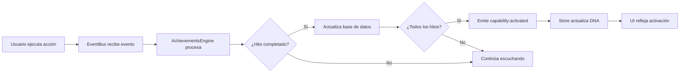

# Sistema de Evolución y Logros - MVP

## 🎯 Resumen del Sistema

El **Sistema de Evolución y Logros** transforma las capacidades latentes del ADN de negocio en capacidades activas a través de hitos fundacionales gamificados. Reemplaza el modelo de arquetipos dominantes con un enfoque compositivo donde todas las capacidades coexisten de manera independiente.

## 🏗️ Arquitectura Implementada

### 1. **Dominio de Gamificación** (`src/pages/admin/gamification/achievements/`)
- **Tipos**: Definiciones TypeScript para logros, hitos y eventos
- **Servicios**: `AchievementsEngine` - Motor principal que escucha EventBus
- **Hooks**: `useAchievements` - Hook React para gestión de estado
- **Componentes**: `OnboardingGuide` - Widget interactivo de activación

### 2. **Configuración de Hitos** (`src/config/milestones.ts`)
- **22 hitos fundacionales** específicos para activar capacidades
- **Patrones de eventos** que el EventBus debe escuchar
- **Mapeo capacidades → hitos** requeridos para activación

### 3. **Schema de Base de Datos** (`database/achievements_schema.sql`)
- **capability_milestones**: Relación capacidades ↔ hitos requeridos
- **user_achievement_progress**: Progreso individual por usuario
- **Políticas RLS**: Seguridad a nivel de fila

### 4. **Integración con Store** (`src/store/businessCapabilitiesStore.ts`)
- **Modelo compositivo**: BusinessDNA con capacidades independientes
- **Event listeners**: Reacciona a `capability:activated` 
- **Status tracking**: 'latent' → 'activating' → 'active' → 'optimized'

### 5. **Sistema de Gestión** (`src/lib/achievements/`)
- **AchievementSystemManager**: Coordinador principal singleton
- **Inicialización automática**: Setup en arranque de aplicación
- **Logging y debugging**: Monitoreo de eventos en desarrollo

## 🔄 Flujo de Activación



## 📋 Hitos Fundacionales (22 total)

### **Configuración Base (4 hitos)**
- `setup_business_info` - Configurar información básica
- `setup_business_locations` - Configurar ubicaciones
- `setup_contact_info` - Configurar información de contacto  
- `setup_business_hours` - Configurar horarios de operación

### **Productos y Servicios (6 hitos)**
- `create_first_product` - Crear primer producto
- `setup_product_categories` - Configurar categorías
- `configure_pricing_strategy` - Configurar estrategia de precios
- `setup_service_offerings` - Configurar ofertas de servicios
- `configure_appointment_types` - Configurar tipos de citas
- `setup_digital_products` - Configurar productos digitales

### **Operaciones (7 hitos)**
- `configure_delivery_zones` - Configurar zonas de entrega
- `setup_pickup_locations` - Configurar puntos de recogida
- `configure_inventory_management` - Configurar gestión de inventario
- `setup_supplier_relationships` - Configurar relaciones con proveedores
- `configure_rental_terms` - Configurar términos de alquiler
- `setup_event_management` - Configurar gestión de eventos
- `configure_space_reservations` - Configurar reservas de espacios

### **Comercio y Pagos (3 hitos)**
- `setup_payment_methods` - Configurar métodos de pago
- `configure_online_store` - Configurar tienda online
- `setup_b2b_pricing` - Configurar precios B2B

### **Membresías y Suscripciones (2 hitos)**
- `setup_membership_tiers` - Configurar niveles de membresía
- `configure_subscription_plans` - Configurar planes de suscripción

## 🎮 Componentes de UI

### **OnboardingGuide**
```tsx
import { OnboardingGuide } from '@/pages/admin/gamification/achievements';

<OnboardingGuide 
  userId={user.id}
  compact={false}
  showOnlyNext={true}
  maxCapabilities={4}
/>
```

**Props:**
- `userId`: ID del usuario para cargar progreso
- `compact`: Modo compacto sin resumen de progreso
- `showOnlyNext`: Solo mostrar siguiente capacidad a activar
- `maxCapabilities`: Límite de capacidades a mostrar

**Características:**
- **Progreso visual**: Barras de progreso por capacidad
- **Hitos expandibles**: Lista detallada de hitos pendientes
- **Navegación directa**: Botones para ir a completar hitos
- **Estados adaptativos**: Latente/Activando/Activa
- **Motivación**: Mensajes de progreso y logros

## 🛠️ Integración en la Aplicación

### 1. **Inicialización en App.tsx**
```tsx
import { AchievementSystemProvider } from '@/lib/achievements/AchievementSystemIntegration';

function App() {
  return (
    <ChakraProvider>
      <AuthProvider>
        <AchievementSystemProvider>
          <Router>
            {/* Rutas */}
          </Router>
        </AchievementSystemProvider>
      </AuthProvider>
    </ChakraProvider>
  );
}
```

### 2. **Emisión de eventos de negocio**
```tsx
import eventBus from '@/lib/events/EventBus';

// Al crear un producto
const handleCreateProduct = async (productData) => {
  const product = await createProduct(productData);
  
  await eventBus.emit('products.product.created', {
    type: 'products.product.created',
    timestamp: Date.now(),
    userId: user.id,
    data: { productId: product.id }
  });
};
```

### 3. **Hook de logros en componentes**
```tsx
import { useAchievements } from '@/pages/admin/gamification/achievements';

function Dashboard() {
  const { 
    progress, 
    activeCapabilities, 
    overallProgress,
    getCapabilityProgress 
  } = useAchievements(user.id);
  
  return (
    <Box>
      <Text>Progreso: {overallProgress}%</Text>
      <Text>Activas: {activeCapabilities} capacidades</Text>
    </Box>
  );
}
```

## 🎯 Casos de Uso

### **Activación de "sells_products"**
Hitos requeridos:
1. `setup_business_info` - Configurar datos básicos ✅
2. `create_first_product` - Crear primer producto ✅  
3. `configure_pricing_strategy` - Configurar precios ✅
4. `setup_payment_methods` - Configurar pagos ✅

Cuando se completan los 4 hitos → Capacidad se activa automáticamente

### **Activación de "has_online_store"**
Hitos requeridos:
1. `sells_products` debe estar activa (dependencia)
2. `configure_online_store` - Configurar tienda ✅
3. `setup_payment_methods` - Configurar pagos ✅

### **Dashboard Personalizado**
- Capacidades activas determinan módulos visibles
- Tutoriales relevantes según capacidades seleccionadas
- Características habilitadas dinámicamente

## 🚀 Beneficios del Sistema

1. **Experiencia Gamificada**: Progreso visual y logros motivacionales
2. **Onboarding Guiado**: Usuarios saben exactamente qué hacer
3. **Activación Automática**: Sin intervención manual, sistema reactivo
4. **Personalización Dinámica**: UI adapta según capacidades activas
5. **Escalabilidad**: Fácil agregar nuevos hitos y capacidades
6. **Arquitectura Limpia**: Separación clara de responsabilidades

## 🔧 Desarrollo y Testing

### **Simulación de hitos (development)**
```tsx
import { useAchievementSystem } from '@/lib/achievements/AchievementSystem';

function DevTools() {
  const { simulateMilestone } = useAchievementSystem(user.id);
  
  return (
    <Button onClick={() => simulateMilestone('setup_business_info')}>
      Simular: Configurar info de negocio
    </Button>
  );
}
```

### **Logs de debugging**
El sistema registra automáticamente:
- ✅ Hitos completados
- 🎉 Capacidades activadas  
- 📈 Progreso actualizado
- 🔄 Eventos procesados

### **Estado del sistema**
```tsx
import { achievementSystem } from '@/lib/achievements/AchievementSystem';

const status = achievementSystem.getStatus();
console.log('Sistema inicializado:', status.isInitialized);
console.log('Motor activo:', status.hasAchievementsEngine);
```

## 📈 Métricas y Analytics

El sistema está preparado para recopilar:
- **Tiempo de activación** por capacidad
- **Hitos más/menos completados**
- **Rutas de onboarding** más efectivas
- **Abandono** en hitos específicos
- **Adopción** de capacidades por tipo de negocio