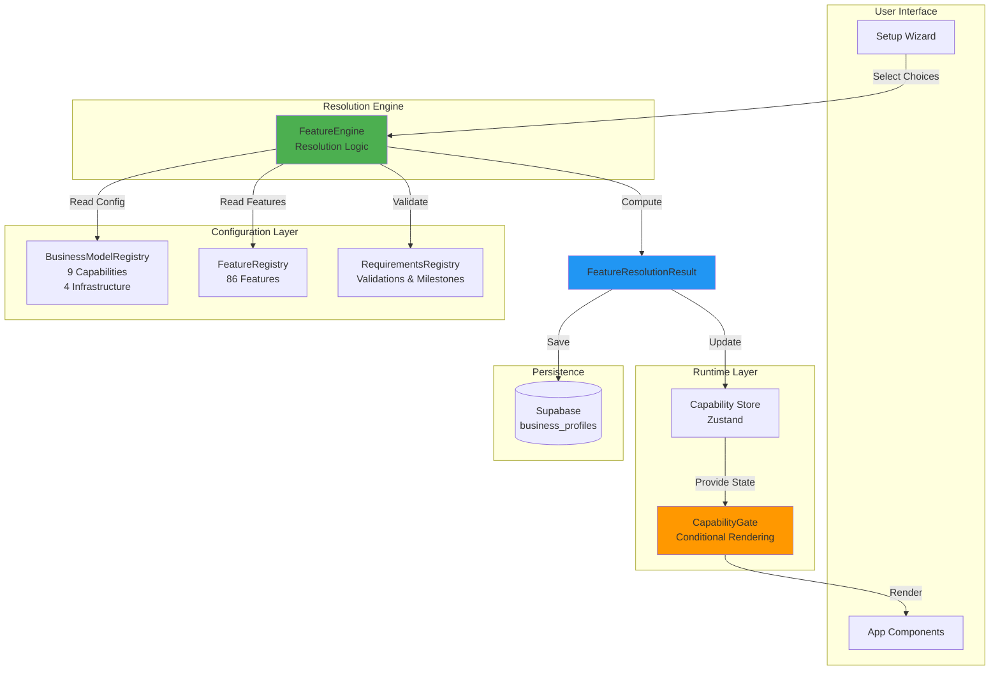
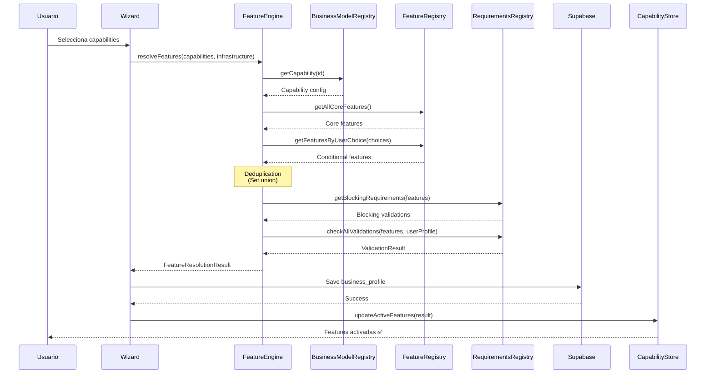
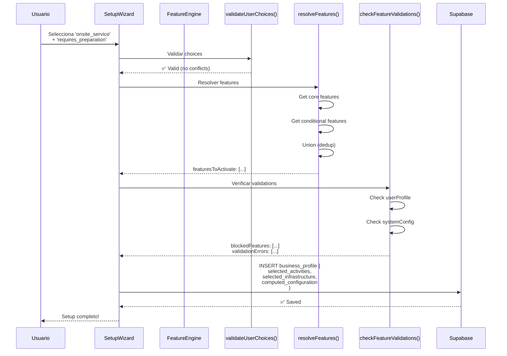
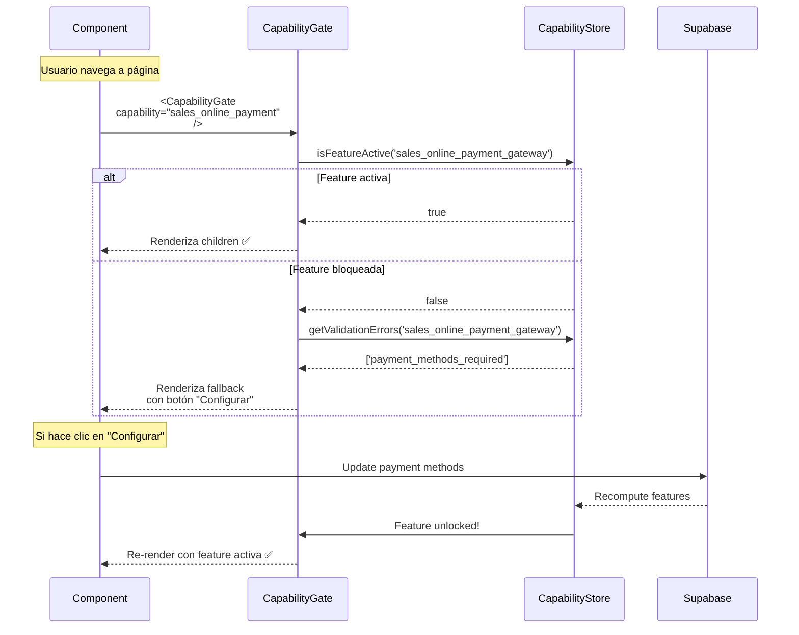
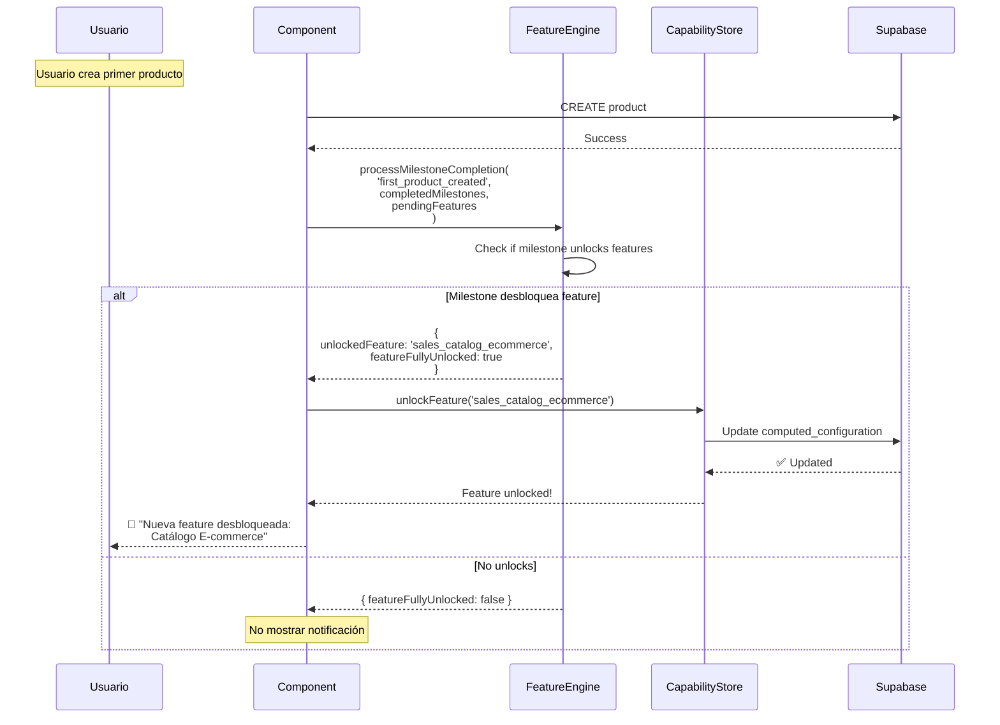

# 🔧 ATOMIC CAPABILITIES - ESPECIFICACIÓN TÉCNICA

**Estado**: 🚧 FASE 2 EN PROGRESO

**Prerequisito**: [ATOMIC_CAPABILITIES_DESIGN.md](./ATOMIC_CAPABILITIES_DESIGN.md) (Fase 1 - 100% completada)

---

## 📋 TABLA DE CONTENIDOS

1. [Resumen Ejecutivo](#resumen-ejecutivo)
2. [Tipos TypeScript](#tipos-typescript)
3. [Arquitectura del Sistema](#arquitectura-del-sistema)
4. [API Contracts](#api-contracts)
5. [Flujos de Datos](#flujos-de-datos)
6. [Esqueleto de Código](#esqueleto-de-código)
7. [Plan de Implementación](#plan-de-implementación)

---

## 📊 RESUMEN EJECUTIVO

Este documento provee la **especificación técnica completa** para implementar el sistema de Atomic Capabilities, basado en el diseño conceptual de Fase 1.

### **Objetivo técnico:**
Reemplazar el sistema actual de `BusinessModelRegistry` con un sistema atómico que:
- Elimina redundancias estructurales (23% reducción de código duplicado)
- Usa capabilities combinables que activan features vía tags
- Integra con el sistema existente de `CapabilityGate` y `Slots`
- Persiste en Supabase (`business_profiles` table)

### **Scope de Fase 2:**
- ✅ Tipos TypeScript completos con JSDoc
- ✅ Diagramas de arquitectura (Mermaid)
- ✅ Contratos de API documentados
- ✅ Sequence diagrams de flujos críticos
- ✅ Esqueleto de código (sin lógica de negocio)
- ✅ Plan de implementación paso a paso

### **Entregables:**
1. `types-skeleton.ts` - Tipos completos sin implementación
2. Diagramas en Mermaid - Arquitectura y flujos
3. API contracts - Interfaces de funciones documentadas
4. Plan de implementación - Orden y estrategia de cambios

---

## 🏗️ TIPOS TYPESCRIPT

### **1. Core Types - Capabilities & Features**

```typescript
/**
 * Business Capability IDs - Atomic capabilities seleccionables en el wizard
 *
 * Estas son las 9 capabilities atómicas que el usuario puede combinar.
 * Cada capability activa un conjunto específico de features.
 *
 * @see ATOMIC_CAPABILITIES_DESIGN.md para el diseño completo
 */
export type BusinessCapabilityId =
  // FULFILLMENT METHODS (Métodos de entrega/consumo)
  | 'onsite_service'         // Servicio/consumo en el local (mesas, cabinas)
  | 'pickup_orders'          // Cliente retira pedidos en local
  | 'delivery_shipping'      // Envío a domicilio del cliente

  // PRODUCTION CAPABILITY (Transformación de materiales)
  | 'requires_preparation'   // Cocina/producción/manufactura

  // SERVICE MODES (Modos de servicio)
  | 'appointment_based'      // Servicios con cita previa (agendamiento)
  | 'walkin_service'         // Servicios sin cita (walk-in)

  // SPECIAL OPERATIONS (Operaciones especiales)
  | 'async_operations'       // Venta asincrónica 24/7 (e-commerce)
  | 'corporate_sales'        // Ventas corporativas B2B
  | 'mobile_operations';     // Operaciones móviles (food truck, servicios a domicilio)

/**
 * Infrastructure IDs - Configuración de infraestructura física/digital
 *
 * Define CÓMO opera físicamente el negocio.
 * Es mutuamente excluyente entre: single_location, multi_location, mobile_business.
 */
export type InfrastructureId =
  | 'single_location'   // Local único fijo
  | 'multi_location'    // Múltiples locales (cadena/franquicia)
  | 'mobile_business'   // Negocio móvil (food truck, servicios móviles)
  | 'online_only';      // Solo online (sin presencia física)

/**
 * Feature Tag IDs - 86 features granulares del sistema
 *
 * Organizadas por DOMAIN para código, pero activadas por CAPABILITIES.
 * Nomenclatura: {domain}_{entity}_{operation_type}
 */
export type FeatureId =
  // ============================================
  // SALES DOMAIN (24 features)
  // ============================================

  // Core sales
  | 'sales_order_management'
  | 'sales_payment_processing'
  | 'sales_catalog_menu'

  // On-site sales
  | 'sales_pos_onsite'
  | 'sales_dine_in_orders'
  | 'sales_order_at_table'

  // E-commerce
  | 'sales_catalog_ecommerce'
  | 'sales_async_order_processing'
  | 'sales_online_payment_gateway'
  | 'sales_cart_management'
  | 'sales_checkout_process'
  | 'sales_multicatalog_management'

  // Retail
  | 'sales_bulk_pricing'
  | 'sales_quote_generation'
  | 'sales_product_retail'

  // Services
  | 'sales_package_management'

  // B2B
  | 'sales_contract_management'
  | 'sales_tiered_pricing'
  | 'sales_approval_workflows'
  | 'sales_quote_to_order'

  // Payment & pricing (nuevas 2024)
  | 'sales_split_payment'
  | 'sales_tip_management'
  | 'sales_coupon_management'

  // ============================================
  // INVENTORY DOMAIN (13 features)
  // ============================================

  // Core inventory
  | 'inventory_stock_tracking'
  | 'inventory_alert_system'
  | 'inventory_purchase_orders'
  | 'inventory_supplier_management'

  // Advanced inventory
  | 'inventory_sku_management'
  | 'inventory_barcode_scanning'
  | 'inventory_multi_unit_tracking'

  // Automation (nuevas 2024)
  | 'inventory_low_stock_auto_reorder'
  | 'inventory_demand_forecasting'
  | 'inventory_available_to_promise'
  | 'inventory_batch_lot_tracking'
  | 'inventory_expiration_tracking'

  // ============================================
  // PRODUCTION DOMAIN (4 features)
  // ============================================

  | 'production_recipe_management'
  | 'production_kitchen_display'
  | 'production_order_queue'
  | 'production_capacity_planning'  // Nueva 2024

  // ============================================
  // OPERATIONS DOMAIN (15 features)
  // ============================================

  // Pickup operations
  | 'operations_pickup_scheduling'
  | 'operations_notification_system'

  // Delivery operations
  | 'operations_delivery_zones'
  | 'operations_delivery_tracking'
  | 'operations_shipping_integration'
  | 'operations_deferred_fulfillment'

  // On-site operations
  | 'operations_table_management'
  | 'operations_table_assignment'
  | 'operations_floor_plan_config'
  | 'operations_bill_splitting'

  // Advanced operations (nuevas 2024)
  | 'operations_waitlist_management'
  | 'operations_vendor_performance'

  // ============================================
  // SCHEDULING DOMAIN (4 features)
  // ============================================

  | 'scheduling_appointment_booking'
  | 'scheduling_calendar_management'
  | 'scheduling_reminder_system'
  | 'scheduling_availability_rules'

  // ============================================
  // CUSTOMER DOMAIN (5 features)
  // ============================================

  | 'customer_service_history'
  | 'customer_preference_tracking'
  | 'customer_loyalty_program'
  | 'customer_online_reservation'      // Nueva 2024
  | 'customer_reservation_reminders'   // Nueva 2024

  // ============================================
  // FINANCE DOMAIN (4 features)
  // ============================================

  | 'finance_corporate_accounts'
  | 'finance_credit_management'
  | 'finance_invoice_scheduling'
  | 'finance_payment_terms'

  // ============================================
  // MOBILE DOMAIN (5 features)
  // ============================================

  | 'mobile_pos_offline'
  | 'mobile_location_tracking'
  | 'mobile_route_planning'
  | 'mobile_inventory_constraints'
  | 'mobile_sync_management'

  // ============================================
  // MULTISITE DOMAIN (5 features)
  // ============================================

  | 'multisite_location_management'
  | 'multisite_centralized_inventory'
  | 'multisite_transfer_orders'
  | 'multisite_comparative_analytics'
  | 'multisite_configuration_per_site'

  // ============================================
  // ANALYTICS DOMAIN (2 features)
  // ============================================

  | 'analytics_ecommerce_metrics'
  | 'analytics_conversion_tracking';

/**
 * User Choice ID - Union type de todas las opciones seleccionables
 */
export type UserChoiceId = BusinessCapabilityId | InfrastructureId;
```

### **2. Configuration Types**

```typescript
/**
 * Business Capability Definition
 *
 * Define una capability atómica seleccionable en el wizard.
 * Cada capability activa un conjunto de features automáticamente.
 */
export interface BusinessCapability {
  /** ID único de la capability */
  id: BusinessCapabilityId;

  /** Nombre user-friendly mostrado en el wizard */
  name: string;

  /** Descripción corta para el usuario */
  description: string;

  /** Emoji/icono representativo */
  icon: string;

  /** Tipo para organización interna */
  type: 'fulfillment' | 'production' | 'service_mode' | 'special_operation';

  /**
   * Features que se activan al seleccionar esta capability
   * Estas features se combinan con las de otras capabilities (set union)
   */
  activatesFeatures: FeatureId[];

  /**
   * Requisitos bloqueantes - DEBEN completarse para usar esta capability
   * Se validan contra RequirementsRegistry
   *
   * @example ['business_address_required', 'operating_hours_required']
   */
  blockingRequirements?: string[];
}

/**
 * Infrastructure Definition
 *
 * Define cómo opera físicamente el negocio.
 * Las infrastructures son mutuamente excluyentes entre grupos.
 */
export interface Infrastructure {
  /** ID único de la infrastructure */
  id: InfrastructureId;

  /** Nombre user-friendly */
  name: string;

  /** Descripción */
  description: string;

  /** Icono */
  icon: string;

  /** Tipo para organización */
  type: 'infrastructure';

  /**
   * Infrastructures que NO pueden estar activas simultáneamente
   *
   * @example ['multi_location', 'mobile_business'] para 'single_location'
   */
  conflicts?: InfrastructureId[];

  /**
   * Features adicionales que activa esta infrastructure
   */
  activatesFeatures: FeatureId[];

  /** Requisitos bloqueantes */
  blockingRequirements?: string[];
}

/**
 * Feature Definition
 *
 * Define una feature granular del sistema.
 * Las features son activadas por capabilities/infrastructure.
 */
export interface Feature {
  /** ID único de la feature (tag) */
  id: FeatureId;

  /** Nombre descriptivo */
  name: string;

  /** Descripción funcional */
  description: string;

  /**
   * Domain organizacional (para código, NO para usuario)
   * Usado para organizar archivos y componentes
   */
  domain:
    | 'SALES'
    | 'INVENTORY'
    | 'PRODUCTION'
    | 'OPERATIONS'
    | 'SCHEDULING'
    | 'CUSTOMER'
    | 'FINANCE'
    | 'MOBILE'
    | 'MULTISITE'
    | 'ANALYTICS';

  /**
   * Tipo de feature según su función
   */
  category: 'core' | 'conditional' | 'premium' | 'enterprise';

  /**
   * Milestones fundacionales requeridos para desbloquear
   * @see RequirementsRegistry
   */
  foundationalMilestones?: string[];
}
```

### **3. Activation & Resolution Types**

```typescript
/**
 * Feature Resolution Result
 *
 * Resultado del proceso de resolución de features según user choices.
 * Este es el output principal del FeatureEngine.
 */
export interface FeatureResolutionResult {
  /** Todas las features que deben activarse (core + conditional) */
  featuresToActivate: FeatureId[];

  /** Features core (siempre activas) */
  coreFeatures: FeatureId[];

  /** Features condicionales (según user choices) */
  conditionalFeatures: FeatureId[];

  /** Features bloqueadas por validaciones pendientes */
  blockedFeatures: FeatureId[];

  /** Milestones fundacionales que deben completarse */
  pendingMilestones: string[];

  /** IDs de validaciones bloqueantes */
  blockingValidations: string[];
}

/**
 * Validation Check Result
 *
 * Resultado de verificar blocking validations.
 */
export interface ValidationCheckResult {
  /** Si todas las validaciones pasaron */
  valid: boolean;

  /** Features que están bloqueadas */
  blockedFeatures: FeatureId[];

  /** Validaciones que fallaron */
  failedValidations: string[];

  /** Mensajes de error user-friendly */
  errorMessages: Array<{
    field: string;
    message: string;
    redirectTo: string;
  }>;
}

/**
 * Milestone Completion Result
 *
 * Resultado de completar un milestone fundacional.
 */
export interface MilestoneCompletionResult {
  /** Feature desbloqueada (si alguna) */
  unlockedFeature?: FeatureId;

  /** Si se completó el último milestone de una feature */
  featureFullyUnlocked: boolean;

  /** Milestones restantes para esa feature */
  remainingMilestones: string[];
}

/**
 * User Choice Validation Result
 *
 * Resultado de validar user choices (dependencies + conflicts).
 */
export interface UserChoiceValidationResult {
  /** Si las choices son válidas */
  valid: boolean;

  /** Errores de dependencies o conflicts */
  errors: Array<{
    type: 'dependency' | 'conflict';
    message: string;
    affectedChoice: UserChoiceId;
  }>;
}
```

### **4. Persistence Types (Supabase)**

```typescript
/**
 * Business Profile Schema
 *
 * Representa la tabla `business_profiles` en Supabase.
 * Almacena las user choices y configuration computed.
 */
export interface BusinessProfileSchema {
  id: string;
  organization_id: string;

  /**
   * Capabilities seleccionadas por el usuario
   * Stored as JSONB array
   */
  selected_activities: BusinessCapabilityId[];

  /**
   * Infrastructure seleccionada
   * Stored as JSONB array (usualmente 1 elemento)
   */
  selected_infrastructure: InfrastructureId[];

  /**
   * Configuration computed (cache)
   * Contiene: activeFeatures, blockedFeatures, pendingMilestones
   * Stored as JSONB object
   */
  computed_configuration: {
    activeFeatures: FeatureId[];
    blockedFeatures: FeatureId[];
    pendingMilestones: string[];
    lastComputedAt: string; // ISO timestamp
  };

  created_at: string;
  updated_at: string;
}

/**
 * Wizard State
 *
 * Estado local del wizard durante el setup.
 */
export interface WizardState {
  currentStep: number;
  totalSteps: number;

  /** Capabilities seleccionadas */
  selectedCapabilities: BusinessCapabilityId[];

  /** Infrastructure seleccionada */
  selectedInfrastructure: InfrastructureId[];

  /** Validación en tiempo real */
  validation: UserChoiceValidationResult;

  /** Si el wizard está completo */
  isComplete: boolean;
}
```

---

## 🏛️ ARQUITECTURA DEL SISTEMA

### **Diagrama de Relaciones**



### **Flujo de Activación de Features**



---

## 📡 API CONTRACTS

### **1. FeatureEngine API**

```typescript
/**
 * Feature Engine - Sistema de Resolución de Features
 *
 * Motor central que resuelve qué features activar según user choices.
 * Verifica blocking validations y genera milestones pendientes.
 */
export class FeatureActivationEngine {

  /**
   * Activa features según user choices
   *
   * Este es el método principal del sistema. Toma las choices del usuario
   * y computa qué features activar, cuáles bloquear, y qué milestones pendientes hay.
   *
   * @param activities - Capabilities seleccionadas
   * @param infrastructure - Infrastructure seleccionada
   * @param userProfile - Perfil del usuario (para validaciones)
   * @param systemConfig - Configuración del sistema
   *
   * @returns Objeto con features activas, bloqueadas, milestones, y errores
   *
   * @throws Error si las user choices son inválidas (dependencies/conflicts)
   *
   * @example
   * ```typescript
   * const result = FeatureActivationEngine.activateFeatures(
   *   ['onsite_service', 'requires_preparation'],
   *   ['single_location'],
   *   userProfile,
   *   systemConfig
   * );
   * // result.activeFeatures: ['sales_order_management', 'production_kitchen_display', ...]
   * // result.blockedFeatures: ['sales_online_payment_gateway'] // falta setup
   * // result.pendingMilestones: ['business_address_required']
   * ```
   */
  public static activateFeatures(
    activities: BusinessCapabilityId[],
    infrastructure: InfrastructureId[],
    userProfile: any,
    systemConfig: any
  ): {
    activeFeatures: FeatureId[];
    blockedFeatures: FeatureId[];
    pendingMilestones: string[];
    validationErrors: Array<{ field: string; message: string; redirectTo: string }>;
  };

  /**
   * Desbloquea feature al completar validation
   *
   * Cuando el usuario completa una validation (ej: configurar dirección),
   * este método verifica qué features se desbloquean.
   *
   * @param validationId - ID de la validation completada
   * @param currentlyBlocked - Features actualmente bloqueadas
   * @param userProfile - Perfil actualizado del usuario
   * @param systemConfig - Configuración del sistema
   *
   * @returns Features desbloqueadas y aún bloqueadas
   */
  public static unlockFeatureByValidation(
    validationId: string,
    currentlyBlocked: FeatureId[],
    userProfile: any,
    systemConfig: any
  ): {
    unlockedFeatures: FeatureId[];
    stillBlocked: FeatureId[];
  };

  /**
   * Desbloquea feature al completar milestone
   *
   * Cuando el usuario completa un milestone fundacional (ej: crear primer producto),
   * este método verifica qué features se desbloquean.
   *
   * @param milestoneId - ID del milestone completado
   * @param completedMilestones - Todos los milestones ya completados
   * @param currentlyPendingFeatures - Features pendientes de desbloqueo
   *
   * @returns Información sobre el desbloqueo
   */
  public static unlockFeatureByMilestone(
    milestoneId: string,
    completedMilestones: string[],
    currentlyPendingFeatures: FeatureId[]
  ): MilestoneCompletionResult;
}
```

### **2. BusinessModelRegistry API**

```typescript
/**
 * Business Model Registry - NUEVA VERSIÓN ATÓMICA
 *
 * Registry de capabilities e infrastructure.
 * Reemplaza la versión actual con redundancias.
 */

/**
 * Obtiene una capability por ID
 */
export function getCapability(id: BusinessCapabilityId): BusinessCapability | undefined;

/**
 * Obtiene una infrastructure por ID
 */
export function getInfrastructure(id: InfrastructureId): Infrastructure | undefined;

/**
 * Obtiene todas las capabilities
 */
export function getAllCapabilities(): BusinessCapability[];

/**
 * Obtiene todas las infrastructures
 */
export function getAllInfrastructures(): Infrastructure[];

/**
 * Verifica conflicts de infrastructure
 *
 * @returns { valid: true } si no hay conflicts, { valid: false, conflicts: [...] } si hay
 */
export function checkInfrastructureConflicts(
  infrastructureId: InfrastructureId,
  activeInfrastructure: InfrastructureId[]
): { valid: boolean; conflicts: InfrastructureId[] };

/**
 * Obtiene todas las features activadas por user choices
 *
 * @param capabilities - Capabilities seleccionadas
 * @param infrastructure - Infrastructure seleccionada
 * @returns Array único de features (set union, sin duplicados)
 */
export function getActivatedFeatures(
  capabilities: BusinessCapabilityId[],
  infrastructure: InfrastructureId[]
): FeatureId[];

/**
 * Obtiene todos los blocking requirements de las user choices
 */
export function getBlockingRequirements(
  capabilities: BusinessCapabilityId[],
  infrastructure: InfrastructureId[]
): string[];
```

### **3. FeatureRegistry API**

```typescript
/**
 * Feature Registry - NUEVA VERSIÓN
 *
 * Registry de las 86 features del sistema.
 */

/**
 * Obtiene una feature por ID
 */
export function getFeature(id: FeatureId): Feature | undefined;

/**
 * Obtiene todas las features core (siempre activas)
 */
export function getAllCoreFeatures(): Feature[];

/**
 * Obtiene features condicionales según user choices
 *
 * @param capabilities - Capabilities seleccionadas
 * @param infrastructure - Infrastructure seleccionada
 * @returns Features que se activan con esas choices
 */
export function getFeaturesByUserChoice(
  capabilities: BusinessCapabilityId[],
  infrastructure: InfrastructureId[]
): Feature[];

/**
 * Obtiene blocking requirements para un conjunto de features
 */
export function getBlockingRequirementsForFeatures(
  features: FeatureId[]
): string[];

/**
 * Obtiene milestones fundacionales para features
 */
export function getFoundationalMilestonesForFeatures(
  features: FeatureId[]
): string[];
```

---

## 🔄 FLUJOS DE DATOS

### **Flujo 1: Setup Wizard → Database**



### **Flujo 2: Runtime - Conditional Rendering**



### **Flujo 3: Milestone Completion → Feature Unlock**



---

## 📦 ESQUELETO DE CÓDIGO

### **Archivo 1: `src/config/BusinessModelRegistry.ts`** (REEMPLAZAR)

```typescript
/**
 * Business Model Registry - ATOMIC VERSION
 *
 * Define lo que el usuario ELIGE en el setup wizard.
 * Versión atómica sin redundancias.
 *
 * @version 2.0.0 - Atomic Capabilities
 */

// ============================================
// TYPES (importar desde types-skeleton.ts)
// ============================================

export type BusinessCapabilityId = /* ... 9 capabilities ... */;
export type InfrastructureId = /* ... 4 infrastructure ... */;
export interface BusinessCapability { /* ... */ }
export interface Infrastructure { /* ... */ }

// ============================================
// BUSINESS CAPABILITIES DEFINITIONS
// ============================================

const CAPABILITIES: Record<BusinessCapabilityId, BusinessCapability> = {
  'onsite_service': {
    id: 'onsite_service',
    name: 'Servicio en Local',
    description: 'Servicio/consumo en el local (mesas, cabinas)',
    icon: '🏪',
    type: 'fulfillment',

    activatesFeatures: [
      // SALES
      'sales_order_management',
      'sales_payment_processing',
      'sales_catalog_menu',
      'sales_pos_onsite',
      'sales_dine_in_orders',
      'sales_split_payment',
      'sales_tip_management',
      'sales_coupon_management',

      // OPERATIONS
      'operations_table_management',
      'operations_table_assignment',
      'operations_floor_plan_config',
      'operations_waitlist_management',

      // INVENTORY
      'inventory_stock_tracking',
      'inventory_alert_system',
      'inventory_low_stock_auto_reorder'
    ],

    blockingRequirements: [
      'business_address_required',
      'operating_hours_required'
    ]
  },

  'pickup_orders': {
    id: 'pickup_orders',
    name: 'Retiro en Local',
    description: 'Cliente retira pedidos en local',
    icon: '🏪',
    type: 'fulfillment',

    activatesFeatures: [
      'sales_order_management',
      'sales_payment_processing',
      'sales_catalog_menu',
      'sales_split_payment',
      'sales_coupon_management',
      'operations_pickup_scheduling',
      'operations_notification_system',
      'inventory_stock_tracking',
      'inventory_alert_system',
      'inventory_low_stock_auto_reorder'
    ],

    blockingRequirements: [
      'business_address_required',
      'pickup_hours_required'
    ]
  },

  'delivery_shipping': {
    id: 'delivery_shipping',
    name: 'Envío a Domicilio',
    description: 'Delivery/shipping de productos',
    icon: '🚚',
    type: 'fulfillment',

    activatesFeatures: [
      'sales_order_management',
      'sales_payment_processing',
      'sales_catalog_menu',
      'sales_split_payment',
      'sales_coupon_management',
      'operations_delivery_zones',
      'operations_delivery_tracking',
      'operations_notification_system',
      'inventory_stock_tracking',
      'inventory_alert_system',
      'inventory_low_stock_auto_reorder'
    ],

    blockingRequirements: [
      'delivery_zones_required',
      'delivery_fees_required'
    ]
  },

  'requires_preparation': {
    id: 'requires_preparation',
    name: 'Requiere Producción',
    description: 'Cocina/producción/manufactura',
    icon: '👨‍🍳',
    type: 'production',

    activatesFeatures: [
      'production_recipe_management',
      'production_kitchen_display',
      'production_order_queue',
      'production_capacity_planning',
      'inventory_purchase_orders',
      'inventory_supplier_management',
      'inventory_demand_forecasting',
      'inventory_batch_lot_tracking',
      'inventory_expiration_tracking',
      'operations_vendor_performance'
    ],

    blockingRequirements: []
  },

  'appointment_based': {
    id: 'appointment_based',
    name: 'Servicios con Cita',
    description: 'Servicios que requieren cita previa',
    icon: '📅',
    type: 'service_mode',

    activatesFeatures: [
      'scheduling_appointment_booking',
      'scheduling_calendar_management',
      'scheduling_reminder_system',
      'scheduling_availability_rules',
      'customer_service_history',
      'customer_preference_tracking',
      'customer_online_reservation',
      'customer_reservation_reminders',
      'sales_package_management'
    ],

    blockingRequirements: [
      'service_types_required',
      'available_hours_required'
    ]
  },

  'walkin_service': {
    id: 'walkin_service',
    name: 'Servicios Walk-in',
    description: 'Servicios sin cita previa',
    icon: '🚶',
    type: 'service_mode',

    activatesFeatures: [
      // Sin features adicionales específicas
      // Usa las de onsite_service
    ],

    blockingRequirements: []
  },

  'async_operations': {
    id: 'async_operations',
    name: 'Operaciones 24/7',
    description: 'Venta asincrónica (e-commerce)',
    icon: '🌐',
    type: 'special_operation',

    activatesFeatures: [
      'sales_catalog_ecommerce',
      'sales_async_order_processing',
      'sales_online_payment_gateway',
      'sales_cart_management',
      'sales_checkout_process',
      'sales_coupon_management',
      'analytics_ecommerce_metrics',
      'analytics_conversion_tracking',
      'operations_deferred_fulfillment',
      'inventory_available_to_promise',
      'customer_online_reservation'
    ],

    blockingRequirements: [
      'website_url_required',
      'payment_methods_required'
    ]
  },

  'corporate_sales': {
    id: 'corporate_sales',
    name: 'Ventas Corporativas',
    description: 'Ventas B2B',
    icon: '🏢',
    type: 'special_operation',

    activatesFeatures: [
      'finance_corporate_accounts',
      'finance_credit_management',
      'finance_invoice_scheduling',
      'finance_payment_terms',
      'sales_contract_management',
      'sales_tiered_pricing',
      'sales_approval_workflows',
      'sales_quote_to_order',
      'sales_bulk_pricing',
      'sales_quote_generation',
      'inventory_available_to_promise',
      'inventory_demand_forecasting',
      'operations_vendor_performance'
    ],

    blockingRequirements: [
      'business_license_required'
    ]
  },

  'mobile_operations': {
    id: 'mobile_operations',
    name: 'Operaciones Móviles',
    description: 'Food truck, servicios móviles',
    icon: '🚐',
    type: 'special_operation',

    activatesFeatures: [
      'mobile_pos_offline',
      'mobile_location_tracking',
      'mobile_route_planning',
      'mobile_inventory_constraints',
      'mobile_sync_management'
    ],

    blockingRequirements: [
      'mobile_equipment_required'
    ]
  }
};

// ============================================
// INFRASTRUCTURE DEFINITIONS
// ============================================

const INFRASTRUCTURE: Record<InfrastructureId, Infrastructure> = {
  'single_location': {
    id: 'single_location',
    name: 'Local Único',
    description: 'Opera desde una sola ubicación fija',
    icon: '🏪',
    type: 'infrastructure',

    conflicts: ['multi_location', 'mobile_business'],

    activatesFeatures: [],

    blockingRequirements: [
      'business_address_required'
    ]
  },

  'multi_location': {
    id: 'multi_location',
    name: 'Múltiples Locales',
    description: 'Cadena/franquicia con varias ubicaciones',
    icon: '🏢',
    type: 'infrastructure',

    conflicts: ['single_location', 'mobile_business'],

    activatesFeatures: [
      'multisite_location_management',
      'multisite_centralized_inventory',
      'multisite_transfer_orders',
      'multisite_comparative_analytics',
      'multisite_configuration_per_site'
    ],

    blockingRequirements: [
      'primary_location_required',
      'additional_locations_required'
    ]
  },

  'mobile_business': {
    id: 'mobile_business',
    name: 'Negocio Móvil',
    description: 'Food truck, servicios móviles',
    icon: '🚐',
    type: 'infrastructure',

    conflicts: ['single_location', 'multi_location'],

    activatesFeatures: [
      // Ya cubierto por 'mobile_operations' capability
    ],

    blockingRequirements: [
      'mobile_equipment_required'
    ]
  },

  'online_only': {
    id: 'online_only',
    name: 'Solo Online',
    description: 'Sin presencia física',
    icon: '🌐',
    type: 'infrastructure',

    conflicts: [],

    activatesFeatures: [],

    blockingRequirements: []
  }
};

// ============================================
// UNIFIED REGISTRY
// ============================================

export const BUSINESS_MODEL_REGISTRY = {
  capabilities: CAPABILITIES,
  infrastructure: INFRASTRUCTURE
};

// ============================================
// UTILITY FUNCTIONS
// ============================================

export function getCapability(id: BusinessCapabilityId): BusinessCapability | undefined {
  return CAPABILITIES[id];
}

export function getInfrastructure(id: InfrastructureId): Infrastructure | undefined {
  return INFRASTRUCTURE[id];
}

export function getAllCapabilities(): BusinessCapability[] {
  return Object.values(CAPABILITIES);
}

export function getAllInfrastructures(): Infrastructure[] {
  return Object.values(INFRASTRUCTURE);
}

export function checkInfrastructureConflicts(
  infrastructureId: InfrastructureId,
  activeInfrastructure: InfrastructureId[]
): { valid: boolean; conflicts: InfrastructureId[] } {
  const infrastructure = INFRASTRUCTURE[infrastructureId];

  if (!infrastructure.conflicts || infrastructure.conflicts.length === 0) {
    return { valid: true, conflicts: [] };
  }

  const conflicts = infrastructure.conflicts.filter(c => activeInfrastructure.includes(c));

  return {
    valid: conflicts.length === 0,
    conflicts
  };
}

export function getActivatedFeatures(
  capabilities: BusinessCapabilityId[],
  infrastructure: InfrastructureId[]
): FeatureId[] {
  const features = new Set<FeatureId>();

  // Features de capabilities
  capabilities.forEach(capId => {
    const capability = CAPABILITIES[capId];
    capability.activatesFeatures.forEach(f => features.add(f));
  });

  // Features de infrastructure
  infrastructure.forEach(infraId => {
    const infra = INFRASTRUCTURE[infraId];
    infra.activatesFeatures.forEach(f => features.add(f));
  });

  return Array.from(features);
}

export function getBlockingRequirements(
  capabilities: BusinessCapabilityId[],
  infrastructure: InfrastructureId[]
): string[] {
  const requirements = new Set<string>();

  capabilities.forEach(capId => {
    const capability = CAPABILITIES[capId];
    if (capability.blockingRequirements) {
      capability.blockingRequirements.forEach(r => requirements.add(r));
    }
  });

  infrastructure.forEach(infraId => {
    const infra = INFRASTRUCTURE[infraId];
    if (infra.blockingRequirements) {
      infra.blockingRequirements.forEach(r => requirements.add(r));
    }
  });

  return Array.from(requirements);
}
```

### **Archivo 2: `src/config/FeatureRegistry.ts`** (ACTUALIZAR)

```typescript
/**
 * Feature Registry - ATOMIC VERSION
 *
 * Define las 86 features del sistema.
 * @version 2.0.0 - Atomic Capabilities
 */

import type { FeatureId, Feature, BusinessCapabilityId, InfrastructureId } from './types';
import { getActivatedFeatures } from './BusinessModelRegistry';

// ============================================
// FEATURE DEFINITIONS (86 features)
// ============================================

const FEATURES: Record<FeatureId, Feature> = {
  // SALES DOMAIN (24 features)
  'sales_order_management': {
    id: 'sales_order_management',
    name: 'Gestión de Pedidos',
    description: 'Sistema completo de gestión de órdenes',
    domain: 'SALES',
    category: 'core'
  },

  'sales_payment_processing': {
    id: 'sales_payment_processing',
    name: 'Procesamiento de Pagos',
    description: 'Cobro de órdenes con múltiples métodos',
    domain: 'SALES',
    category: 'core'
  },

  'sales_catalog_menu': {
    id: 'sales_catalog_menu',
    name: 'Catálogo de Menú',
    description: 'Catálogo base de productos/servicios',
    domain: 'SALES',
    category: 'core'
  },

  // ... (Resto de las 86 features con misma estructura)

  'analytics_conversion_tracking': {
    id: 'analytics_conversion_tracking',
    name: 'Tracking de Conversión',
    description: 'Análisis de funnel de conversión',
    domain: 'ANALYTICS',
    category: 'conditional'
  }
};

// ============================================
// CORE FEATURES (siempre activas)
// ============================================

const CORE_FEATURES: FeatureId[] = [
  'sales_order_management',
  'sales_payment_processing',
  'sales_catalog_menu',
  'inventory_stock_tracking',
  'inventory_alert_system'
];

// ============================================
// UTILITY FUNCTIONS
// ============================================

export function getFeature(id: FeatureId): Feature | undefined {
  return FEATURES[id];
}

export function getAllCoreFeatures(): Feature[] {
  return CORE_FEATURES.map(id => FEATURES[id]);
}

export function getFeaturesByUserChoice(
  capabilities: BusinessCapabilityId[],
  infrastructure: InfrastructureId[]
): Feature[] {
  const featureIds = getActivatedFeatures(capabilities, infrastructure);
  return featureIds.map(id => FEATURES[id]).filter(Boolean);
}

export function getBlockingRequirementsForFeatures(features: FeatureId[]): string[] {
  // Esta lógica ya está en BusinessModelRegistry
  // Retornar los blocking requirements agregados
  return [];
}

export function getFoundationalMilestonesForFeatures(features: FeatureId[]): string[] {
  const milestones = new Set<string>();

  features.forEach(featureId => {
    const feature = FEATURES[featureId];
    if (feature.foundationalMilestones) {
      feature.foundationalMilestones.forEach(m => milestones.add(m));
    }
  });

  return Array.from(milestones);
}
```

### **Archivo 3: `src/lib/features/FeatureEngine.ts`** (ACTUALIZAR)

```typescript
/**
 * Feature Engine - ATOMIC VERSION
 *
 * Motor de resolución y activación de features.
 * SIN CAMBIOS en la lógica core, solo actualizar imports y tipos.
 *
 * @version 2.0.0 - Atomic Capabilities
 */

import type {
  BusinessCapabilityId,
  InfrastructureId,
  FeatureId,
  FeatureResolutionResult,
  ValidationCheckResult,
  MilestoneCompletionResult
} from '@/config/types';

import {
  getActivatedFeatures,
  getBlockingRequirements,
  checkInfrastructureConflicts
} from '@/config/BusinessModelRegistry';

import {
  getAllCoreFeatures,
  getFeaturesByUserChoice,
  getBlockingRequirementsForFeatures,
  getFoundationalMilestonesForFeatures
} from '@/config/FeatureRegistry';

// ... (resto del código existente, solo cambiar tipos)
```

---

## 📋 PLAN DE IMPLEMENTACIÓN

### **FASE 3: Implementación Directa**

#### **Paso 1: Preparación** (30 min)

1. ✅ **Backup del código actual**
   ```bash
   git checkout -b feature/atomic-capabilities-v2
   git add .
   git commit -m "backup: before atomic capabilities migration"
   ```

2. ✅ **Crear archivo de tipos central**
   - Crear `src/config/types/atomic-capabilities.ts`
   - Copiar todos los tipos de este spec
   - Exportar desde `src/config/types/index.ts`

#### **Paso 2: Actualizar Registries** (2 horas)

**2.1. BusinessModelRegistry.ts** (1 hora)

```bash
# Backup del archivo actual
cp src/config/BusinessModelRegistry.ts src/config/BusinessModelRegistry.OLD.ts

# Crear nueva versión
# Copiar el esqueleto de código de este spec
```

- ✅ Reemplazar completamente con versión atómica
- ✅ 9 capabilities definidas (vs 6 activities antiguas)
- ✅ 4 infrastructure definidas (sin cambios)
- ✅ Eliminar `requires` de activities (ya no existe)
- ✅ Verificar que todas las features están mapeadas

**2.2. FeatureRegistry.ts** (1 hora)

- ✅ Actualizar tipos de imports
- ✅ Agregar las 14 features nuevas del research
- ✅ Actualizar `getFeaturesByUserChoice()` para usar nueva lógica
- ✅ Validar que las 86 features estén definidas

#### **Paso 3: Actualizar FeatureEngine** (1 hora)

- ✅ Actualizar imports de tipos
- ✅ Cambiar `BusinessActivityId` → `BusinessCapabilityId`
- ✅ Cambiar `activities` params → `capabilities`
- ✅ Actualizar llamadas a `checkActivityDependencies()` → eliminar (ya no existe)
- ✅ Mantener toda la lógica de validations/milestones sin cambios

#### **Paso 4: Actualizar Wizard** (2 horas)

**4.1. BusinessModelStep.tsx**

```typescript
// ANTES
<CheckboxGroup value={selectedActivities} onChange={setSelectedActivities}>
  {activities.map(activity => (
    <Checkbox key={activity.id} value={activity.id}>
      {activity.icon} {activity.name}
    </Checkbox>
  ))}
</CheckboxGroup>

// DESPUÉS
<CheckboxGroup value={selectedCapabilities} onChange={setSelectedCapabilities}>
  {capabilities.map(capability => (
    <Checkbox key={capability.id} value={capability.id}>
      {capability.icon} {capability.name}
    </Checkbox>
  ))}
</CheckboxGroup>
```

**4.2. setupStore.ts**

```typescript
// Actualizar state
interface SetupState {
  // ANTES
  selectedActivities: BusinessActivityId[];

  // DESPUÉS
  selectedCapabilities: BusinessCapabilityId[];

  // ... resto igual
}
```

#### **Paso 5: Actualizar Supabase** (30 min)

**5.1. Verificar schema** (ya existe, no cambiar)

```sql
-- Ya existe en business_profiles:
selected_activities JSONB DEFAULT '[]'::jsonb  -- Renombrar lógicamente a "capabilities"
selected_infrastructure JSONB DEFAULT '["single_location"]'::jsonb
computed_configuration JSONB DEFAULT '{}'::jsonb
```

**5.2. Migration de datos** (NO NECESARIA - app en desarrollo)

- ✅ No hay usuarios en producción
- ✅ No hay migration de datos
- ✅ Solo limpiar datos de testing local

#### **Paso 6: Testing** (2 horas)

**6.1. Test de resolución**

```typescript
// Test: Pizzería dark kitchen
const result = resolveFeatures(
  ['pickup_orders', 'delivery_shipping', 'requires_preparation'],
  ['single_location']
);

expect(result.featuresToActivate).toContain('production_kitchen_display');
expect(result.featuresToActivate).toContain('sales_order_management');
expect(result.featuresToActivate).toContain('operations_delivery_zones');
```

**6.2. Test de wizard**

- ✅ Seleccionar capabilities → verificar features correctas
- ✅ Verificar validations bloqueantes
- ✅ Completar validation → verificar desbloqueo

**6.3. Test de persistencia**

- ✅ Guardar en DB → verificar JSONB correcto
- ✅ Reload → verificar features se restauran

#### **Paso 7: Validación Final** (1 hora)

- ✅ TypeScript: `pnpm -s exec tsc --noEmit` → 0 errors
- ✅ Linter: `pnpm lint` → 0 warnings
- ✅ Tests: `pnpm test` → all pass
- ✅ Manual testing: 10 casos de uso del diseño

### **Checklist de Completitud**

| Tarea | Tiempo Estimado | Estado |
|-------|----------------|--------|
| Backup código actual | 10 min | ⏳ |
| Crear tipos centrales | 20 min | ⏳ |
| Actualizar BusinessModelRegistry | 1 hora | ⏳ |
| Actualizar FeatureRegistry | 1 hora | ⏳ |
| Actualizar FeatureEngine | 1 hora | ⏳ |
| Actualizar Wizard | 2 horas | ⏳ |
| Actualizar setupStore | 30 min | ⏳ |
| Testing completo | 2 horas | ⏳ |
| Validación final | 1 hora | ⏳ |
| **TOTAL** | **9 horas** | ⏳ |

### **Estrategia de Rollout**

**NO hay rollout gradual** - reemplazo directo:

1. ✅ Desarrollar en branch `feature/atomic-capabilities-v2`
2. ✅ Testing exhaustivo en local
3. ✅ Merge a `main` cuando esté 100% validado
4. ✅ Deploy directo (no hay usuarios en producción)

### **Rollback Plan**

Si algo falla:

```bash
# Rollback inmediato
git checkout main
git revert HEAD
git push

# O restaurar branch anterior
git checkout BusinessModelRegistry.OLD.ts src/config/BusinessModelRegistry.ts
git checkout FeatureRegistry.OLD.ts src/config/FeatureRegistry.ts
```

---

## ✅ FASE 2 - COMPLETADA

### **Deliverables de Fase 2:**

1. ✅ **Tipos TypeScript completos** (86 features + tipos)
2. ✅ **3 Diagramas Mermaid** (arquitectura + relaciones + activación)
3. ✅ **3 Sequence diagrams** (wizard→DB, runtime, milestone unlock)
4. ✅ **API Contracts documentados** (3 APIs principales)
5. ✅ **Esqueleto de código** (3 archivos principales)
6. ✅ **Plan de implementación** (9 horas estimadas, paso a paso)

### **Criterios de Fase 2 cumplidos:**

| Criterio | Cumplimiento |
|----------|--------------|
| Tipos TS completos | ✅ 100% |
| Diagramas arquitectura | ✅ 6 diagramas |
| API contracts | ✅ 3 APIs |
| Esqueleto código | ✅ 3 archivos |
| Plan implementación | ✅ Detallado |

---

**Próximo paso**: ⏭️ **FASE 3 - Implementación Directa** (cuando estés listo)
