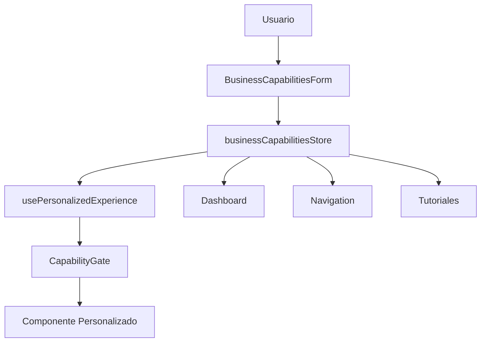

# Sistema de Capacidades Operativas - Documentación Técnica

**Proyecto**: G-Admin Mini  
**Versión**: 1.0  
**Fecha**: 1 de Septiembre de 2025  
**Estado**: Implementado ✅

---

## 📋 Índice

1. [Visión General](#visión-general)
2. [Arquitectura del Sistema](#arquitectura-del-sistema)
3. [Componentes Principales](#componentes-principales)
4. [API y Hooks](#api-y-hooks)
5. [Flujo de Usuario](#flujo-de-usuario)
6. [Guía de Implementación](#guía-de-implementación)
7. [Ejemplos de Uso](#ejemplos-de-uso)
8. [Troubleshooting](#troubleshooting)

---

## 🎯 Visión General

El **Sistema de Capacidades Operativas** permite personalizar completamente la experiencia de G-Admin basándose en las capacidades que tiene cada negocio. Reemplaza el modelo rígido de "tipos de negocio" con un sistema flexible de flags booleanas.

### Objetivos Principales

- **Personalización Total**: Cada usuario ve solo las funcionalidades relevantes para su negocio
- **Escalabilidad**: Fácil agregar nuevas capacidades sin romper código existente
- **UX Simplificada**: Reduce sobrecarga cognitiva mostrando solo lo necesario
- **Flexibilidad**: Los negocios pueden activar/desactivar capacidades según evolucionen

---

## 🏗️ Arquitectura del Sistema

### Estructura Base

```
src/
├── types/
│   └── businessCapabilities.ts     # Tipado y configuración
├── store/
│   └── businessCapabilitiesStore.ts # Estado global (Zustand)
├── hooks/
│   └── usePersonalizedExperience.ts # Hook principal
├── components/
│   ├── setup/
│   │   ├── BusinessCapabilitiesForm.tsx    # Pantalla principal
│   │   └── BasicBusinessInfoForm.tsx       # Formulario simplificado
│   └── personalization/
│       └── CapabilityGate.tsx              # Renderizado condicional
└── examples/
    └── PersonalizedDashboardExample.tsx    # Ejemplo completo
```

### Flujo de Datos



---

## 🧩 Componentes Principales

### 1. Tipos Base (`/types/businessCapabilities.ts`)

Define la estructura fundamental del sistema:

```typescript
// Las 4 capacidades principales
interface BusinessCapabilities {
  has_physical_presence: boolean;    // Venta en Local Físico
  has_delivery_logistics: boolean;   // Entregas y Envíos
  has_online_store: boolean;         // Tienda Online
  has_scheduling_system: boolean;    // Reservas y Turnos
}

// Tiers calculados automáticamente
type OperationalTier = 
  | 'Sin Configurar'
  | 'Base Operativa' 
  | 'Estructura Funcional'
  | 'Negocio Integrado' 
  | 'Sistema Consolidado';
```

### 2. Store Global (`/store/businessCapabilitiesStore.ts`)

Maneja el estado usando Zustand con persistencia:

```typescript
interface BusinessCapabilitiesState {
  profile: BusinessProfile | null;
  enabledFeatures: string[];
  dashboardModules: string[];
  
  // Actions
  setCapability: (capability, value) => void;
  updateBasicInfo: (info) => void;
  hasCapability: (capability) => boolean;
}
```

**Características**:
- ✅ **Persistencia automática** con `zustand/middleware`
- ✅ **Computed values** actualizados en tiempo real
- ✅ **Helper functions** para uso directo en componentes

### 3. Hook Principal (`/hooks/usePersonalizedExperience.ts`)

Centraliza toda la lógica de personalización:

```typescript
const {
  // Estado
  profile, tier,
  
  // Navegación personalizada
  modules, navigationItems,
  
  // Dashboard personalizado  
  dashboardWidgets, dashboardLayout,
  
  // Sistema de tutoriales
  tutorials, onboardingFlow,
  
  // Helpers
  hasCapability, shouldShowFeature
} = usePersonalizedExperience();
```

### 4. Renderizado Condicional (`/components/personalization/CapabilityGate.tsx`)

Componente clave para mostrar/ocultar contenido:

```typescript
// Ejemplos de uso
<CapabilityGate requires={['has_physical_presence']}>
  <SalesModule />
</CapabilityGate>

<CapabilityGate minTier="Estructura Funcional">
  <AdvancedAnalytics />
</CapabilityGate>

// Componentes de conveniencia
<PhysicalPresenceGate>
  <TableManagement />
</PhysicalPresenceGate>
```

---

## 🔧 API y Hooks

### Hook Principal: `usePersonalizedExperience()`

```typescript
const experience = usePersonalizedExperience();

// Verificar capacidades
experience.hasCapability('has_physical_presence') // boolean

// Obtener módulos personalizados
experience.modules // PersonalizedModule[]

// Dashboard personalizado
experience.dashboardWidgets // string[]
experience.dashboardLayout // 'single-column' | 'two-columns' | etc.

// Sistema de tutoriales
experience.tutorials // PersonalizedTutorial[]
```

### Hooks Especializados

```typescript
// Para navegación
const { items, tier, shouldCollapse } = usePersonalizedNavigation();

// Para dashboard
const { widgets, layout, stats } = usePersonalizedDashboard();

// Para verificaciones lógicas
const { can, hasFeature, tier } = useCapabilityCheck();
```

### Store Actions

```typescript
const store = useBusinessCapabilities();

// Configurar capacidades
store.setCapability('has_physical_presence', true);

// Actualizar información básica
store.updateBasicInfo({ businessName: 'Mi Negocio' });

// Verificaciones
store.hasCapability('has_online_store'); // boolean
store.shouldShowModule('ecommerce'); // boolean
```

---

## 🚀 Flujo de Usuario

### Nuevo Flujo de Setup

1. **Welcome Screen** - Saludo inicial
2. **Supabase Connection** - Conectar base de datos
3. **🆕 Business Capabilities** - Seleccionar capacidades (pantalla principal)
4. **Basic Business Info** - Solo datos esenciales (6 campos)
5. **Setup Complete** - Redirigir a dashboard personalizado

### Pantalla de Capacidades

**Layout de 2 columnas**:
- **Izquierda**: Selector de capacidades con cards interactivas
- **Derecha**: Preview en tiempo real del tier + herramientas que se activarán

**Interactividad**:
- ✅ Feedback inmediato al seleccionar capacidades
- ✅ Tier calculado automáticamente
- ✅ Lista de herramientas que se activarán
- ✅ Validación mínima (al menos 1 capacidad)

---

## 💻 Guía de Implementación

### 1. Usar en Componentes Existentes

```typescript
// En cualquier componente
import { CapabilityGate } from '@/components/personalization/CapabilityGate';

export function ExistingComponent() {
  return (
    <div>
      {/* Contenido base */}
      <BasicFeatures />
      
      {/* Contenido condicional */}
      <CapabilityGate requires={['has_physical_presence']}>
        <TableManagement />
      </CapabilityGate>
      
      <CapabilityGate requires={['has_online_store']}>
        <EcommerceTools />
      </CapabilityGate>
    </div>
  );
}
```

### 2. Personalizar Navegación

```typescript
// En Sidebar o Navigation
import { usePersonalizedNavigation } from '@/hooks/usePersonalizedExperience';

export function Navigation() {
  const { items } = usePersonalizedNavigation();
  
  return (
    <nav>
      {items.map(item => (
        <NavItem key={item.id} {...item} />
      ))}
    </nav>
  );
}
```

### 3. Dashboard Personalizado

```typescript
// En Dashboard principal
import { usePersonalizedDashboard } from '@/hooks/usePersonalizedExperience';

export function Dashboard() {
  const { widgets, layout } = usePersonalizedDashboard();
  
  return (
    <div className={`dashboard-${layout}`}>
      {widgets.map(widget => (
        <Widget key={widget} type={widget} />
      ))}
    </div>
  );
}
```

### 4. Lógica Condicional

```typescript
// En componentes con lógica compleja
import { useCapabilityCheck } from '@/components/personalization/CapabilityGate';

export function ComplexComponent() {
  const { can, hasFeature } = useCapabilityCheck();
  
  // Lógica condicional
  const showAdvancedSettings = can('has_physical_presence') && 
                                hasFeature('table_management');
  
  const menuItems = [
    'dashboard',
    ...(can('has_physical_presence') ? ['sales', 'tables'] : []),
    ...(can('has_online_store') ? ['ecommerce'] : [])
  ];
  
  return (
    <div>
      {showAdvancedSettings && <AdvancedSettings />}
      <Menu items={menuItems} />
    </div>
  );
}
```

---

## 📚 Ejemplos de Uso

### Ejemplo 1: Widget Condicional en Dashboard

```typescript
// Solo mostrar si tiene local físico
<PhysicalPresenceGate fallback={<EmptyState />}>
  <Widget title="Estado de Mesas">
    <TableStatus />
  </Widget>
</PhysicalPresenceGate>
```

### Ejemplo 2: Navegación Dinámica

```typescript
const navigationConfig = [
  { path: '/admin', label: 'Dashboard', always: true },
  { path: '/admin/materials', label: 'Materiales', always: true },
  { 
    path: '/admin/sales', 
    label: 'Ventas', 
    requires: 'has_physical_presence' 
  },
  { 
    path: '/admin/delivery', 
    label: 'Entregas', 
    requires: 'has_delivery_logistics' 
  }
];

// Filtrar según capacidades
const visibleItems = navigationConfig.filter(item => 
  item.always || hasCapability(item.requires)
);
```

### Ejemplo 3: Form Condicional

```typescript
export function ProductForm() {
  const { can } = useCapabilityCheck();
  
  return (
    <Form>
      <Input name="name" label="Nombre" />
      <Input name="price" label="Precio" />
      
      {can('has_physical_presence') && (
        <Input name="table_availability" label="Disponible en mesas" />
      )}
      
      {can('has_online_store') && (
        <Input name="online_description" label="Descripción web" />
      )}
      
      {can('has_delivery_logistics') && (
        <Input name="delivery_time" label="Tiempo de entrega" />
      )}
    </Form>
  );
}
```

### Ejemplo 4: Tutorial Condicional

```typescript
export function OnboardingWidget() {
  const { tutorials, onboardingFlow } = usePersonalizedExperience();
  
  return (
    <div>
      <h3>Próximos Pasos</h3>
      {onboardingFlow.map(tutorial => (
        <TutorialCard 
          key={tutorial.id}
          {...tutorial}
          onClick={() => startTutorial(tutorial.id)}
        />
      ))}
    </div>
  );
}
```

---

## 🔧 Configuración de Capacidades

### Agregar Nueva Capacidad

1. **Actualizar tipos** (`/types/businessCapabilities.ts`):
```typescript
interface BusinessCapabilities {
  // ... existentes
  has_new_capability: boolean; // Nueva capacidad
}
```

2. **Agregar definición**:
```typescript
const CAPABILITY_DEFINITIONS = [
  // ... existentes
  {
    id: 'has_new_capability',
    title: 'Nueva Funcionalidad',
    subtitle: 'Descripción breve',
    icon: '🆕',
    description: 'Descripción completa...',
    enabledFeatures: ['feature1', 'feature2']
  }
];
```

3. **Actualizar configuración**:
```typescript
// En MODULE_CONFIG
new_capability: [
  { id: 'new_module', name: 'Nuevo Módulo', path: '/admin/new' }
]

// En DASHBOARD_WIDGETS  
new_capability: ['new_widget', 'related_widget']
```

### Personalizar Tiers

Los tiers se calculan automáticamente por número de capacidades:

```typescript
function calculateOperationalTier(capabilities: BusinessCapabilities): OperationalTier {
  const activeCount = Object.values(capabilities).filter(Boolean).length;
  
  switch (activeCount) {
    case 0: return 'Sin Configurar';
    case 1: return 'Base Operativa';
    case 2: return 'Estructura Funcional';  
    case 3: return 'Negocio Integrado';
    case 4: return 'Sistema Consolidado';
    default: return 'Sin Configurar';
  }
}
```

---

## 🐛 Troubleshooting

### Problemas Comunes

**1. CapabilityGate no funciona**
```typescript
// ❌ Error común
<CapabilityGate requires="has_physical_presence"> // String

// ✅ Correcto  
<CapabilityGate requires={['has_physical_presence']}> // Array
```

**2. Hook fuera del contexto**
```typescript
// ❌ Error: usar hook fuera de componente React
const experience = usePersonalizedExperience(); // En scope global

// ✅ Correcto: dentro del componente
export function MyComponent() {
  const experience = usePersonalizedExperience();
  // ...
}
```

**3. Store no persiste**
- Verificar que `zustand/middleware` esté importado correctamente
- Revisar que `persist` esté configurado en el store
- Limpiar localStorage si hay datos corruptos: `localStorage.removeItem('business-capabilities-store')`

**4. Tiers no se actualizan**
- El tier se calcula automáticamente al cambiar capacidades
- Si no se actualiza, verificar que `setCapability()` se esté llamando correctamente

**5. Componentes no se renderizan**
- Verificar que `setupCompleted: true` en el profile
- Confirmar que las capacidades están activas en el store
- Revisar que `CapabilityGate` tenga las props correctas

### Debug Tips

```typescript
// Para debuggear en componentes
const experience = usePersonalizedExperience();
console.log('Capabilities:', experience.profile?.capabilities);
console.log('Tier:', experience.tier);
console.log('Enabled Features:', experience.enabledFeatures);

// Para debuggear en DevTools
// Buscar en Application > LocalStorage > business-capabilities-store
```

---

## 📈 Métricas y Analytics

### Tracking de Uso

El sistema está preparado para tracking:

```typescript
// Ejemplo de tracking
const { stats, tier } = usePersonalizedExperience();

analytics.track('capability_selected', {
  capability: 'has_physical_presence',
  tier: tier,
  total_capabilities: stats.activeCapabilities
});
```

### Métricas Útiles

- **Distribución de Tiers**: ¿Qué % de usuarios están en cada tier?
- **Capacidades más usadas**: ¿Cuáles se seleccionan más?
- **Combinaciones populares**: ¿Qué combinaciones de capacidades son comunes?
- **Abandono en setup**: ¿Dónde abandonan el flujo de configuración?

---

## 🚀 Roadmap Futuro

### Fase 2 - Milestones System
- [ ] Implementar sistema de objetivos progresivos
- [ ] Dashboard de progreso personalizado
- [ ] Achievements por completar milestones

### Fase 3 - AI Personalization  
- [ ] Sugerencias automáticas de capacidades basadas en uso
- [ ] Recomendaciones de features basadas en tier
- [ ] Optimización automática de dashboard

### Fase 4 - Advanced Features
- [ ] A/B testing por capacidades
- [ ] Feature flags por tier
- [ ] Monetización: features premium por tier

---

**📝 Última actualización**: 1 de Septiembre de 2025  
**👤 Responsable**: Equipo G-Admin  
**📧 Contacto**: Para consultas técnicas, revisar código en `/src/` o contactar al equipo de desarrollo.