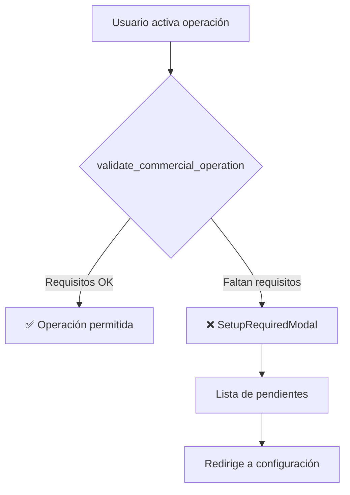

# Sistema de Achievements - Documentación Completa

## Visión General

El sistema de achievements implementa validación de requisitos obligatorios que **bloquean operaciones comerciales** hasta que el negocio esté correctamente configurado.

### Arquitectura



### Archivos Clave

| Archivo | Propósito |
|---------|-----------|
| `constants.ts` | Define los 52 requisitos obligatorios |
| `types.ts` | Interfaces `Achievement`, `ValidationContext` |
| `manifest.tsx` | Hook `validate_commercial_operation` |
| `useValidationContext.ts` | Agrega datos de múltiples stores |
| `achievementsStore.ts` | Estado del modal y progreso |

---

## Requisitos por Capability

### 1. pickup_orders (TakeAway) - 5 requisitos

**Bloquea:** `takeaway:toggle_public`

| ID | Requisito | Validador |
|----|-----------|-----------|
| `takeaway_business_name` | Nombre del negocio | `profile.businessName` |
| `takeaway_address` | Dirección del local | `profile.address` |
| `takeaway_pickup_hours` | Horarios de retiro | `profile.pickupHours` |
| `takeaway_min_products` | 5+ productos publicados | `products.filter(is_published).length >= 5` |
| `takeaway_payment_method` | Método de pago | `paymentMethods.length > 0` |

---

### 2. onsite_service (Dine-In) - 6 requisitos

**Bloquea:** `dinein:open_shift`

| ID | Requisito | Validador |
|----|-----------|-----------|
| `dinein_business_name` | Nombre del negocio | `profile.businessName` |
| `dinein_operating_hours` | Horarios de atención | `profile.operatingHours` |
| `dinein_tables_configured` | 1+ mesa | `tables.length >= 1` |
| `dinein_active_staff` | 1+ empleado activo | `staff.filter(is_active).length >= 1` |
| `dinein_min_products` | 3+ productos publicados | `products.filter(is_published).length >= 3` |
| `dinein_payment_method` | Método de pago | `paymentMethods.length > 0` |

---

### 3. async_operations (E-commerce) - 7 requisitos

**Bloquea:** `ecommerce:toggle_public`

| ID | Requisito | Validador |
|----|-----------|-----------|
| `ecommerce_business_name` | Nombre comercial | `profile.businessName` |
| `ecommerce_logo` | Logo del negocio | `profile.logoUrl` |
| `ecommerce_min_products` | 10+ productos | `products.filter(is_published).length >= 10` |
| `ecommerce_payment_gateway` | Gateway online | `paymentGateways.some(type='online')` |
| `ecommerce_shipping_policy` | Política de envío | `profile.shippingPolicy` |
| `ecommerce_terms_conditions` | Términos legales | `profile.termsAndConditions` |
| `ecommerce_contact_info` | Email + teléfono | `profile.contactEmail && contactPhone` |

---

### 4. delivery_shipping - 4 requisitos

**Bloquea:** `delivery:enable_public`

| ID | Requisito | Validador |
|----|-----------|-----------|
| `delivery_zones` | Zonas de cobertura | `deliveryZones.length > 0` |
| `delivery_rates` | Tarifas por zona | `deliveryZones.every(z => z.deliveryFee !== undefined)` |
| `delivery_active_courier` | 1+ repartidor | `staff.filter(role='courier').length >= 1` |
| `delivery_hours` | Horarios de delivery | `profile.deliveryHours` |

---

### 5. physical_products - 5 requisitos

**Bloquea:** `catalog:publish`

| ID | Requisito | Validador |
|----|-----------|-----------|
| `physical_business_name` | Nombre del negocio | `profile.businessName` |
| `physical_min_materials` | 1+ material | `materials.length >= 1` |
| `physical_min_suppliers` | 1+ proveedor | `suppliers.length >= 1` |
| `physical_min_products` | 3+ productos | `products.length >= 3` |
| `physical_payment_method` | Método de pago | `paymentMethods.length > 0` |

---

### 6. professional_services - 5 requisitos

**Bloquea:** `services:accept_bookings`

| ID | Requisito | Validador |
|----|-----------|-----------|
| `services_business_name` | Nombre del negocio | `profile.businessName` |
| `services_operating_hours` | Horarios | `profile.operatingHours` |
| `services_min_professionals` | 1+ profesional | `staff.filter(role='professional' or 'staff')` |
| `services_min_offerings` | 2+ servicios | `products.filter(type='service', duration > 0)` |
| `services_payment_method` | Método de pago | `paymentMethods.length > 0` |

---

### 7. asset_rental - 4 requisitos

**Bloquea:** `rental:accept_bookings`

| ID | Requisito | Validador |
|----|-----------|-----------|
| `rental_business_name` | Nombre del negocio | `profile.businessName` |
| `rental_min_assets` | 1+ activo | `assets.length >= 1` |
| `rental_pricing_configured` | Precios de alquiler | `products.filter(type='rental', price > 0)` |
| `rental_contact_info` | Email + teléfono | `profile.contactEmail && contactPhone` |

---

### 8. membership_subscriptions - 4 requisitos

**Bloquea:** `membership:accept_subscriptions`

| ID | Requisito | Validador |
|----|-----------|-----------|
| `membership_business_name` | Nombre del negocio | `profile.businessName` |
| `membership_min_plans` | 1+ plan | `products.filter(type='membership')` |
| `membership_payment_gateway` | Gateway de pagos | `paymentGateways.length > 0` |
| `membership_contact_info` | Email + teléfono | `profile.contactEmail && contactPhone` |

---

### 9. digital_products - 4 requisitos

**Bloquea:** `digital:accept_orders`

| ID | Requisito | Validador |
|----|-----------|-----------|
| `digital_business_name` | Nombre del negocio | `profile.businessName` |
| `digital_min_products` | 1+ producto digital | `products.filter(type='digital')` |
| `digital_payment_gateway` | Gateway online | `paymentGateways.length > 0` |
| `digital_contact_email` | Email de soporte | `profile.contactEmail` |

---

### 10. corporate_sales (B2B) - 4 requisitos

**Bloquea:** `b2b:accept_corporate_orders`

| ID | Requisito | Validador |
|----|-----------|-----------|
| `b2b_business_name` | Nombre del negocio | `profile.businessName` |
| `b2b_tax_id` | CUIT/datos fiscales | `profile.taxId` |
| `b2b_min_products` | 5+ productos | `products.length >= 5` |
| `b2b_contact_info` | Email + teléfono | `profile.contactEmail && contactPhone` |

---

### 11. mobile_operations - 4 requisitos

**Bloquea:** `mobile:start_operations`

| ID | Requisito | Validador |
|----|-----------|-----------|
| `mobile_business_name` | Nombre del negocio | `profile.businessName` |
| `mobile_min_products` | 3+ productos | `products.length >= 3` |
| `mobile_contact_phone` | Teléfono | `profile.contactPhone` |
| `mobile_operating_hours` | Horarios | `profile.operatingHours` |

---

## Flujo de Validación

### Componentes que Usan Validación

```typescript
// TakeAwayToggle.tsx
const validation = await achievementsAPI.validateOperation(
  'pickup_orders',
  'takeaway:toggle_public',
  context
);

if (!validation.allowed) {
  openSetupModal({
    title: 'Configuración TakeAway Requerida',
    missing: validation.missingRequirements,
    progress: validation.progressPercentage,
    capability: 'pickup_orders'
  });
}
```

### Stores Involucrados

| Store | Campos Usados |
|-------|---------------|
| `AppStore` | businessName, address, logoUrl, contactEmail, contactPhone, shippingPolicy, termsAndConditions |
| `OperationsStore` | operatingHours, pickupHours, deliveryHours, tables, deliveryZones |
| `FiscalStore` | taxId |
| `ProductsStore` | products (id, name, is_published, type, cost) |
| `StaffStore` | staff (id, name, is_active, role) |
| `PaymentsStore` | paymentMethods, paymentGateways |
| `SuppliersStore` | suppliers |

---

## Cómo Agregar Nuevos Requisitos

1. **Agregar al array en `constants.ts`**:

```typescript
export const MY_CAPABILITY_MANDATORY: Achievement[] = [
  {
    id: 'my_requirement',
    tier: 'mandatory',
    capability: 'my_capability',
    name: 'Descripción corta',
    icon: '📦',
    category: 'setup',
    blocksAction: 'my_capability:action',
    validator: (ctx) => ctx.someField !== undefined,
    redirectUrl: '/admin/path/to/config',
    estimatedMinutes: 5,
  },
];
```

2. **Agregar al array `ALL_MANDATORY_REQUIREMENTS`**

3. **Asegurar que el campo esté en `ValidationContext`**

4. **Verificar que el store proporcione el dato**

---

## Deuda Técnica Conocida

| Issue | Estado | Notas |
|-------|--------|-------|
| `materials` array vacío | ⚠️ Pendiente | MaterialsStore es UI-only, datos vienen de useMaterials hook |
| `assets` array vacío | ⚠️ Pendiente | AssetsStore es UI-only |
| Widget dashboard re-render | ⚠️ Pendiente | AchievementsWidget usa placeholder |
| Ruta /admin/operations/fulfillment/onsite | ⚠️ Pendiente | Muestra "Página no encontrada" |

---

## Resumen de Totales

| Capability | Requisitos | Estado |
|------------|------------|--------|
| pickup_orders | 5 | ✅ |
| onsite_service | 6 | ✅ |
| async_operations | 7 | ✅ |
| delivery_shipping | 4 | ✅ |
| physical_products | 5 | ⚠️ materials/suppliers |
| professional_services | 5 | ✅ |
| asset_rental | 4 | ⚠️ assets |
| membership_subscriptions | 4 | ✅ |
| digital_products | 4 | ✅ |
| corporate_sales | 4 | ✅ |
| mobile_operations | 4 | ✅ |
| **TOTAL** | **52** | |
