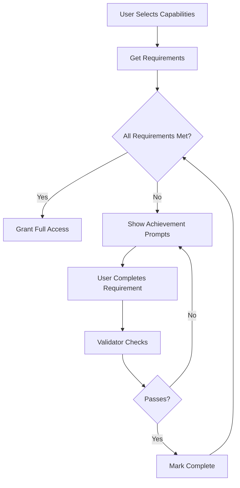

# Capability-Features System Architecture

**Technical deep dive into the 4-layer architecture powering G-Admin Mini's business model flexibility**

**Version**: 4.0 (Atomic Architecture)
**Last Updated**: 2025-01-20

---

## Table of Contents

1. [System Overview](#system-overview)
2. [Layer 1: User Choices](#layer-1-user-choices)
3. [Layer 2: System Features](#layer-2-system-features)
4. [Layer 3: UI/Modules](#layer-3-uimodules)
5. [Layer 4: Requirements & Progression](#layer-4-requirements--progression)
6. [Data Flow](#data-flow)
7. [Component Interactions](#component-interactions)
8. [Architecture Diagrams](#architecture-diagrams)

---

## System Overview

The Capability-Features System is built on **4 distinct layers**, each with specific responsibilities:

```
USER CHOICES → SYSTEM FEATURES → UI/MODULES → REQUIREMENTS
```

### Design Goals

1. **Separation of Concerns**: Each layer has a single responsibility
2. **Declarative Configuration**: Features declared once, activated automatically
3. **Type Safety**: Full TypeScript coverage
4. **Performance**: Computed once, cached, optimized selectors
5. **Testability**: Each layer independently testable

### Key Architecture Decisions

| Decision | Rationale |
|----------|-----------|
| **Atomic Capabilities** | No dependencies between capabilities = combinatorial flexibility |
| **Auto-Activation** | Features activate automatically = simpler UX |
| **Bidirectional Mapping** | MODULE_FEATURE_MAP enables both directions = faster lookups |
| **Centralized Requirements** | Single source of truth = easier maintenance |
| **Reference Deduplication** | Shared requirements by reference = memory efficient |

---

## Layer 1: User Choices

**What users select in the setup wizard**

### Components

#### Business Capabilities (12+)

Atomic capabilities representing **what the business offers**:

```typescript
export type BusinessCapabilityId =
  // CORE BUSINESS MODELS
  | 'physical_products'           // Food, retail, manufactured items
  | 'professional_services'       // Consulting, health, beauty
  | 'asset_rental'                // Equipment, spaces, vehicles
  | 'membership_subscriptions'    // Recurring access
  | 'digital_products'            // Downloadable content

  // FULFILLMENT METHODS
  | 'onsite_service'              // Consume in location
  | 'pickup_orders'               // TakeAway
  | 'delivery_shipping'           // Home delivery

  // SPECIAL OPERATIONS
  | 'async_operations'            // After-hours operations
  | 'corporate_sales'             // B2B sales
  | 'mobile_operations';          // Food truck, mobile services
```

**Key Properties**:
- **Atomic**: Cannot be broken down further
- **Combinable**: Can be selected together (no dependencies)
- **Declarative**: Each declares what features it activates

#### Infrastructure (3)

Represents **how the business operates physically**:

```typescript
export type InfrastructureId =
  | 'single_location'    // Fixed single location
  | 'multi_location'     // Multiple locations (chain)
  | 'mobile_business';   // Mobile operations (truck)
```

**Key Properties**:
- **Mutually Exclusive**: Only one can be selected (enforced by `conflicts` array)
- **Feature Activation**: Can activate additional features (e.g., multi_location → multisite features)

### Configuration Structure

```typescript
// BusinessModelRegistry.ts

const CAPABILITIES: Record<BusinessCapabilityId, BusinessCapability> = {
  'physical_products': {
    id: 'physical_products',
    name: 'Productos Físicos',
    description: 'Comida, retail, manufactura',
    icon: '🍕',
    type: 'business_model',

    // Features auto-activated
    activatesFeatures: [
      'production_bom_management',
      'production_display_system',
      'inventory_stock_tracking',
      'inventory_alert_system',
      'products_recipe_management',
      'sales_order_management',
      // ... 20+ more
    ],

    // Requirements that must be completed
    blockingRequirements: [
      'business_name_configured',
      'product_first_published'
    ]
  }
};
```

### Validation Rules

#### Infrastructure Conflicts

```typescript
const INFRASTRUCTURE: Record<InfrastructureId, Infrastructure> = {
  'multi_location': {
    id: 'multi_location',
    conflicts: ['mobile_business'], // Can't be both chain AND mobile
    activatesFeatures: [
      'multisite_location_management',
      'multisite_centralized_inventory',
      // ...
    ]
  }
};
```

#### Capability Combinations

**All capabilities are atomic and combinable**:

```typescript
// ✅ VALID: Restaurant with all fulfillment methods
['physical_products', 'onsite_service', 'pickup_orders', 'delivery_shipping']

// ✅ VALID: Hybrid business (services + products)
['professional_services', 'physical_products', 'onsite_service']

// ✅ VALID: Digital-only business
['digital_products', 'async_operations']

// ✅ VALID: Rental + memberships (coworking space model)
['asset_rental', 'membership_subscriptions', 'onsite_service']
```

---

## Layer 2: System Features

**Granular features auto-activated by Layer 1**

### Feature Organization

88+ features organized by **domain** (for code organization):

```typescript
export type FeatureId =
  // SALES DOMAIN (26 features)
  | 'sales_order_management'
  | 'sales_payment_processing'
  | 'sales_pos_onsite'
  | 'sales_delivery_orders'
  // ... 22 more

  // INVENTORY DOMAIN (13 features)
  | 'inventory_stock_tracking'
  | 'inventory_alert_system'
  | 'inventory_purchase_orders'
  // ... 10 more

  // PRODUCTION DOMAIN (4 features)
  | 'production_bom_management'
  | 'production_display_system'
  | 'production_order_queue'
  | 'production_capacity_planning'

  // ... 8 more domains (OPERATIONS, SCHEDULING, CUSTOMER, etc.)
```

### Feature Definition

```typescript
// FeatureRegistry.ts

const FEATURE_REGISTRY: Record<FeatureId, Feature> = {
  'sales_order_management': {
    id: 'sales_order_management',
    name: 'Gestión de Órdenes',
    description: 'Sistema base de gestión de pedidos',
    domain: 'SALES',            // Code organization
    category: 'conditional'      // Activation type
  },

  'inventory_stock_tracking': {
    id: 'inventory_stock_tracking',
    name: 'Seguimiento de Stock',
    description: 'Control básico de inventario',
    domain: 'INVENTORY',
    category: 'conditional'
  }
};
```

### Feature Categories

```typescript
type FeatureCategory =
  | 'conditional'     // Activated by capabilities (88+ features)
  | 'premium'         // Future: paid features
  | 'enterprise';     // Future: enterprise-only

// Note: 'always_active' removed in v5.0 (2026-01-19)
// CORE modules now loaded via CORE_MODULES array (see constants.ts)
```

### Auto-Activation Logic

Handled by **FeatureActivationEngine**:

```typescript
// src/lib/features/FeatureEngine.ts

export class FeatureActivationEngine {
  public static activateFeatures(
    capabilities: BusinessCapabilityId[],
    infrastructure: InfrastructureId[]
  ): { activeFeatures: FeatureId[] } {

    // 1. Collect all features from capabilities
    const capabilityFeatures = capabilities.flatMap(capId =>
      getCapability(capId)?.activatesFeatures || []
    );

    // 2. Collect all features from infrastructure
    const infrastructureFeatures = infrastructure.flatMap(infraId =>
      getInfrastructure(infraId)?.activatesFeatures || []
    );

    // 3. Union (deduplicated)
    const allFeatures = [
      ...new Set([...capabilityFeatures, ...infrastructureFeatures])
    ];

    return { activeFeatures: allFeatures };
  }
}
```

### Example: Feature Activation

```typescript
// User selects:
capabilities = ['physical_products', 'onsite_service'];
infrastructure = ['single_location'];

// System activates:
activeFeatures = [
  // From physical_products:
  'production_bom_management',
  'production_display_system',
  'inventory_stock_tracking',
  'inventory_alert_system',
  'products_recipe_management',
  'sales_order_management',
  'sales_payment_processing',

  // From onsite_service:
  'sales_pos_onsite',
  'sales_dine_in_orders',
  'operations_table_management',
  'operations_table_assignment',
  'staff_employee_management',
  'staff_shift_management',

  // From single_location:
  // (no additional features)

  // Total: 40+ features activated
];
```

---

## Layer 3: UI/Modules

**Navigation items and pages shown to user**

### Module-Feature Bidirectional Mapping

**MODULE_FEATURE_MAP** resolves which modules to show based on active features:

```typescript
// FeatureRegistry.ts

export const MODULE_FEATURE_MAP: Record<string, {
  alwaysActive?: boolean;
  requiredFeatures?: FeatureId[];    // AND logic
  optionalFeatures?: FeatureId[];    // OR logic
}> = {
  // CORE MODULES (Always visible)
  'dashboard': {
    alwaysActive: true
  },

  'settings': {
    alwaysActive: true
  },

  // CONDITIONAL MODULES (Feature-dependent)
  'sales': {
    optionalFeatures: [
      'sales_order_management',
      'sales_payment_processing',
      'sales_pos_onsite',
      // ... any sales feature activates this module
    ]
  },

  'delivery': {
    requiredFeatures: [              // ALL required
      'operations_delivery_zones',
      'operations_delivery_tracking'
    ]
  },

  'production': {
    requiredFeatures: [              // ALL required
      'production_bom_management',
      'production_display_system',
      'production_order_queue'
    ]
  }
};
```

### Module Visibility Logic

```typescript
// FeatureRegistry.ts

export function getModulesForActiveFeatures(features: FeatureId[]): string[] {
  const activeModules = new Set<string>();

  Object.entries(MODULE_FEATURE_MAP).forEach(([moduleId, config]) => {
    // Case 1: Always-active modules
    if (config.alwaysActive) {
      activeModules.add(moduleId);
      return;
    }

    // Case 2: Modules with required features (AND logic)
    if (config.requiredFeatures && config.requiredFeatures.length > 0) {
      const hasAllRequired = config.requiredFeatures.every(f =>
        features.includes(f)
      );
      if (hasAllRequired) {
        activeModules.add(moduleId);
      }
      return; // Don't check optional if required not met
    }

    // Case 3: Modules with optional features (OR logic)
    if (config.optionalFeatures && config.optionalFeatures.length > 0) {
      const hasAnyOptional = config.optionalFeatures.some(f =>
        features.includes(f)
      );
      if (hasAnyOptional) {
        activeModules.add(moduleId);
      }
    }
  });

  return Array.from(activeModules);
}
```

### Navigation Integration

```typescript
// Sidebar.tsx

export const Sidebar = () => {
  const activeModules = useCapabilityStore(state => state.getActiveModules());

  const allNavItems = [
    { id: 'dashboard', label: 'Dashboard', icon: HomeIcon },
    { id: 'sales', label: 'Ventas', icon: ShoppingCartIcon },
    { id: 'products', label: 'Productos', icon: PackageIcon },
    { id: 'delivery', label: 'Delivery', icon: TruckIcon },
    // ... more
  ];

  // Filter by active modules
  const visibleNavItems = allNavItems.filter(item =>
    activeModules.includes(item.id)
  );

  return (
    <nav>
      {visibleNavItems.map(item => (
        <NavLink key={item.id} to={`/admin/${item.id}`}>
          {item.icon}
          {item.label}
        </NavLink>
      ))}
    </nav>
  );
};
```

### Dynamic Widget Rendering

```typescript
// Dashboard.tsx

export const DashboardPage = () => {
  const { hasFeature } = useCapabilities();

  return (
    <Dashboard>
      {/* Always visible */}
      <SalesWidget />

      {/* Conditional widgets */}
      {hasFeature('inventory_stock_tracking') && (
        <InventoryWidget />
      )}

      {hasFeature('production_order_queue') && (
        <KitchenDisplayWidget />
      )}

      {hasFeature('operations_delivery_tracking') && (
        <DeliveryTrackingWidget />
      )}

      {hasFeature('staff_shift_management') && (
        <ShiftControlWidget />
      )}
    </Dashboard>
  );
};
```

---

## Layer 4: Requirements & Progression

**Blocking requirements that must be completed**

### Requirement System

Requirements are optional validation gates that must be completed before using a capability:

```typescript
// capability-mapping.ts

export const CAPABILITY_REQUIREMENTS: Record<
  BusinessCapabilityId,
  Achievement[]
> = {
  'delivery_shipping': [
    BUSINESS_NAME_CONFIGURED,      // Shared requirement
    BUSINESS_ADDRESS_CONFIGURED,   // Shared requirement
    DELIVERY_ZONE_CONFIGURED,      // Specific to delivery
    DELIVERY_HOURS_CONFIGURED,     // Specific to delivery
    PAYMENT_METHOD_CONFIGURED,     // Shared requirement
  ],

  'onsite_service': [
    BUSINESS_NAME_CONFIGURED,      // Same reference as above
    BUSINESS_ADDRESS_CONFIGURED,   // Same reference as above
    TABLE_CONFIGURATION,           // Specific to onsite
    ONSITE_HOURS_CONFIGURED,       // Specific to onsite
    PAYMENT_METHOD_CONFIGURED,     // Same reference as above
  ]
};
```

### Shared Requirements Pattern

**Reference-based deduplication** prevents redundant validations:

```typescript
// shared/requirements.ts

export const BUSINESS_NAME_CONFIGURED: Achievement = {
  id: 'business_name_configured',
  tier: 'mandatory',
  name: 'Configurar nombre del negocio',
  validator: (ctx) => !!ctx.profile?.businessName,
  redirectUrl: '/admin/settings/business'
};

export const PAYMENT_METHOD_CONFIGURED: Achievement = {
  id: 'payment_method_configured',
  tier: 'mandatory',
  name: 'Configurar método de pago',
  validator: (ctx) => (ctx.paymentMethods?.length || 0) > 0,
  redirectUrl: '/admin/settings/payment-methods'
};
```

### Requirement Validation Flow



### Progressive Disclosure Example

```typescript
// AchievementsWidget.tsx

export const AchievementsWidget = () => {
  const { profile } = useCapabilities();
  const requirements = getRequirementsForCapabilities(
    profile?.selectedCapabilities || []
  );

  const incomplete = requirements.filter(req => !req.validator(context));

  if (incomplete.length === 0) {
    return <Badge>All Setup Complete!</Badge>;
  }

  return (
    <Card>
      <Heading>Complete Your Setup</Heading>
      {incomplete.map(req => (
        <RequirementCard
          key={req.id}
          requirement={req}
          onClick={() => navigate(req.redirectUrl)}
        />
      ))}
    </Card>
  );
};
```

---

## Data Flow

### Setup Flow (Initial Configuration)

```
┌─────────────────┐
│  Setup Wizard   │
└────────┬────────┘
         │ User selects capabilities
         ↓
┌─────────────────────────────────────┐
│ BusinessModelRegistry               │
│ - Get activatesFeatures[]           │
│ - Get blockingRequirements[]        │
└────────┬────────────────────────────┘
         │
         ↓
┌─────────────────────────────────────┐
│ FeatureActivationEngine             │
│ - Union all features                │
│ - Deduplicate                       │
└────────┬────────────────────────────┘
         │
         ↓
┌─────────────────────────────────────┐
│ Capability Store (Zustand)          │
│ - Store user choices                │
│ - Store active features             │
│ - Persist to DB                     │
└────────┬────────────────────────────┘
         │
         ↓
┌─────────────────────────────────────┐
│ MODULE_FEATURE_MAP                  │
│ - Calculate visible modules         │
└────────┬────────────────────────────┘
         │
         ↓
┌─────────────────────────────────────┐
│ Navigation Sidebar                  │
│ - Render visible modules            │
└─────────────────────────────────────┘
```

### Runtime Flow (Feature Checks)

```
┌─────────────────┐
│  Component      │
└────────┬────────┘
         │ useCapabilities()
         ↓
┌─────────────────────────────────────┐
│ Capability Store                    │
│ - Get active features               │
└────────┬────────────────────────────┘
         │
         ↓
┌─────────────────────────────────────┐
│ hasFeature('feature_id')            │
│ - Check if feature is active        │
└────────┬────────────────────────────┘
         │
         ├──→ Yes → Render Component
         │
         └──→ No  → Hide Component
```

---

## Component Interactions

### Store → Components

```typescript
// Capability Store exposes state and getters
export const useCapabilityStore = create<CapabilityStoreState>((set, get) => ({
  profile: null,
  features: {
    activeFeatures: [],
    blockedFeatures: [],
    pendingMilestones: [],
    // ...
  },

  // Computed getters
  hasFeature: (featureId) => {
    const { features } = get();
    return features.activeFeatures.includes(featureId);
  },

  getActiveModules: () => {
    const { features } = get();
    return getModulesForActiveFeatures(features.activeFeatures);
  }
}));

// Components consume via hooks
export const useCapabilities = () => {
  const store = useCapabilityStore();
  return useMemo(() => ({
    activeFeatures: store.features.activeFeatures,
    visibleModules: store.getActiveModules(),
    hasFeature: store.hasFeature,
    // ...
  }), [store.features.activeFeatures]);
};
```

### Registry → Engine → Store

```typescript
// 1. User action triggers capability toggle
toggleCapability('delivery_shipping');

// 2. Store updates user choices
set((state) => ({
  ...state,
  profile: {
    ...state.profile,
    selectedCapabilities: [...state.profile.selectedCapabilities, 'delivery_shipping']
  }
}));

// 3. Engine recalculates features
const { activeFeatures } = FeatureActivationEngine.activateFeatures(
  updatedProfile.selectedCapabilities,
  updatedProfile.selectedInfrastructure
);

// 4. Store updates active features
set((state) => ({
  ...state,
  features: {
    ...state.features,
    activeFeatures
  }
}));

// 5. Components re-render with new features
// (React rerenders consumers of useCapabilities)
```

---

## Architecture Diagrams

### High-Level System Architecture

```
┌──────────────────────────────────────────────────────────┐
│                      CLIENT LAYER                         │
├──────────────────────────────────────────────────────────┤
│  Setup Wizard  │  Dashboard  │  Navigation  │  Widgets   │
└────────┬─────────────────────┬──────────────┬────────────┘
         │                     │              │
         ↓                     ↓              ↓
┌──────────────────────────────────────────────────────────┐
│                   PRESENTATION LAYER                      │
├──────────────────────────────────────────────────────────┤
│  useCapabilities()  │  useModuleAccess()  │  useFeature()│
└────────┬────────────────────────────────────────────────┘
         │
         ↓
┌──────────────────────────────────────────────────────────┐
│                      STATE LAYER                          │
├──────────────────────────────────────────────────────────┤
│          CapabilityStore (Zustand + Persistence)          │
│  • profile.selectedCapabilities                           │
│  • profile.selectedInfrastructure                         │
│  • features.activeFeatures                                │
└────────┬────────────────────────────────────────────────┘
         │
         ↓
┌──────────────────────────────────────────────────────────┐
│                     BUSINESS LOGIC                        │
├──────────────────────────────────────────────────────────┤
│  FeatureActivationEngine  │  MODULE_FEATURE_MAP          │
└────────┬────────────────────────────────────────────────┘
         │
         ↓
┌──────────────────────────────────────────────────────────┐
│                    CONFIGURATION LAYER                    │
├──────────────────────────────────────────────────────────┤
│  BusinessModelRegistry  │  FeatureRegistry               │
└────────┬────────────────────────────────────────────────┘
         │
         ↓
┌──────────────────────────────────────────────────────────┐
│                      DATA LAYER                           │
├──────────────────────────────────────────────────────────┤
│  Supabase (business_profiles table)                      │
│  • selected_activities: jsonb[]                           │
│  • selected_infrastructure: jsonb[]                       │
│  • computed_configuration: jsonb                          │
└──────────────────────────────────────────────────────────┘
```

### Feature Activation Sequence

```
User                Wizard          Engine          Registry        Store
 │                    │               │               │              │
 │  Select           │               │               │              │
 │  "delivery"       │               │               │              │
 │──────────────────>│               │               │              │
 │                   │               │               │              │
 │                   │  Get features │               │              │
 │                   │  for delivery │               │              │
 │                   │──────────────>│               │              │
 │                   │               │               │              │
 │                   │               │  Query        │              │
 │                   │               │  Registry     │              │
 │                   │               │──────────────>│              │
 │                   │               │               │              │
 │                   │               │  Return 15+   │              │
 │                   │               │  features     │              │
 │                   │               │<──────────────│              │
 │                   │               │               │              │
 │                   │  Activate     │               │              │
 │                   │  features     │               │              │
 │                   │<──────────────│               │              │
 │                   │               │               │              │
 │                   │  Store        │               │              │
 │                   │  choices +    │               │              │
 │                   │  features     │               │              │
 │                   │───────────────────────────────>              │
 │                   │               │               │              │
 │  <Wizard Done>    │               │               │              │
 │<──────────────────│               │               │              │
 │                   │               │               │              │
 │  Navigate to      │               │               │              │
 │  Dashboard        │               │               │              │
 │──────────────────────────────────────────────────────────────>  │
 │                   │               │               │              │
 │                   │               │               │   Rehydrate  │
 │                   │               │               │   features   │
 │                   │               │               │<─────────────│
 │                   │               │               │              │
 │  Dashboard        │               │               │              │
 │  renders with     │               │               │              │
 │  delivery widgets │               │               │              │
 │<──────────────────────────────────────────────────────────────  │
```

---

## Performance Considerations

### Optimization Strategies

1. **Memoization**: `useCapabilities()` uses `React.useMemo` to prevent unnecessary rerenders
2. **Selector Optimization**: Zustand allows granular subscriptions
3. **Computed Caching**: `getActiveModules()` computed on-demand, not stored
4. **Reference Preservation**: Array references preserved when content unchanged

### Performance Metrics

```typescript
// ✅ FAST: Direct feature check
const hasDelivery = useCapabilityStore(state =>
  state.features.activeFeatures.includes('sales_delivery_orders')
);

// ⚠️ SLOWER: Full object subscription
const { activeFeatures } = useCapabilities(); // Creates new object each render
const hasDelivery = activeFeatures.includes('sales_delivery_orders');

// ✅ OPTIMIZED: Specific selector
const hasDelivery = useFeature('sales_delivery_orders');
```

---

## Testing Strategies

### Unit Tests

```typescript
describe('FeatureActivationEngine', () => {
  it('should activate delivery features when delivery_shipping selected', () => {
    const result = FeatureActivationEngine.activateFeatures(
      ['delivery_shipping'],
      ['single_location']
    );

    expect(result.activeFeatures).toContain('operations_delivery_zones');
    expect(result.activeFeatures).toContain('operations_delivery_tracking');
  });

  it('should deduplicate features from multiple capabilities', () => {
    const result = FeatureActivationEngine.activateFeatures(
      ['physical_products', 'onsite_service'], // Both activate inventory
      ['single_location']
    );

    const inventoryFeatures = result.activeFeatures.filter(f =>
      f.startsWith('inventory_')
    );

    // Should not have duplicates
    expect(inventoryFeatures.length).toBe(new Set(inventoryFeatures).size);
  });
});
```

### Integration Tests

```typescript
describe('Capability Store Integration', () => {
  it('should update visible modules when capability toggled', () => {
    const { result } = renderHook(() => useCapabilities());

    act(() => {
      result.current.toggleCapability('delivery_shipping');
    });

    expect(result.current.visibleModules).toContain('delivery');
  });
});
```

---

## Next Steps

- **[REGISTRIES.md](./REGISTRIES.md)**: Complete registry reference
- **[DEVELOPER_GUIDE.md](./DEVELOPER_GUIDE.md)**: Practical development guide
- **[PATTERNS.md](./PATTERNS.md)**: Design patterns and best practices
