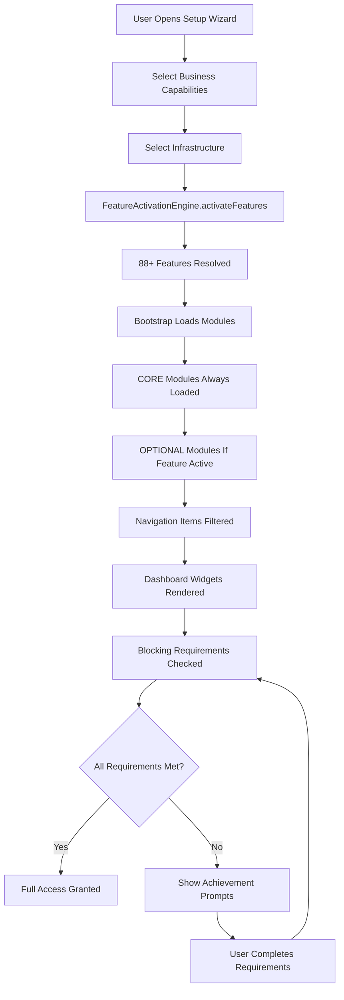
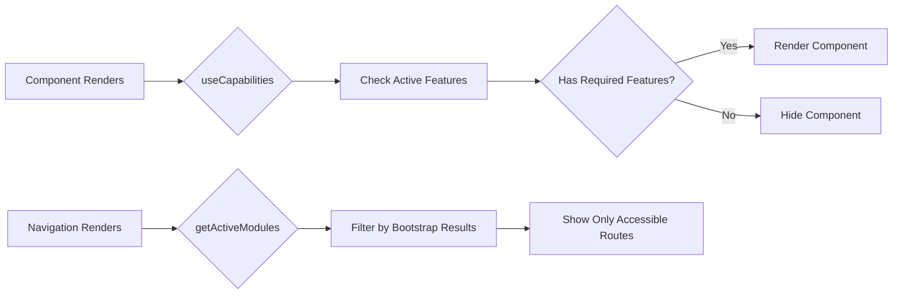

# Capability-Features System

**Complete documentation suite for G-Admin Mini's sophisticated business model configuration and feature activation system**

**Version**: 5.0 (Simplified Architecture)
**Last Updated**: 2026-01-19
**Status**: Production-ready

> ⚡ **NEW v5.0**: Simplified module loading with `CORE_MODULES` and `OPTIONAL_MODULES`.
> Removed over-engineering (autoInstall, enhancedBy, MODULE_FEATURE_MAP auto-generation).
> See [Simplified Architecture](#simplified-architecture-v50) below.

---

## Quick Navigation

| Document | Description | Audience |
|----------|-------------|----------|
| **[ARCHITECTURE.md](./ARCHITECTURE.md)** | Technical architecture and layer design | Developers, Architects |
| **[REGISTRIES.md](./REGISTRIES.md)** | Complete registry reference (88+ features, 12+ capabilities) | Developers |
| **[DEVELOPER_GUIDE.md](./DEVELOPER_GUIDE.md)** | Practical development guide with code examples | Developers |
| **[PATTERNS.md](./PATTERNS.md)** | Design patterns and best practices | Developers, Architects |
| **[API_REFERENCE.md](./API_REFERENCE.md)** | Complete API documentation | Developers |
| **[MIGRATIONS.md](./MIGRATIONS.md)** | Migration guides and version history | Developers, DevOps |
| **[TROUBLESHOOTING.md](./TROUBLESHOOTING.md)** | Common issues and solutions | All |

---

## What is the Capability-Features System?

The **Capability-Features System** is a sophisticated architecture that enables **Progressive Disclosure** and **Business Model Flexibility** in G-Admin Mini. It allows businesses to configure exactly what they offer and how they operate, automatically activating only the features they need.

### Core Principles

1. **User Choices First**: Users select business capabilities (what they sell/offer) and infrastructure (how they operate)
2. **Automatic Feature Activation**: System automatically activates 88+ granular features based on user choices
3. **Progressive Disclosure**: Only show UI/features relevant to the configured business model
4. **Combinatorial Flexibility**: 12+ capabilities can be mixed and matched to support unique business models

---

## The 3-Layer Architecture

```
┌─────────────────────────────────────────────────────────────┐
│ LAYER 1: USER CHOICES                                       │
│ What users select in setup wizard                           │
├─────────────────────────────────────────────────────────────┤
│ • Business Capabilities (12+)                               │
│   - physical_products, professional_services, etc.          │
│ • Infrastructure (3)                                        │
│   - single_location, multi_location, mobile_business        │
└─────────────────────────────────────────────────────────────┘
                          ↓
                 activatesFeatures[]
                          ↓
┌─────────────────────────────────────────────────────────────┐
│ LAYER 2: SYSTEM FEATURES                                    │
│ Granular capabilities auto-activated by Layer 1             │
├─────────────────────────────────────────────────────────────┤
│ • 88+ Atomic Features                                       │
│   Organized by domain:                                      │
│   - SALES (26), INVENTORY (13), PRODUCTION (4)              │
│   - OPERATIONS (15), SCHEDULING (4), CUSTOMER (5)           │
│   - FINANCE (4), STAFF (6), RENTAL (5)                      │
│   - MEMBERSHIP (5), DIGITAL (4), MOBILE (3)                 │
│   - MULTISITE (5), ANALYTICS (2), CORE (7)                  │
└─────────────────────────────────────────────────────────────┘
                          ↓
            getDynamicModuleFeatureMap()
          (Auto-generated from manifests)
                          ↓
┌─────────────────────────────────────────────────────────────┐
│ LAYER 3: UI/MODULES                                         │
│ Navigation items and pages shown to user                    │
├─────────────────────────────────────────────────────────────┤
│ • Dynamic Navigation                                        │
│   - Only show modules user can access                       │
│ • Dynamic Widgets                                           │
│   - Only render relevant dashboard widgets                  │
│ • Conditional UI                                            │
│   - Show/hide features based on active capabilities         │
└─────────────────────────────────────────────────────────────┘
                          ↓
                 blockingRequirements[]
                          ↓
┌─────────────────────────────────────────────────────────────┐
│ LAYER 4: REQUIREMENTS & PROGRESSION (Optional)              │
│ Blocking requirements that must be completed                │
├─────────────────────────────────────────────────────────────┤
│ • Achievements System                                       │
│   - business_address_required                               │
│   - payment_method_configured                               │
│   - product_min_catalog (5 products)                        │
│ • Progressive Unlocking                                     │
│   - Motivate users to complete setup                        │
│   - Gamification integration                                │
└─────────────────────────────────────────────────────────────┘
```

---

## Quick Example

### How a Restaurant Sets Up

```typescript
// User selects in wizard:
const userChoices = {
  capabilities: [
    'physical_products',    // We make food
    'onsite_service',       // Customers eat here
    'pickup_orders',        // TakeAway available
    'delivery_shipping'     // We also deliver
  ],
  infrastructure: ['single_location']
};

// System automatically activates 40+ features:
const activeFeatures = [
  // PRODUCTION
  'production_bom_management',        // Recipes
  'production_display_system',        // Kitchen Display
  'production_order_queue',           // Order queue

  // INVENTORY
  'inventory_stock_tracking',         // Stock control
  'inventory_alert_system',           // Low stock alerts
  'inventory_supplier_management',    // Suppliers

  // SALES
  'sales_order_management',           // Orders
  'sales_payment_processing',         // Payments
  'sales_pos_onsite',                 // POS
  'sales_pickup_orders',              // TakeAway
  'sales_delivery_orders',            // Delivery

  // OPERATIONS
  'operations_table_management',      // Tables
  'operations_delivery_zones',        // Delivery zones
  'operations_delivery_tracking',     // Track drivers

  // ... 30+ more features
];

// Navigation automatically shows:
visibleModules = [
  'dashboard',
  'sales',           // ✅ Has sales features
  'products',        // ✅ Has product features
  'materials',       // ✅ Has inventory features
  'operations',      // ✅ Has operations features
  'suppliers',       // ✅ Has supplier features
  'staff',           // ✅ Has staff features
  // 'memberships'   // ❌ Not selected
  // 'rentals'       // ❌ Not selected
];
```

---

## Key Concepts

### Business Capabilities (What You Offer)

**Core Business Models**:
- `physical_products` - Food, retail, manufactured items
- `professional_services` - Consulting, health, beauty, repairs
- `asset_rental` - Equipment, spaces, vehicles for rent
- `membership_subscriptions` - Recurring access to services/spaces
- `digital_products` - Downloadable files, licenses

**Fulfillment Methods**:
- `onsite_service` - Consume in location (tables, booths)
- `pickup_orders` - Customer picks up (TakeAway)
- `delivery_shipping` - Deliver to customer

**Special Operations**:
- `async_operations` - Receive orders/bookings after hours
- `corporate_sales` - B2B sales
- `mobile_operations` - Food truck, mobile services

### Infrastructure (How You Operate)

- `single_location` - Fixed single location
- `multi_location` - Multiple locations (chain/franchise)
- `mobile_business` - Mobile business (truck, van)

### Features (System Capabilities)

88+ granular features organized by domain. Examples:
- `sales_order_management` - Order processing
- `inventory_stock_tracking` - Inventory control
- `production_bom_management` - Recipe/BOM management
- `operations_table_management` - Table management
- `scheduling_appointment_booking` - Appointment scheduling

---

## How It Works

### Setup Flow



### Runtime Flow



---

## Real-World Examples

### Example 1: Coffee Shop

```typescript
{
  capabilities: ['physical_products', 'onsite_service', 'pickup_orders'],
  infrastructure: ['single_location']
}

// Auto-activates:
// - POS, tables, recipes, inventory, suppliers
// - Pickup scheduling, notifications
// - Staff management, shifts
```

### Example 2: Beauty Salon

```typescript
{
  capabilities: ['professional_services', 'async_operations'],
  infrastructure: ['single_location']
}

// Auto-activates:
// - Appointment booking, calendar, reminders
// - After-hours online booking
// - Staff scheduling, performance tracking
// - Customer history, preferences
```

### Example 3: Digital Product Store

```typescript
{
  capabilities: ['digital_products', 'async_operations'],
  infrastructure: [] // No physical location
}

// Auto-activates:
// - E-commerce catalog, cart, checkout
// - Digital file delivery, license management
// - Download tracking, version control
// - 24/7 operations (no shifts needed)
```

### Example 4: Multi-Location Restaurant Chain

```typescript
{
  capabilities: [
    'physical_products',
    'onsite_service',
    'pickup_orders',
    'delivery_shipping'
  ],
  infrastructure: ['multi_location']
}

// Auto-activates:
// - All restaurant features (recipes, POS, tables, delivery)
// - Multi-location management
// - Centralized inventory
// - Transfer orders between locations
// - Comparative analytics
// - Per-site configuration
```

---

## Integration with Other Systems

### Achievements System

The Capability-Features System integrates with the Achievements module to create **blocking requirements**:

```typescript
// Capability declares blocking requirement
{
  id: 'delivery_shipping',
  blockingRequirements: [
    'delivery_zones_required',
    'delivery_fees_required'
  ]
}

// Achievement system provides the requirement
{
  id: 'delivery_zones_required',
  validator: (ctx) => (ctx.deliveryZones?.length || 0) > 0,
  redirectUrl: '/admin/operations/delivery'
}
```

See [Achievements System Documentation](../achievements/README.md)

### Permissions System

Features can be gated by user roles:

```typescript
// Feature is active but user lacks permission
if (hasFeature('executive') && !hasPermission('view_executive_dashboard')) {
  // Show "upgrade to manager role" prompt
}
```

See [Permissions Registry](../../src/config/PermissionsRegistry.ts)

### Module System

Features determine which modules are registered and visible:

```typescript
// Module manifest declares feature requirements
export const salesManifest = {
  id: 'sales',
  requiredFeatures: ['sales_order_management'], // AND logic
  optionalFeatures: ['sales_pos_onsite', 'sales_delivery_orders'] // OR logic
};
```

See [Module System Documentation](../architecture/MODULE_SYSTEM.md)

---

## Benefits

### For Users

- **Simplified Setup**: Select what you do, not technical features
- **Clean UI**: Only see what's relevant to your business
- **Guided Onboarding**: Clear requirements to complete
- **Flexibility**: Combine capabilities for unique models

### For Developers

- **Declarative Configuration**: Define features once, use everywhere
- **Type Safety**: Full TypeScript support
- **Maintainability**: Clear separation of concerns
- **Testability**: Each layer can be tested independently
- **Extensibility**: Add new capabilities/features without breaking existing code

### For Product

- **Market Fit**: Support diverse business models
- **Gradual Adoption**: Users can add capabilities as they grow
- **Upsell Opportunities**: Clear feature progression
- **Analytics**: Track which capabilities are most popular

---

## Architecture Patterns Used

### 1. Feature Flags Pattern
Inspired by LaunchDarkly, ConfigCat - features are toggled based on configuration.

### 2. Progressive Disclosure (Nielsen Norman Group)
Show complexity gradually as users need it.

### 3. Atomic Design
Capabilities are atomic (can't be broken down) and combinable.

### 4. Strategy Pattern
Different widget modes based on capability combinations.

### 5. Rule Engine
Declarative rules for feature activation.

### 6. Dynamic Configuration (v3.0)
Auto-generate mappings from source of truth (manifests) instead of manual duplication.

---

## Simplified Architecture v5.0

**New in v5.0 (2026-01-19)**: Removed over-engineering and aligned with industry patterns (Odoo, WordPress, VS Code).

### What Changed

**REMOVED (Over-engineering):**
- ❌ `autoInstall` property (replaced with CORE_MODULES array)
- ❌ `enhancedBy` property (not used in practice)
- ❌ `CORE_FEATURES` auto-injection (circular logic)
- ❌ Dynamic `MODULE_FEATURE_MAP` generation (unnecessary complexity)

**ADDED (Simplicity):**
- ✅ `CORE_MODULES` array - Always loaded (6 modules)
- ✅ `OPTIONAL_MODULES` mapping - Loaded conditionally (29 modules)
- ✅ Declarative `CAPABILITY_FEATURES` mapping
- ✅ Simplified bootstrap logic

### Before v5.0 (Complex) ❌

```typescript
// Scattered logic, multiple systems
export const myModuleManifest: ModuleManifest = {
  id: 'my-module',
  autoInstall: false,           // Property 1
  activatedBy: 'some_feature',   // Property 2
  enhancedBy: ['extra1', 'extra2'] // Property 3 (unused)
};

// CORE_FEATURES auto-injected in FeatureActivationService
const features = [...CORE_FEATURES, ...conditionalFeatures];

// MODULE_FEATURE_MAP generated at runtime
const map = getDynamicModuleFeatureMap();
```

### After v5.0 (Simple) ✅

```typescript
// Single source of truth in constants.ts
export const CORE_MODULES = [
  'dashboard', 'settings', 'debug',
  'customers', 'sales', 'gamification'
] as const;

export const OPTIONAL_MODULES = {
  'materials': 'inventory_stock_tracking',
  'products': 'products_recipe_management',
  // ... 27 more
} as const;

// Module manifest - clean and minimal
export const materialsManifest: ModuleManifest = {
  id: 'materials',
  depends: [],
  activatedBy: 'inventory_stock_tracking',
  // ✅ That's it! No autoInstall, no enhancedBy
};

// Bootstrap loads CORE always, OPTIONAL conditionally
function loadModules(activeFeatures: FeatureId[]) {
  const modules = new Set();

  // 1. CORE modules - always
  CORE_MODULES.forEach(id => modules.add(id));

  // 2. OPTIONAL modules - if feature active
  Object.entries(OPTIONAL_MODULES).forEach(([moduleId, featureId]) => {
    if (activeFeatures.includes(featureId)) {
      modules.add(moduleId);
    }
  });

  return Array.from(modules);
}
```

### Benefits

1. **Simpler**: 3 arrays instead of complex auto-generation
2. **Clearer**: Explicit CORE vs OPTIONAL separation
3. **Industry-aligned**: Matches Odoo, WordPress, VS Code patterns
4. **Maintainable**: Easy to understand and modify
5. **No Duplication**: Single source of truth (constants.ts)

**Full details**: See `docs/plans/2026-01-19-capabilities-architecture-simplification.md`

---

## Version History

| Version | Date | Changes |
|---------|------|---------|
| **5.0** | 2026-01 | Simplified architecture - removed autoInstall, enhancedBy, CORE_FEATURES |
| **4.0** | 2025-01 | Atomic architecture, online_store → async_operations |
| **3.0** | 2024-12 | Centralized requirements mapping + Dynamic MODULE_FEATURE_MAP (now deprecated) |
| **2.0** | 2024-11 | Business Model Registry refactor |
| **1.0** | 2024-09 | Initial capability system |

---

## Related Documentation

### Internal Docs
- [Architecture Deep Dive](./ARCHITECTURE.md)
- [Registry Reference](./REGISTRIES.md)
- [Developer Guide](./DEVELOPER_GUIDE.md)
- [API Reference](./API_REFERENCE.md)
- [Migration Guides](./MIGRATIONS.md)
- [Troubleshooting](./TROUBLESHOOTING.md)
- **[Simplified Architecture v5.0](../../docs/plans/2026-01-19-capabilities-architecture-simplification.md)** ⚡ NEW

### External Resources
- [Feature Flags Best Practices (LaunchDarkly)](https://launchdarkly.com/blog/feature-flag-best-practices/)
- [Progressive Disclosure (NN/G)](https://www.nngroup.com/articles/progressive-disclosure/)
- [Atomic Design (Brad Frost)](https://bradfrost.com/blog/post/atomic-web-design/)

---

## Support

### For Questions
- Check [Troubleshooting Guide](./TROUBLESHOOTING.md)
- Review [API Reference](./API_REFERENCE.md)
- See code examples in [Developer Guide](./DEVELOPER_GUIDE.md)

### For Issues
- Check [Known Issues](./TROUBLESHOOTING.md#known-issues)
- Review [Migration Guides](./MIGRATIONS.md) if upgrading

### For Feature Requests
- Understand current architecture in [ARCHITECTURE.md](./ARCHITECTURE.md)
- Review design patterns in [PATTERNS.md](./PATTERNS.md)

---

**Next**: Read [ARCHITECTURE.md](./ARCHITECTURE.md) for technical deep dive.
