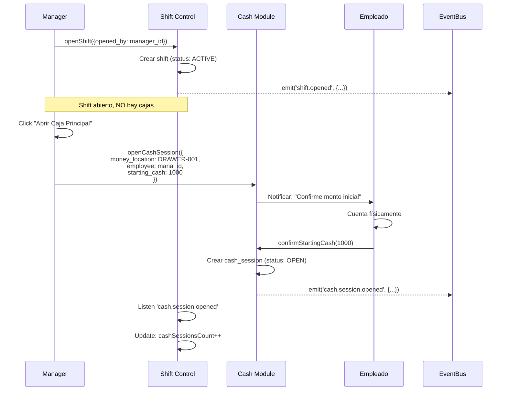
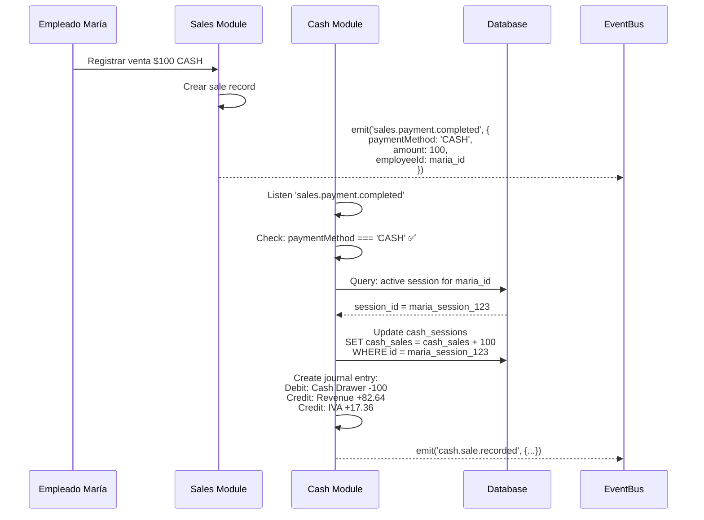
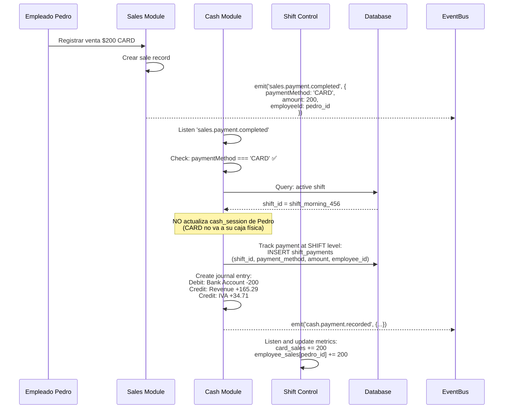
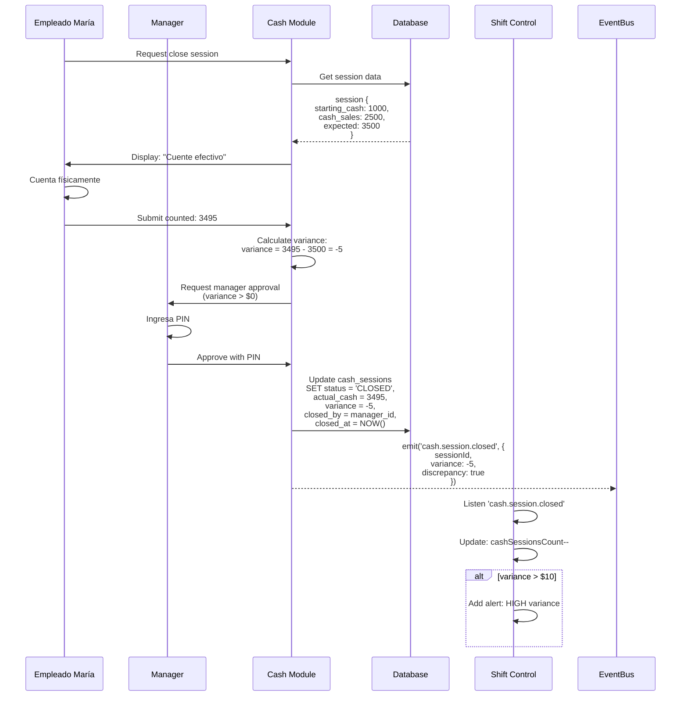
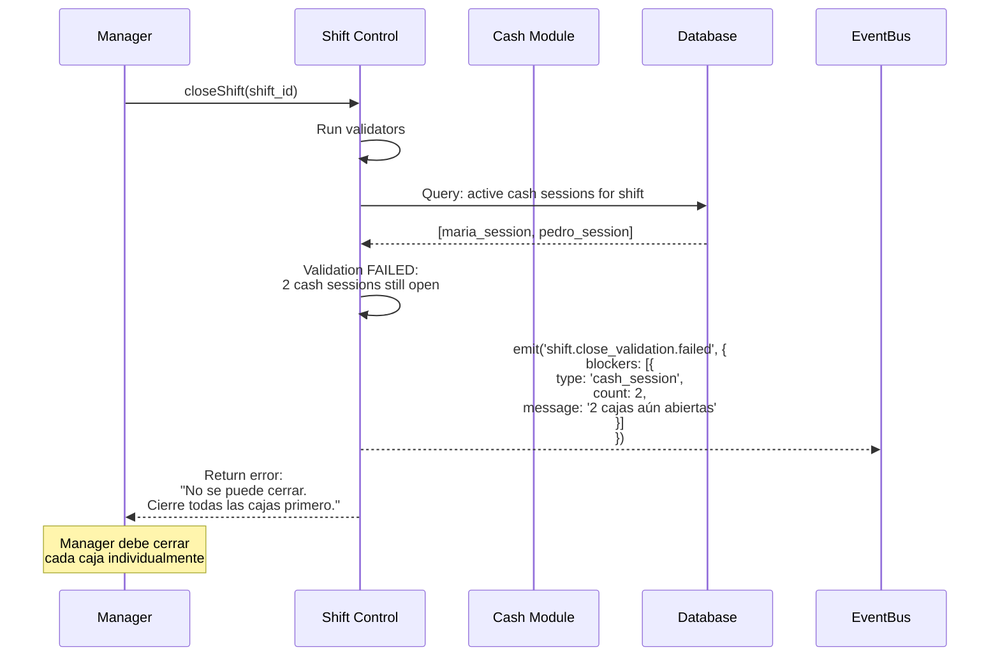

# 💼 CASH & OPERATIONAL FLOWS - DISEÑO ESTRATÉGICO

**Project**: G-Admin Mini
**Date**: 2025-12-09
**Status**: Diseño basado en investigación de industria
**Scope**: Flujos operativos, responsabilidad, coordinación Shift ⟷ Cash

---

## 📊 RESEARCH SUMMARY: Industry Best Practices

### Sistemas Investigados
- **Toast POS** (USA - líder en restaurants)
- **Square for Restaurants** (USA - popular SMB)
- **Microsoft Dynamics 365 Commerce** (Enterprise)
- **Maxirest** (Argentina - 28,000+ users)

---

## 🎯 PATRONES IDENTIFICADOS EN LA INDUSTRIA

### 1. Modelos de Responsabilidad del Dinero

#### ✅ **Patrón A: Individual Accountability (RECOMENDADO)**
**Usado por**: Toast, Square, Dynamics 365 (stand-alone shifts)

```
1 Empleado = 1 Caja = Responsabilidad Exclusiva

Características:
├─ Empleado firma al recibir caja (ownership)
├─ Solo ese empleado opera esa caja durante su turno
├─ Cualquier discrepancia → responsable claro
└─ Segregation of duties: manager supervisa cierre
```

**Ventajas**: ✅ Accountability máxima, ✅ Prevención de fraude, ✅ Auditoría clara
**Desventajas**: ❌ Requiere más cajas físicas

---

#### ⚠️ **Patrón B: Shared Accountability**
**Usado por**: Algunos retailers con limitaciones físicas

```
N Empleados = 1 Caja = Responsabilidad Compartida

Características:
├─ Múltiples empleados usan la misma caja
├─ Difícil determinar responsable de errores
└─ Requiere tracking detallado por transacción
```

**Ventajas**: ✅ Flexibilidad, menos cajas necesarias
**Desventajas**: ❌ Accountability débil, ❌ Mayor riesgo de fraude

---

#### ⚠️ **Patrón C: Pooled/Group Shifts**
**Usado por**: Mobile POS environments (tablets)

```
N Empleados = N Cajas = Responsabilidad Grupal

Características:
├─ Todos comparten pool de cajas
├─ Cualquier empleado usa cualquier caja
└─ Reconciliación al final del día (no por empleado)
```

**Ventajas**: ✅ Máxima flexibilidad
**Desventajas**: ❌ No accountability individual, ❌ No apto para efectivo

---

### 2. Procedimientos Operativos Estándar

#### **A. Opening Shift (Abrir Turno)**

**Toast/Square Pattern:**
```
1. Manager abre turno operacional (shift)
2. Manager prepara cajas con starting cash ($150-200 típico)
3. Para cada empleado:
   ├─ Manager entrega caja
   ├─ Empleado cuenta físicamente
   ├─ Empleado firma "Cash Drawer Receipt"
   └─ Sistema registra: employee_id + drawer_id + starting_amount
4. Empleado tiene "ownership" de su caja durante todo el turno
```

**Key Points**:
- ✅ **Dual verification**: Manager + Empleado cuentan juntos
- ✅ **Signature required**: Empleado acepta responsabilidad
- ✅ **Starting amount fijo**: Facilita reconciliación

---

#### **B. During Shift (Durante el Turno)**

**Toast/Square Pattern:**
```
Por cada venta en EFECTIVO:
├─ Empleado registra venta en su POS
├─ Sistema asigna venta a SU cash drawer
├─ Efectivo va a SU caja física
└─ Sistema trackea: employee_id + transaction_id + amount

Por cada venta NO-EFECTIVO (CARD/TRANSFER/QR):
├─ Empleado registra venta en su POS
├─ Sistema trackea venta pero NO va a cash drawer
├─ Se atribuye al empleado (para comisiones/metrics)
└─ Se trackea a nivel de shift (agregado)

Skims (Retiros intermedios):
├─ Si caja tiene mucho efectivo (>$500)
├─ Manager retira exceso ("skim")
├─ Requiere 2 firmas (dual verification)
└─ Sistema registra: cash_drop con timestamp
```

**Key Points**:
- ✅ **CASH**: Se atribuye a caja individual del empleado
- ✅ **NO-CASH**: Se atribuye al shift (agregado) o empleado (para métricas)
- ✅ **Skims**: Previenen robo, reducen riesgo

---

#### **C. Closing Shift (Cerrar Turno)**

**Toast/Square Pattern:**
```
Para cada empleado:
1. Empleado solicita "Shift Review"
2. Empleado cuenta efectivo en su caja físicamente
3. Empleado ingresa cantidad contada en sistema
4. Sistema calcula:
   ├─ Expected: starting_cash + cash_sales - cash_refunds - skims
   ├─ Actual: cantidad contada por empleado
   └─ Variance: expected - actual
5. Manager verifica:
   ├─ Cuenta caja junto con empleado (dual verification)
   ├─ Revisa variance
   ├─ Si variance > $5: Investiga
   └─ Firma closeout
6. Sistema cierra cash drawer de ese empleado
7. Empleado entrega caja a manager (o deposita en safe)

Para NO-CASH:
├─ Sistema calcula: total CARD/TRANSFER/QR del turno
├─ No requiere conteo físico
└─ Se reporta como parte del shift total
```

**Key Points**:
- ✅ **Empleado NO se auto-reconcilia**: Segregation of duties
- ✅ **Manager DEBE verificar**: Prevención de fraude
- ✅ **Dual signatures**: Accountability de ambos
- ✅ **Variance threshold**: ej. >$5 dispara investigación

---

### 3. Cierre de Mesa vs Cierre de Caja (Restaurant Specific)

**Observación de Usuario**: "Vi una moza cerrando mesa con código en Maxirest"

**Pattern Identificado**:
```
CIERRE DE MESA (Table Close / Order Complete):
├─ Empleado cierra orden/mesa
├─ Puede requerir: PIN/código del empleado
├─ Sistema marca: order_completed_by = employee_id
├─ Propósito: Tracking de quién procesó la venta
├─ NO cierra la caja del empleado
└─ Empleado sigue trabajando

CIERRE DE CAJA (Cash Drawer Close / Shift End):
├─ Empleado termina su turno
├─ Requiere: Manager approval
├─ Sistema cierra cash drawer
├─ Propósito: Reconciliar efectivo del turno
└─ Empleado no puede seguir vendiendo con esa caja
```

**Son procesos SEPARADOS e INDEPENDIENTES**

---

## 🏗️ DISEÑO PROPUESTO PARA G-ADMIN

### Decisión: **Modelo Híbrido (Individual Accountability + Multi-Location)**

#### Características Clave

```
ESTRUCTURA:
1 Shift Operacional (business is open)
  ├─ N Cash Sessions (1 por empleado que maneja efectivo)
  │  ├─ Cash Session 1: Juan - Caja Principal
  │  ├─ Cash Session 2: María - Caja Barra
  │  └─ Cash Session 3: Pedro - Delivery (si maneja cash)
  │
  ├─ Non-Cash Payments: Agregados al shift (no por caja)
  │  ├─ CARD payments → shift-level tracking
  │  ├─ TRANSFER payments → shift-level tracking
  │  └─ QR payments → shift-level tracking
  │
  └─ Validation al cerrar: TODAS las cajas deben estar cerradas
```

---

### Coordinación: **SEMI-ACOPLADO con UX Inteligente**

```
ABRIR SHIFT:
┌─────────────────────────────────────┐
│ Manager abre "Shift Operacional"    │
│ Fecha: 2025-12-09                   │
│ Turno: Mañana (8am - 4pm)           │
│ Abierto por: Manager Juan           │
└─────────────────────────────────────┘
           ↓
┌─────────────────────────────────────┐
│ ⚠️  No hay cajas abiertas           │
│                                      │
│ [Abrir Caja Principal]  ← CTA       │
│ [ + Agregar otra caja ]             │
└─────────────────────────────────────┘
           ↓
┌─────────────────────────────────────┐
│ Abrir Cash Session                  │
│ ───────────────────────────────────  │
│ Caja: Caja Principal                │
│ Empleado: María (Cajera)            │
│ Monto inicial: $1,000.00            │
│                                      │
│ ✅ María debe contar y confirmar    │
│ [Confirmar y Abrir]                 │
└─────────────────────────────────────┘
```

**Key Points**:
- ✅ **Shift y Cash son independientes** (no acoplados forzosamente)
- ✅ **UX sugiere abrir caja** cuando shift abre (CTA prominente)
- ✅ **Manager puede abrir N cajas** según necesidad del negocio
- ✅ **Empleado firma digitalmente** al recibir caja

---

```
DURANTE SHIFT:
┌─────────────────────────────────────┐
│ 🟢 Shift Activo: Turno Mañana       │
│                                      │
│ 💰 Cajas Abiertas: 2                │
│   ├─ María - Caja Principal         │
│   └─ Pedro - Caja Barra             │
│                                      │
│ 💳 Ventas del Turno:                │
│   ├─ Efectivo: $2,500 (2 cajas)     │
│   ├─ Tarjeta: $8,000 (shift-level)  │
│   └─ QR: $500 (shift-level)         │
│                                      │
│ Total Turno: $11,000                │
└─────────────────────────────────────┘
```

**Venta CASH**:
```
Cliente paga $100 en efectivo a María
  ↓
ModernPaymentProcessor emite:
  sales.payment.completed {
    paymentMethod: 'CASH',
    amount: 100,
    employeeId: 'maria-id'
  }
  ↓
Cash Module handler:
  ├─ Identifica: María tiene cash session abierta
  ├─ Registra: cash_session_id = maría.session.id
  ├─ Actualiza: maría.session.cash_sales += 100
  └─ Crea journal entry con money_location_id = DRAWER-001
```

**Venta NO-CASH**:
```
Cliente paga $100 con tarjeta a Pedro
  ↓
ModernPaymentProcessor emite:
  sales.payment.completed {
    paymentMethod: 'CARD',
    amount: 100,
    employeeId: 'pedro-id'
  }
  ↓
Cash Module handler:
  ├─ Identifica: NO es CASH
  ├─ Registra a nivel SHIFT (no en cash session de Pedro)
  ├─ Crea journal entry → cuenta BANK-001 (virtual)
  └─ Tracking: venta atribuida a Pedro (para métricas)
```

---

```
CERRAR SHIFT:
┌─────────────────────────────────────┐
│ Manager intenta cerrar shift        │
└─────────────────────────────────────┘
           ↓
┌─────────────────────────────────────┐
│ ❌ No se puede cerrar                │
│                                      │
│ Bloqueadores:                        │
│ ├─ 2 cajas aún abiertas             │
│ │  ├─ María - Caja Principal         │
│ │  └─ Pedro - Caja Barra            │
│ │                                    │
│ └─ 1 mesa aún ocupada (#5)          │
│                                      │
│ Debe resolver estos bloqueadores    │
│ antes de cerrar el turno.           │
└─────────────────────────────────────┘
           ↓
[Cada empleado cierra su caja]
           ↓
┌─────────────────────────────────────┐
│ María: Cerrar Cash Session          │
│ ───────────────────────────────────  │
│ Efectivo esperado: $3,500           │
│ (Starting: $1,000 + Sales: $2,500)  │
│                                      │
│ Ingrese efectivo contado:            │
│ [ $3,495.00 ]                       │
│                                      │
│ ⚠️  Diferencia: -$5.00               │
│                                      │
│ Manager debe aprobar:                │
│ PIN: [____]                         │
│                                      │
│ [Cerrar Caja]                       │
└─────────────────────────────────────┘
           ↓
[Todas las cajas cerradas]
           ↓
┌─────────────────────────────────────┐
│ ✅ Shift puede cerrarse ahora        │
│                                      │
│ Resumen del Turno:                  │
│ ├─ Efectivo: $5,000 (2 cajas)       │
│ ├─ Tarjeta: $8,000                  │
│ ├─ QR: $500                         │
│ └─ Total: $13,500                   │
│                                      │
│ Varianza total: -$7.00              │
│                                      │
│ [Cerrar Turno]                      │
└─────────────────────────────────────┘
```

---

## 📋 FLUJOS DETALLADOS

### FLOW 1: Abrir Shift con Caja



---

### FLOW 2: Venta con CASH



---

### FLOW 3: Venta con CARD (NO-CASH)



---

### FLOW 4: Cerrar Cash Session (con Manager Approval)



---

### FLOW 5: Intentar Cerrar Shift con Cajas Abiertas (Blocker)



---

## 🗄️ DATABASE SCHEMA EXTENSIONS

### Tablas Necesarias

#### 1. **cash_sessions** (Existing - Extend)

```sql
ALTER TABLE cash_sessions
  -- Existing columns
  ADD COLUMN employee_id UUID REFERENCES auth.users(id),  -- NEW: responsable
  ADD COLUMN shift_id UUID REFERENCES operational_shifts(id),  -- NEW: link to shift
  ADD COLUMN approved_by UUID REFERENCES auth.users(id);  -- NEW: manager que aprobó cierre
```

#### 2. **shift_payments** (NEW - Non-Cash Tracking)

```sql
CREATE TABLE shift_payments (
  id UUID PRIMARY KEY DEFAULT gen_random_uuid(),

  -- Links
  shift_id UUID REFERENCES operational_shifts(id) NOT NULL,
  sale_id UUID REFERENCES sales(id),
  employee_id UUID REFERENCES auth.users(id),

  -- Payment details
  payment_method TEXT NOT NULL,  -- 'CARD', 'TRANSFER', 'QR'
  amount DECIMAL(12,2) NOT NULL,

  -- Metadata
  created_at TIMESTAMPTZ NOT NULL DEFAULT NOW(),

  -- Indexes
  CONSTRAINT shift_payments_payment_method_check
    CHECK (payment_method IN ('CARD', 'TRANSFER', 'QR'))
);

CREATE INDEX idx_shift_payments_shift ON shift_payments(shift_id);
CREATE INDEX idx_shift_payments_employee ON shift_payments(employee_id);
CREATE INDEX idx_shift_payments_method ON shift_payments(payment_method);
```

#### 3. **operation_locks** (NEW - Idempotency)

```sql
CREATE TABLE operation_locks (
  id TEXT PRIMARY KEY,              -- UUID from client
  operation_type TEXT NOT NULL,     -- 'close_session', 'close_shift', etc.
  status TEXT NOT NULL,             -- 'processing', 'completed', 'failed'

  request_params JSONB NOT NULL,
  result JSONB,
  error_message TEXT,
  user_id UUID REFERENCES auth.users(id),

  created_at TIMESTAMPTZ NOT NULL DEFAULT NOW(),
  completed_at TIMESTAMPTZ,
  expires_at TIMESTAMPTZ NOT NULL DEFAULT NOW() + INTERVAL '24 hours',

  CONSTRAINT operation_locks_status_check
    CHECK (status IN ('processing', 'completed', 'failed'))
);

CREATE INDEX idx_operation_locks_status ON operation_locks(status);
CREATE INDEX idx_operation_locks_expires ON operation_locks(expires_at)
  WHERE status = 'processing';
```

---

## 🎨 UI/UX DESIGN

### Dashboard Widget: Shift Status

```
┌─────────────────────────────────────────────┐
│ 🟢 Turno Activo: Mañana                     │
│ Abierto: 8:00am por Juan Pérez              │
├─────────────────────────────────────────────┤
│                                              │
│ 💰 CAJAS (2 abiertas)                       │
│                                              │
│ ┌──────────────────┐  ┌──────────────────┐ │
│ │ Caja Principal    │  │ Caja Barra       │ │
│ │ María Gómez      │  │ Pedro López      │ │
│ │ Ventas: $2,500   │  │ Ventas: $1,200   │ │
│ │ 🟢 Abierta 3h    │  │ 🟢 Abierta 2h    │ │
│ └──────────────────┘  └──────────────────┘ │
│                                              │
│ 💳 PAGOS DIGITALES                          │
│ ├─ Tarjeta: $8,000 (45 transacciones)      │
│ ├─ Transferencia: $1,500 (8 trans.)        │
│ └─ QR: $500 (12 trans.)                    │
│                                              │
│ 📊 TOTAL TURNO: $13,700                     │
│                                              │
│ [ + Abrir Nueva Caja ]  [Cerrar Turno]     │
└─────────────────────────────────────────────┘
```

### Modal: Cerrar Cash Session (with Manager Approval)

```
┌─────────────────────────────────────────────┐
│ Cerrar Caja - María Gómez                   │
├─────────────────────────────────────────────┤
│                                              │
│ 📊 RESUMEN                                  │
│ ├─ Fondo inicial: $1,000.00                │
│ ├─ Ventas efectivo: $2,500.00              │
│ ├─ Retiros intermedios: -$500.00           │
│ └─ Efectivo esperado: $3,000.00            │
│                                              │
│ ━━━━━━━━━━━━━━━━━━━━━━━━━━━━━━━━━━━━━━━━━ │
│                                              │
│ 💵 CONTEO FÍSICO                            │
│                                              │
│ María debe contar el efectivo:              │
│                                              │
│ Billetes $1000: [ 2 ] = $2,000             │
│ Billetes $500:  [ 1 ] = $500               │
│ Billetes $200:  [ 2 ] = $400               │
│ Billetes $100:  [ 1 ] = $100               │
│ Monedas:        [ ] = $5                   │
│                                              │
│ Total contado: $3,005.00                    │
│                                              │
│ ⚠️  DIFERENCIA: +$5.00 (sobrante)           │
│                                              │
│ ━━━━━━━━━━━━━━━━━━━━━━━━━━━━━━━━━━━━━━━━━ │
│                                              │
│ 🔐 APROBACIÓN DE MANAGER                    │
│                                              │
│ Supervisor: Juan Pérez                      │
│ PIN: [●●●●]                                 │
│                                              │
│ Notas (opcional):                           │
│ [Cliente dejó propina en efectivo]          │
│                                              │
│ [ Cancelar ]           [Cerrar Caja] →     │
└─────────────────────────────────────────────┘
```

---

## 🔐 SEGURIDAD & COMPLIANCE

### Segregation of Duties

| Acción | Quién Ejecuta | Quién Aprueba |
|--------|---------------|---------------|
| Abrir caja | Empleado | Manager (entrega) |
| Vender | Empleado | - |
| Cerrar mesa/orden | Empleado | Empleado (con PIN) |
| Skim (retiro intermedio) | Manager | Manager + Empleado (dual signature) |
| Cerrar caja | Empleado (cuenta) | Manager (aprueba) |
| Cerrar turno | Manager | - (después de validaciones) |

### Audit Trail

Cada operación crítica genera logs:
```json
{
  "action": "close_cash_session",
  "employee_id": "maria-123",
  "session_id": "session-456",
  "starting_cash": 1000,
  "expected_cash": 3000,
  "actual_cash": 3005,
  "variance": 5,
  "approved_by": "manager-juan-789",
  "approval_method": "PIN",
  "timestamp": "2025-12-09T16:30:00Z",
  "ip_address": "192.168.1.10"
}
```

---

## ✅ VENTAJAS DEL DISEÑO PROPUESTO

1. **✅ Individual Accountability**: Cada empleado es responsable de su caja
2. **✅ Flexibility**: Soporta 1-N cajas por turno según necesidad
3. **✅ Multi-tenant Ready**: Cada negocio configura su modelo
4. **✅ Non-Cash Tracking**: CARD/TRANSFER/QR se trackean correctamente
5. **✅ Manager Oversight**: Dual verification en operaciones críticas
6. **✅ Audit Trail**: Logging completo de todas las acciones
7. **✅ UX Simple**: Semi-acoplado con CTAs inteligentes
8. **✅ Fraud Prevention**: Segregation of duties + variance alerts

---

## 🚧 LIMITACIONES & TRADE-OFFS

| Limitación | Impacto | Mitigación |
|------------|---------|------------|
| Requiere manager para cerrar cajas | Puede ser lento en hora pico | Permitir "pre-cierre" que empleado hace, manager aprueba después |
| No soporta caja compartida | Menos flexible que pooled shifts | Suficiente para 95% de casos de uso |
| Non-cash no atribuido a caja individual | Empleado no ve "su" total CARD en su caja | Se muestra a nivel de shift + métricas por empleado |
| Shift debe esperar cierre de todas cajas | Puede demorar si empleado olvida cerrar | Alerts + notificaciones push |

---

## 🎯 CONFIGURACIÓN POR NEGOCIO (Multi-tenant)

G-Admin permite configurar por negocio:

```typescript
interface BusinessCashConfig {
  // Modelo de caja
  allowMultipleCashiers: boolean;  // true = N cajas por shift
  requireManagerApproval: boolean;  // true = manager debe aprobar cierres

  // Variance handling
  varianceThreshold: number;  // ej: 5 (alert si variance > $5)
  autoInvestigate: boolean;   // true = crea ticket automático

  // Non-cash tracking
  trackNonCashByEmployee: boolean;  // true = CARD atribuido a empleado

  // Shift coordination
  shiftCashMode: 'coupled' | 'semi-coupled' | 'independent';
  // coupled: Abrir shift → abre caja automática
  // semi-coupled: Abrir shift → sugiere abrir caja (CTA)
  // independent: Sin coordinación (solo validación al cerrar)
}
```

---

## 📚 PRÓXIMOS PASOS

1. ✅ **Review este documento** con el equipo
2. ✅ **Decidir configuración default** para G-Admin
3. 🔄 **Actualizar CASH_FINANCIAL_SYSTEM_FINAL_PLAN.md** incorporando estos flujos
4. 🔄 **Implementar Phase 1**:
   - Non-cash payment accounting
   - Employee attribution
   - Manager approval flow
5. 🔄 **Implementar UI/UX**: Widgets, modals, validations

---

**Document Version**: 1.0
**Last Updated**: 2025-12-09
**Based On**: Research de Toast, Square, Dynamics 365, Maxirest
**Status**: Diseño completo - Listo para implementación
