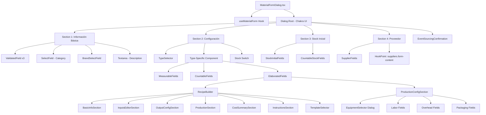
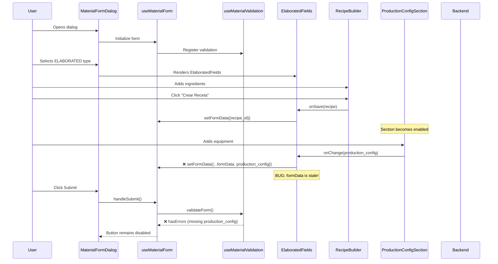

# Material Form Dialog - Complete Architectural Map

## 📐 Component Hierarchy



## 🗂️ Component Breakdown

### 🎯 Main Dialog Component
**[MaterialFormDialog.tsx](file:///i:/Programacion/Proyectos/g-mini/src/pages/admin/supply-chain/materials/components/MaterialsManagement/MaterialFormModalComplete/MaterialFormDialog.tsx)** (508 lines)

**Responsibilities**:
- Dialog orchestration (open/close)
- Section rendering based on material type
- Submit button management
- Wizard mode for supplier creation

**State Management**:
- Uses `useMaterialForm` hook for ALL form logic
- Local states: `packageQuantity`, `showSupplierWizard`

**Renders 4 Conditional Sections**:
1. **Información Básica** (Always visible)
2. **Configuración** (Always visible)
3. **Stock Inicial** (Only if `addToStockNow === true` AND type !== ELABORATED)
4. **Proveedor** (Only if `addToStockNow === true` AND type !== ELABORATED)

---

### 🧠 State Management Hook
**[useMaterialForm.tsx](file:///i:/Programacion/Proyectos/g-mini/src/pages/admin/supply-chain/materials/components/MaterialsManagement/MaterialFormModalComplete/hooks/useMaterialForm.tsx)** (456 lines)

**Core Responsibilities**:
- Form data state (`formData`, `setFormData`)
- Validation integration (`useMaterialValidation`)
- Submit handlers (`handleSubmit`, `confirmAndSubmit`)
- Loading states management
- Event sourcing confirmation flow

**Key State**:
```typescript
formData: {
  id, name, type, unit, initial_stock, unit_cost,
  category?, packaging?, recipe_id?, production_config?,
  supplier: {...}
}
```

**Exposed API** (returned values):
- Data: `formData`, `addToStockNow`, `fieldErrors`, `fieldWarnings`, `validationState`
- Flags: `isSubmitting`, `isEditMode`, `isViewMode`, `showEventSourcingConfirmation`
- Computed: `modalTitle`, `submitButtonContent`, `operationProgress`, `formStatusBadge`
- Actions: `updateFormData`, `handleNameChange`, `handleTypeChange`, `updateSupplierData`, `setAddToStockNow`, `handleSubmit`, `confirmAndSubmit`

---

### 🔧 Type-Specific Components

#### 1️⃣ **MeasurableFields** (42 lines)
**Purpose**: Configure measurable materials (kg, liters, etc.)  
**Fields**: Unit selection only  
**Pattern**: Simple `SelectField` wrapper

#### 2️⃣ **CountableFields** (46 lines)
**Purpose**: Configure countable materials (units)  
**Fields**: Info alert only (packaging configured in Stock section)  
**Auto-sets**: `unit = 'unidad'`

#### 3️⃣ **ElaboratedFields** (472 lines) ⭐ **MOST COMPLEX**
**Purpose**: Configure elaborated/produced materials  
**Contains**:
- Industrial-themed UI components (`StatusIndicator`, `IndustrialContainer`, `SectionDivider`)
- **RecipeBuilder** integration
- **ProductionConfigSection** integration

**Data Flow Problem** 🚨:
```typescript
// ❌ INCORRECT - uses stale formData
const handleProductionConfigChange = useCallback((config: ProductionConfig) => {
  setFormData({
    ...formData,  // Stale closure!
    production_config: config,
  });
}, [formData, setFormData]);
```

---

### 🍳 Recipe Builder Module
**[RecipeBuilder.tsx](file:///i:/Programacion/Proyectos/g-mini/src/modules/recipe/components/RecipeBuilder/RecipeBuilder.tsx)** (326 lines)

**From**: External module `@/modules/recipe/components`  
**State**: Uses own `useRecipeBuilder` hook  
**Callback**: `onSave(recipe)` → Updates `formData.recipe_id`

**Renders 7 Conditional Sections**:
1. **BasicInfoSection** - Name, description
2. **InputsEditorSection** - Ingredient list with MaterialSelector
3. **OutputConfigSection** - Output quantity & yield
4. **ProductionSection** (optional) - Equipment, time estimates
5. **CostSummarySection** (optional) - Calculated costs
6. **InstructionsSection** (lazy-loaded, optional)
7. **TemplateSelector** - Apply recipe templates

**Features Control** (passed from ElaboratedFields):
```typescript
{
  showCostCalculation: true,
  showScalingLite: true,
  showInstructions: false,
  allowProductInputs: false
}
```

---

### ⚙️ Production Config Section
**[ProductionConfigSection.tsx](file:///i:/Programacion/Proyectos/g-mini/src/pages/admin/supply-chain/materials/components/MaterialsManagement/MaterialFormModalComplete/components/ProductionConfigSection.tsx)** (449 lines)

**Purpose**: Configure production costs (equipment, labor, overhead, packaging)

**State**: Local `useState` for each cost field  
**Callback**: `onChange(config: ProductionConfig)` → Should update `formData.production_config`

**Renders 4 Subsections**:
1. **Equipment** - Uses `EquipmentSelector` dialog
2. **Labor** - Hours + cost per hour
3. **Overhead** - Percentage + fixed amount
4. **Packaging** - Fixed packaging cost

**Visibility Rule** 🚨:
```typescript
if (!recipeId) {
  return <InfoMessage>Primero crea una receta</InfoMessage>;
}
```

**Equipment Selector**:
- **[EquipmentSelector.tsx](file:///i:/Programacion/Proyectos/g-mini/src/shared/components/EquipmentSelector.tsx)** (287 lines)
- Modal dialog for selecting equipment
- Fields: Equipment type, hours used, automatic cost calculation
- Returns: `ProductionEquipmentUsage[]`

---

### 📦 Stock & Supplier Components

#### **StockInitialFields** (For MEASURABLE)
**Fields**: Quantity, unit cost, purchase date

#### **CountableStockFields** (For COUNTABLE)
**Fields**: Quantity, packaging info, unit cost, purchase date

#### **SupplierFields**
**Fields**: Supplier selector, purchase details  
**Integration**: Uses `HookPoint` for `suppliers.form-content`  
**Wizard Mode**: Can open supplier creation wizard inline

---

### 🎨 UI Utility Components

**SectionCard** - Wrapper for major sections  
**ValidatedField** - Input with error/warning display  
**EventSourcingConfirmation** - Modal for stock addition confirmation

---

## 🔄 Data Flow Diagram



---

## 🚨 Critical Issues Identified

### 1. **Missing `<form>` Element**
**Location**: [`MaterialFormDialog.tsx`](file:///i:/Programacion/Proyectos/g-mini/src/pages/admin/supply-chain/materials/components/MaterialsManagement/MaterialFormModalComplete/MaterialFormDialog.tsx)

**Problem**: The dialog doesn't use a semantic `<form>` element, it's just a Dialog with Stack components.

**Impact**:
- No native form validation
- Can't use Enter key to submit
- Accessibility issues (screen readers won't detect it as a form)
- No automatic form reset behavior

---

### 2. **Production Config Data Flow Problem**  
**Location**: [`ElaboratedFields.tsx`](file:///i:/Programacion/Proyectos/g-mini/src/pages/admin/supply-chain/materials/components/MaterialsManagement/MaterialFormModalComplete/components/ElaboratedFields.tsx) (lines 461-466)

**Problem**:
```tsx
// ElaboratedFields.tsx line 230-236
const handleProductionConfigChange = useCallback((config: ProductionConfig) => {
  setFormData({
    ...formData,  // ⚠️ This spreads the ENTIRE formData, potentially stale
    production_config: config,
  });
}, [formData, setFormData]);  // ⚠️ Depends on formData - creates stale closures
```

**Impact**:
- The `production_config` might not be updating the parent form state correctly
- Recipe is saved first, `formData.recipe_id` gets set, but then `ProductionConfigSection` tries to update and might be using stale `formData`
- This explains why submit button is disabled - `production_config` never makes it to validation

**Fix Needed**: Use functional setState pattern:
```tsx
setFormData((prev) => ({
  ...prev,
  production_config: config,
}));
```

---

### 3. **No Visual Feedback for Validation Errors**
**Location**: Material Form Dialog (submit button lines 458-474)

**Problem**: 
```tsx
disabled={
  !formData.name ||
  !formData.type ||
  isSubmitting ||
  validationState.hasErrors  // ⚠️ User doesn't know WHY it's disabled
}
```

**Impact**:
- User sees disabled button but no explanation
- No indication which field is missing or invalid
- From test log: `Expected number, received undefined` - but user never sees this

**Fix Needed**: Show validation summary above submit button

---

### 4. **Confusing Conditional Sections**
**Location**: MaterialFormDialog.tsx (lines 373-420)

**Problem**: Stock and Supplier sections only appear when `addToStockNow` is true AND type is not ELABORATED

**Impact**:
- Confusing UX - sections appear/disappear based on switch
- For ELABORATED materials, Production Config is ALWAYS visible but Stock section never shows
- Inconsistent: MEASURABLE/COUNTABLE need switch ON to show stock, ELABORATED always shows production config

---

### 5. **Duplicate/Overlapping Functionality**
**Areas Identified by User**:

Need to investigate:
- RecipeBuilder might be showing cost calculations
- ProductionConfigSection ALSO shows cost calculations  
- Are there duplicate input fields?
- Are costs being calculated in multiple places?

---

## 📋 Action Items

### High Priority
1. [ ] Fix production config data flow (use functional setState)
2. [ ] Add validation error summary UI
3. [ ] Investigate and fix the "Expected number" validation error
4. [ ] Add `<form>` element with proper onSubmit handling

### Medium Priority
5. [ ] Review RecipeBuilder vs ProductionConfigSection for duplicate functionality
6. [ ] Simplify conditional section logic
7. [ ] Add better visual hierarchy

### Low Priority  
8. [ ] Improve accessibility (ARIA labels, form semantics)
9. [ ] Add form field focus management

---

## 🔍 Next Steps

1. **Fix the immediate blocker**: Production config data not flowing to parent state
2. **Continue E2E tests**: Once data flow is fixed, tests should pass
3. **Create comprehensive redesign plan**: Address all UX issues systematically

---

## 📊 Component Statistics

| Component | Lines | Type | Complexity |
|-----------|-------|------|------------|
| **useMaterialForm** | 456 | Hook | ⭐⭐⭐⭐⭐ Very High |
| **MaterialFormDialog** | 508 | Dialog | ⭐⭐⭐⭐ High |
| **ElaboratedFields** | 472 | Type Config | ⭐⭐⭐⭐⭐ Very High |
| **ProductionConfigSection** | 449 | Cost Config | ⭐⭐⭐⭐ High |
| **RecipeBuilder** | 326 | Recipe | ⭐⭐⭐⭐ High |
| **EquipmentSelector** | 287 | Dialog | ⭐⭐⭐ Medium |
| MeasurableFields | 42 | Type Config | ⭐ Low |
| CountableFields | 46 | Type Config | ⭐ Low |
| **TOTAL** | **~2,586** | **8 main** | **HIGH** |

**Key Observations**:
- 🔴 **High complexity**: 5 files over 300 lines
- 🔴 **Deep nesting**: 4 levels (Dialog → ElabFields → RecipeBuilder → InputsEditorSection)
- 🔴 **Tight coupling**: Production config depends on recipe ID
- 🔴 **State management**: Multiple sources (hook, local state, RecipeBuilder hook)


