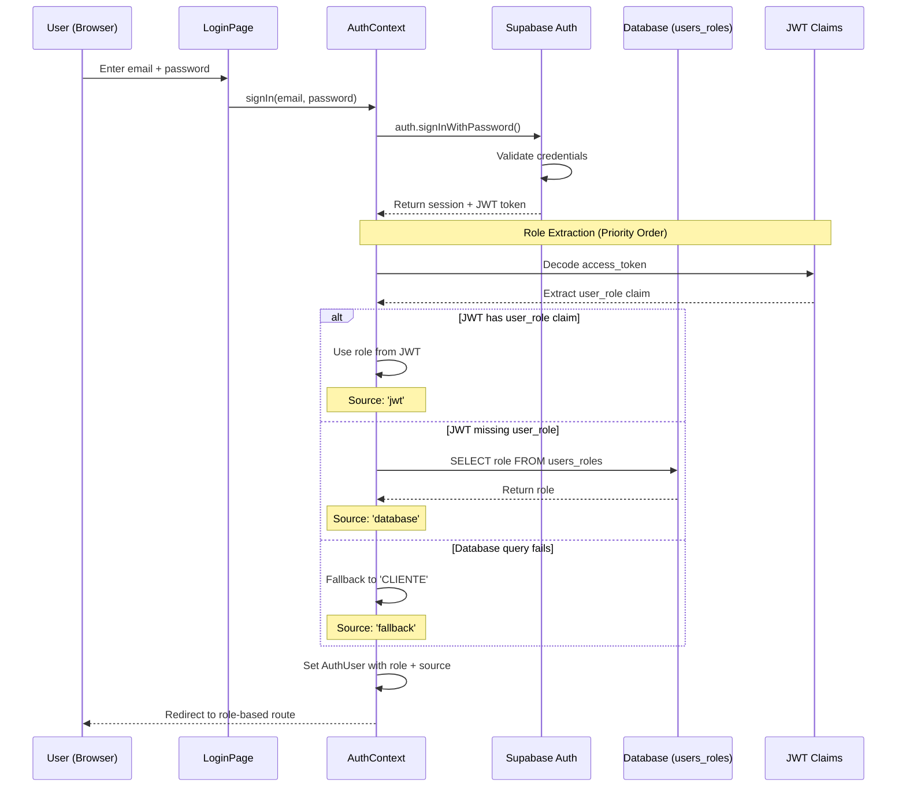
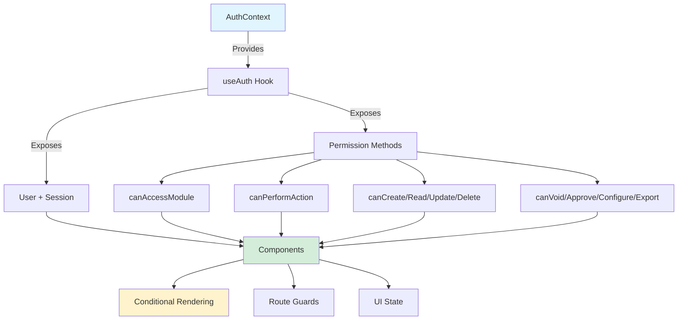
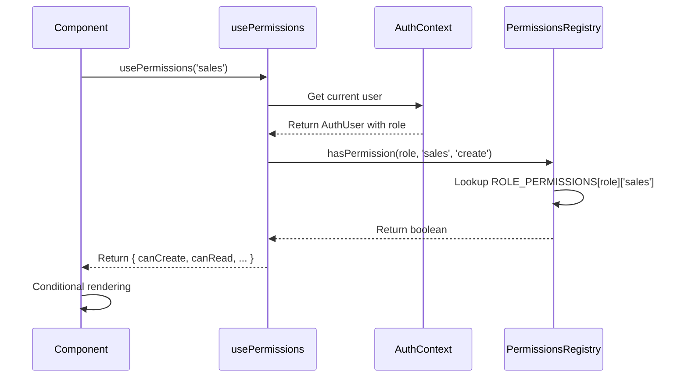
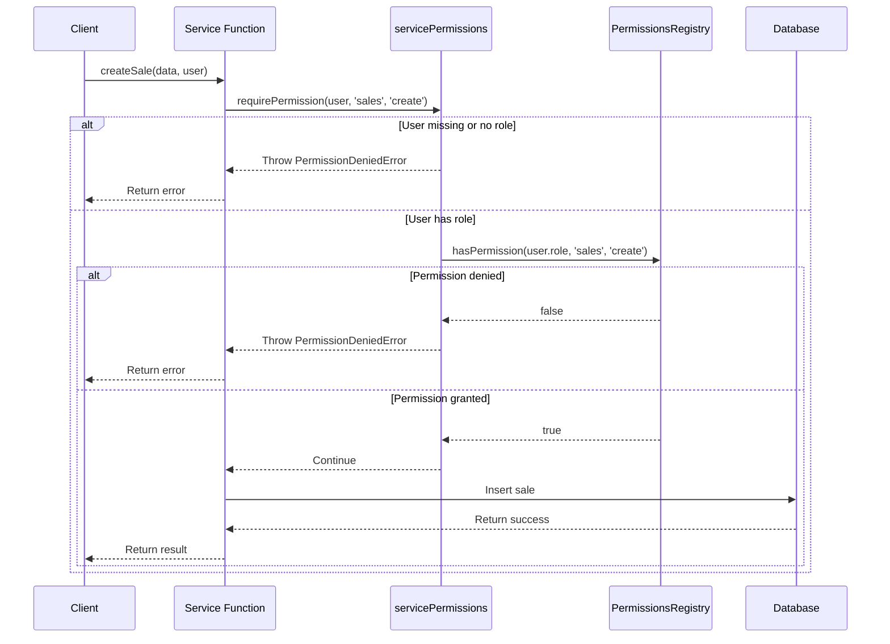

# Permissions System Architecture

**Version**: 1.0.0
**Last Updated**: December 21, 2025

---

## Table of Contents

1. [Overview](#overview)
2. [Authentication Architecture](#authentication-architecture)
3. [Authorization Architecture](#authorization-architecture)
4. [Integration Points](#integration-points)
5. [Multi-Location Support](#multi-location-support)
6. [Data Flow](#data-flow)
7. [Performance Considerations](#performance-considerations)

---

## Overview

The G-Admin Mini permissions system implements a **Role-Based Access Control (RBAC)** architecture with the following characteristics:

- **JWT-First Authentication**: Role extraction prioritizes JWT claims over database queries
- **Resource-Action Model**: Flexible permission matrix with 26 resources × 8 actions
- **Defense in Depth**: Two-layer security (Features → Permissions)
- **Service Layer Validation**: Backend-first security with typed errors
- **Location-Based Filtering**: Multi-tenant ready (Phase 2E)

### Key Design Principles

1. **Security by Default**: Deny access unless explicitly permitted
2. **Explicit Permissions**: No implicit permission inheritance
3. **Stateless Validation**: Permission checks don't depend on external state
4. **Type Safety**: Full TypeScript support with typed errors
5. **Performance**: Memoized checks prevent unnecessary re-renders

---

## Authentication Architecture

### 1. Authentication Flow



### 2. JWT Token Structure

**Access Token Payload**:
```json
{
  "sub": "user-uuid",
  "email": "user@example.com",
  "user_role": "ADMINISTRADOR",
  "is_active": true,
  "role_updated_at": 1703145600,
  "app_metadata": {
    "provider": "email",
    "role_source": "jwt"
  },
  "aud": "authenticated",
  "exp": 1703149200,
  "iat": 1703145600
}
```

**Custom Claims**:
- `user_role`: Primary role (CLIENTE | OPERADOR | SUPERVISOR | ADMINISTRADOR | SUPER_ADMIN)
- `is_active`: Whether user account is active
- `role_updated_at`: Timestamp of last role change (for cache invalidation)
- `error`: Error message if claim generation failed

### 3. Role Resolution Algorithm

**File**: `src/contexts/AuthContext.tsx` (lines 194-244)

```typescript
async function getUserRoleFromMultipleSources(session: Session): Promise<{
  role: UserRole;
  isActive: boolean;
  source: 'jwt' | 'database' | 'fallback';
}> {
  // 1. JWT Claims (Primary - fastest)
  if (session.access_token) {
    const claims = decodeJWTClaims(session.access_token);
    if (claims?.user_role && !claims.error) {
      return {
        role: claims.user_role,
        isActive: claims.is_active ?? true,
        source: 'jwt'
      };
    }
  }

  // 2. Database Query (Fallback)
  try {
    const { data, error } = await supabase
      .from('users_roles')
      .select('role, is_active')
      .eq('user_id', session.user.id)
      .eq('is_active', true)
      .single();

    if (!error && data) {
      return {
        role: data.role as UserRole,
        isActive: data.is_active,
        source: 'database'
      };
    }
  } catch (dbError) {
    logger.error('AuthContext', 'Database role fetch error:', dbError);
  }

  // 3. Final Fallback (Safety)
  return {
    role: 'CLIENTE',
    isActive: false,
    source: 'fallback'
  };
}
```

**Priority Rationale**:
1. **JWT First**: Fastest, no database query, cached in token
2. **Database Fallback**: Ensures role is always available even if JWT missing
3. **CLIENTE Fallback**: Safest default (minimal permissions)

### 4. Session Management

**Session Hash Comparison** (Performance Optimization):

```typescript
const getSessionHash = useCallback((session: Session | null): string => {
  if (!session) return 'null';

  const criticalData = {
    access_token: session.access_token,
    refresh_token: session.refresh_token,
    expires_at: session.expires_at,
    user_id: session.user?.id
  };

  return JSON.stringify(criticalData);
}, []);
```

**Why Hash Comparison?**
- Supabase may return new session objects even if unchanged
- Reference equality fails, causing unnecessary re-renders
- Hash comparison detects actual changes, preserving object reference

**Token Refresh**:
- Automatic refresh via Supabase SDK
- `refreshRole()` method forces role re-fetch
- Token expiry triggers `onAuthStateChange` event

---

## Authorization Architecture

### 1. RBAC Pattern

**Core Implementation**: `src/config/PermissionsRegistry.ts`

```
┌──────────────────────────────────────────────────────┐
│         PERMISSIONS REGISTRY (RBAC Matrix)           │
├──────────────────────────────────────────────────────┤
│                                                      │
│  ROLE_PERMISSIONS: Record<UserRole, ResourcePermissions>
│                                                      │
│  {                                                   │
│    'ADMINISTRADOR': {                                │
│      sales: ['create', 'read', 'update', 'void'],   │
│      materials: ['create', 'read', 'update'],       │
│      staff: ['create', 'read', 'approve'],          │
│      ...                                             │
│    },                                                │
│    'SUPERVISOR': { ... },                            │
│    'OPERADOR': { ... },                              │
│    ...                                               │
│  }                                                   │
│                                                      │
└──────────────────────────────────────────────────────┘
```

### 2. Permission Matrix Structure

**5 Roles × 26 Modules × 8 Actions**:

```typescript
export const ROLE_PERMISSIONS: Record<UserRole, ResourcePermissions> = {
  'ADMINISTRADOR': {
    // Core Operations
    sales: ['create', 'read', 'update', 'delete', 'void', 'configure', 'export'],
    materials: ['create', 'read', 'update', 'delete', 'configure', 'export'],
    suppliers: ['create', 'read', 'update', 'delete', 'configure', 'export'],
    products: ['create', 'read', 'update', 'delete', 'configure', 'export'],

    // Resources
    staff: ['create', 'read', 'update', 'delete', 'approve', 'configure', 'export'],
    scheduling: ['create', 'read', 'update', 'delete', 'approve', 'configure'],

    // Finance
    fiscal: ['create', 'read', 'update', 'delete', 'void', 'configure', 'export'],
    billing: ['create', 'read', 'update', 'delete', 'void', 'configure', 'export'],
    integrations: ['create', 'read', 'update', 'delete', 'configure'],

    // Customers
    customers: ['create', 'read', 'update', 'delete', 'export'],
    memberships: ['create', 'read', 'update', 'delete', 'approve', 'configure'],
    rentals: ['create', 'read', 'update', 'delete', 'configure'],
    assets: ['create', 'read', 'update', 'delete', 'configure'],

    // Analytics
    reporting: ['read', 'export', 'configure'],
    intelligence: ['read', 'configure'],
    executive: ['read', 'export', 'configure'],
    dashboard: ['read', 'configure'],

    // System
    settings: ['read', 'update', 'configure'],
    gamification: ['read', 'configure'],
    debug: [], // NO debug access (only SUPER_ADMIN)

    // Customer-facing
    customer_portal: ['read'],
    customer_menu: ['read'],
    my_orders: ['read'],
  },

  'SUPER_ADMIN': {
    // Inherits all ADMIN permissions + debug access
    debug: ['read', 'create', 'update', 'delete', 'configure'],
    // ... (all other modules same as ADMINISTRADOR)
  },

  // ... (SUPERVISOR, OPERADOR, CLIENTE)
};
```

**Design Decisions**:
- **No Inheritance**: Each role has explicit permissions (no automatic inheritance)
- **Module-Level**: Permissions are at module level, not individual record level
- **Explicit Deny**: Empty array `[]` means no access (explicit deny)
- **Debug Separation**: Only SUPER_ADMIN has debug access (security boundary)

### 3. Permission Check Function

**Core Function**: `hasPermission(role, resource, action)`

```typescript
export function hasPermission(
  role: UserRole,
  resource: ModuleName,
  action: PermissionAction
): boolean {
  const rolePermissions = ROLE_PERMISSIONS[role];
  if (!rolePermissions) return false;

  const resourcePermissions = rolePermissions[resource];
  if (!resourcePermissions) return false;

  return resourcePermissions.includes(action);
}
```

**Complexity**: O(1) - Direct hash map lookup

**Example Usage**:
```typescript
hasPermission('ADMINISTRADOR', 'sales', 'void')     // true
hasPermission('OPERADOR', 'sales', 'delete')        // false
hasPermission('SUPERVISOR', 'fiscal', 'configure')  // false
```

### 4. Role Hierarchy

**Hierarchy Levels**:

```typescript
const ROLE_HIERARCHY: Record<UserRole, number> = {
  'CLIENTE': 0,       // Customer portal only
  'OPERADOR': 1,      // Frontline staff
  'SUPERVISOR': 2,    // Shift managers
  'ADMINISTRADOR': 3, // Business owners
  'SUPER_ADMIN': 4,   // System administrators
};
```

**Hierarchy Comparison**:

```typescript
export function isRoleHigherOrEqual(roleA: UserRole, roleB: UserRole): boolean {
  return ROLE_HIERARCHY[roleA] >= ROLE_HIERARCHY[roleB];
}

// Examples
isRoleHigherOrEqual('ADMINISTRADOR', 'SUPERVISOR')  // true
isRoleHigherOrEqual('OPERADOR', 'SUPERVISOR')       // false
```

**Use Cases**:
- Role requirement checks
- Permission delegation
- Audit logging

---

## Integration Points

### 1. AuthContext → Components Flow



**AuthContext API**:

```typescript
interface AuthContextType {
  // State
  user: AuthUser | null;
  session: Session | null;
  loading: boolean;
  isAuthenticated: boolean;

  // Auth Methods
  signIn: (email: string, password: string) => Promise<{ error?: string }>;
  signUp: (email: string, password: string, fullName?: string) => Promise<{ error?: string }>;
  signOut: () => Promise<void>;
  refreshRole: () => Promise<void>;

  // Role Checks
  isRole: (role: UserRole | UserRole[]) => boolean;
  hasRole: (roles: UserRole[]) => boolean;

  // Permission Checks (Module Access)
  canAccessModule: (module: ModuleName) => boolean;
  canPerformAction: (module: ModuleName, action: PermissionAction) => boolean;

  // CRUD Shortcuts
  canCreate: (module: ModuleName) => boolean;
  canRead: (module: ModuleName) => boolean;
  canUpdate: (module: ModuleName) => boolean;
  canDelete: (module: ModuleName) => boolean;

  // Special Actions
  canVoid: (module: ModuleName) => boolean;
  canApprove: (module: ModuleName) => boolean;
  canConfigure: (module: ModuleName) => boolean;
  canExport: (module: ModuleName) => boolean;
}
```

### 2. Features → Permissions Validation

**Defense in Depth Pattern**:

```
┌─────────────────────────────────────────────┐
│         LAYER 1: FEATURE FLAGS              │
│  (BusinessModelRegistry + Capabilities)     │
├─────────────────────────────────────────────┤
│  Is feature enabled for this business?      │
│  - Check business model                     │
│  - Check infrastructure                     │
│  - Return boolean                           │
└─────────────┬───────────────────────────────┘
              │ ✅ Feature ON
              ↓
┌─────────────────────────────────────────────┐
│       LAYER 2: PERMISSIONS (RBAC)           │
│       (PermissionsRegistry)                 │
├─────────────────────────────────────────────┤
│  Does user's role allow this action?        │
│  - Check role permissions                   │
│  - Check resource + action                  │
│  - Return boolean                           │
└─────────────┬───────────────────────────────┘
              │ ✅ Permission Granted
              ↓
┌─────────────────────────────────────────────┐
│          LAYER 3: UI RENDERING              │
│          (Components)                       │
├─────────────────────────────────────────────┤
│  Render button/component                    │
│  Execute action                             │
└─────────────────────────────────────────────┘
```

**Example Implementation**:

```typescript
function SalesPage() {
  const { hasFeature } = useCapabilities();
  const { canVoid } = usePermissions('sales');

  // ✅ Check feature FIRST
  if (!hasFeature('sales_void_orders')) {
    return null; // Feature disabled globally
  }

  // ✅ Check permission SECOND
  if (!canVoid) {
    return null; // User lacks permission
  }

  // ✅ Render if both checks pass
  return <VoidOrderButton />;
}
```

### 3. Navigation System Integration

**File**: `src/lib/routing/routeMap.ts`

**Permission-Based Route Filtering**:

```typescript
export function getAccessibleRoutes(
  userRole: UserRole,
  enabledFeatures: FeatureId[]
): NavigationItem[] {
  return routes.filter(route => {
    // Check module access (permissions)
    if (route.requiredModule) {
      if (!canAccessModule(userRole, route.requiredModule)) {
        return false;
      }
    }

    // Check feature flags
    if (route.requiredFeature) {
      if (!enabledFeatures.includes(route.requiredFeature)) {
        return false;
      }
    }

    return true;
  });
}
```

**Role-Based Default Routes**:

```typescript
export const ROLE_DEFAULT_ROUTES: Record<UserRole, string> = {
  CLIENTE: '/app/portal',
  OPERADOR: '/admin/operations/sales',
  SUPERVISOR: '/admin/dashboard',
  ADMINISTRADOR: '/admin/dashboard',
  SUPER_ADMIN: '/admin/dashboard'
};
```

### 4. Service Layer Validation

**Pattern**: Backend-first security

```typescript
// Client-side (UI)
import { usePermissions } from '@/hooks/usePermissions';

function SalesPage() {
  const { canCreate } = usePermissions('sales');

  // UI-level check (UX only, not security)
  if (!canCreate) return null;

  return <CreateSaleButton onClick={handleCreate} />;
}

// Service layer (Security boundary)
import { requirePermission } from '@/lib/permissions/servicePermissions';

export async function createSale(data: Sale, user: AuthUser) {
  // Backend validation (REQUIRED for security)
  requirePermission(user, 'sales', 'create');

  // Proceed with operation
  return supabase.from('sales').insert(data);
}
```

**Why Both Layers?**
- **Client-side**: Better UX (hide disabled actions)
- **Server-side**: Actual security (prevent API bypass)

### 5. Error Handling

**Typed Errors**:

```typescript
export class PermissionDeniedError extends Error {
  constructor(
    public resource: ModuleName,
    public action: PermissionAction,
    public userId?: string,
    public reason?: string
  ) {
    super(`Permission denied: User ${userId} cannot perform '${action}' on '${resource}'`);
    this.name = 'PermissionDeniedError';
  }
}

export class LocationAccessError extends Error {
  constructor(
    public userId: string,
    public attemptedLocationId: string,
    public allowedLocationIds: string[]
  ) {
    super(`Location access denied: User ${userId} cannot access location ${attemptedLocationId}`);
    this.name = 'LocationAccessError';
  }
}
```

**Error Handler Integration**:

```typescript
try {
  await createSale(saleData, user);
} catch (error) {
  if (isPermissionDeniedError(error)) {
    showToast({
      title: 'Access Denied',
      description: `You don't have permission to ${error.action} ${error.resource}`,
      status: 'error'
    });
  } else if (isLocationAccessError(error)) {
    showToast({
      title: 'Location Access Denied',
      description: error.message,
      status: 'error'
    });
  } else {
    // Generic error handling
    showToast({
      title: 'Error',
      description: 'An unexpected error occurred',
      status: 'error'
    });
  }
}
```

---

## Multi-Location Support

**Status**: Phase 2E Ready (infrastructure in place, not yet activated)

### 1. User Location Interface

```typescript
export interface UserWithLocation extends AuthUser {
  location_id?: string;           // Primary location
  accessible_locations?: string[]; // Additional locations
}
```

### 2. Location-Based Access Control

**Access Rules**:

```typescript
export function requireLocationAccess(
  user: UserWithLocation,
  targetLocationId: string
): void {
  // Admin bypass (access all locations)
  if (user.role === 'ADMINISTRADOR' || user.role === 'SUPER_ADMIN') {
    return;
  }

  // Check primary location
  if (user.location_id === targetLocationId) {
    return;
  }

  // Check additional locations
  if (user.accessible_locations?.includes(targetLocationId)) {
    return;
  }

  // Denied
  throw new LocationAccessError(
    user.id,
    targetLocationId,
    user.accessible_locations || [user.location_id!]
  );
}
```

### 3. Location Filtering

**Query Pattern**:

```typescript
export async function getSales(user: UserWithLocation) {
  requireModuleAccess(user, 'sales');

  const locationIds = getAccessibleLocationIds(user);

  if (locationIds.length === 0) {
    // Admin - no filter (access all)
    return supabase.from('sales').select('*');
  }

  // Filter by accessible locations
  return supabase
    .from('sales')
    .select('*')
    .in('location_id', locationIds);
}
```

**Location ID Helper**:

```typescript
export function getAccessibleLocationIds(user: UserWithLocation): string[] {
  // Admin bypass (empty array = no filter)
  if (user.role === 'ADMINISTRADOR' || user.role === 'SUPER_ADMIN') {
    return [];
  }

  // Return accessible locations
  if (user.accessible_locations?.length) {
    return user.accessible_locations;
  }

  // Return primary location
  if (user.location_id) {
    return [user.location_id];
  }

  // No locations assigned
  return [];
}
```

---

## Data Flow

### Permission Check Flow (Client-Side)



### Service Layer Validation Flow



---

## Performance Considerations

### 1. Memoization

**AuthContext Value**:

```typescript
const contextValue = useMemo<AuthContextType>(() => ({
  user,
  session,
  loading,
  signIn,
  signUp,
  signOut,
  refreshRole,
  isAuthenticated,
  isRole,
  hasRole,
  canAccessModule,
  canPerformAction,
  // ... all permission methods
}), [
  user,
  session,
  loading,
  // ... all dependencies
]);
```

**Why Memoize?**
- Prevents re-creating context value on every render
- Avoids triggering re-renders in consuming components
- Crucial for NavigationProvider and other high-level consumers

### 2. Permission Check Optimization

**usePermissions Hook**:

```typescript
export function usePermissions(resource: ModuleName): PermissionActions {
  const { user } = useContext(AuthContext);

  const permissions = useMemo(() => {
    if (!user?.role) {
      return { /* empty permissions */ };
    }

    const resourcePermissions = getResourcePermissions(user.role, resource);

    return {
      canCreate: hasAction('create'),
      canRead: hasAction('read'),
      // ... all actions
      permissions: resourcePermissions,
    };
  }, [user, resource]);

  return permissions;
}
```

**Optimization**: Single memo calculates all permission flags at once

### 3. Render Count Monitoring

**AuthContext Debug Logging**:

```typescript
const renderCountRef = useRef(0);
renderCountRef.current++;

if (renderCountRef.current > 20) {
  logger.error('AuthContext', 'EXCESSIVE RENDERS DETECTED!', {
    count: renderCountRef.current,
    userId: user?.id,
  });
}
```

**Trigger**: Logs warning if AuthContext renders > 20 times

### 4. Session Hash Comparison

**Problem**: Supabase returns new session objects even if unchanged

**Solution**: Compare session hashes instead of references

```typescript
const getSessionHash = useCallback((session: Session | null): string => {
  if (!session) return 'null';

  const criticalData = {
    access_token: session.access_token,
    refresh_token: session.refresh_token,
    expires_at: session.expires_at,
    user_id: session.user?.id
  };

  return JSON.stringify(criticalData);
}, []);

setSession(prevSession => {
  const prevHash = getSessionHash(prevSession);
  const currentHash = getSessionHash(currentSession);

  if (prevHash === currentHash) {
    return prevSession; // Preserve reference
  }

  return currentSession; // New session
});
```

**Result**: Prevents cascade re-renders in consuming components

---

## Security Considerations

### 1. Client-Side vs Server-Side

**Never rely solely on client-side checks**:

```typescript
// ❌ INSECURE (client-side only)
function DeleteButton() {
  const { canDelete } = usePermissions('sales');

  const handleDelete = async () => {
    // NO server-side validation!
    await supabase.from('sales').delete().eq('id', saleId);
  };

  if (!canDelete) return null;
  return <Button onClick={handleDelete}>Delete</Button>;
}

// ✅ SECURE (client + server validation)
function DeleteButton() {
  const { canDelete } = usePermissions('sales');

  const handleDelete = async () => {
    // Server-side validation in service layer
    await deleteSale(saleId, user);
  };

  if (!canDelete) return null;
  return <Button onClick={handleDelete}>Delete</Button>;
}

// Service layer (required)
export async function deleteSale(id: string, user: AuthUser) {
  requirePermission(user, 'sales', 'delete'); // Throws if unauthorized
  return supabase.from('sales').delete().eq('id', id);
}
```

### 2. JWT Claims Trust

**Security Notes**:
- JWT claims are signed by Supabase (cannot be tampered with)
- Claims are validated server-side during token generation
- Expired tokens are automatically refreshed
- Never accept user-provided JWT claims without validation

### 3. Debug Access Isolation

**Critical Security Boundary**:

```typescript
debug: ['read', 'create', 'update', 'delete', 'configure'], // ONLY SUPER_ADMIN
```

**Why Separate?**
- Debug tools expose sensitive system internals
- Can view/modify any data
- Can bypass normal validation
- Should NEVER be granted to business users

---

## Next Steps

- [Complete Role Reference](./ROLES.md) - Detailed permissions for each role
- [Complete Module Reference](./MODULES.md) - All 26 modules documented
- [Developer Guide](./DEVELOPER_GUIDE.md) - Practical implementation patterns
- [API Reference](./API_REFERENCE.md) - Complete TypeScript API docs
