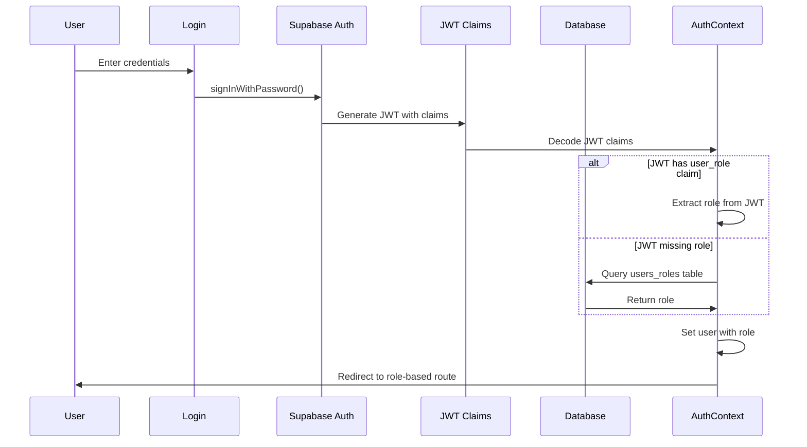
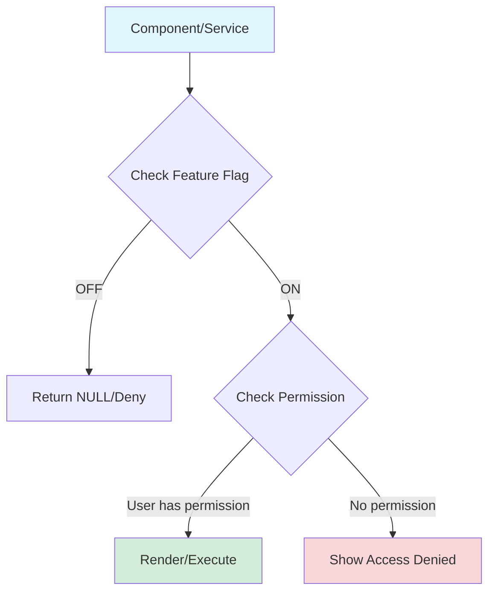

# Roles and Permissions System Documentation

**Version**: 1.0.0
**Last Updated**: December 21, 2025
**System**: G-Admin Mini - Role-Based Access Control (RBAC)

---

## Overview

The G-Admin Mini Roles and Permissions System is a comprehensive **Role-Based Access Control (RBAC)** implementation that provides granular security, multi-tenant support, and seamless integration with Supabase authentication.

### What is RBAC?

Role-Based Access Control (RBAC) is a security paradigm where permissions are assigned to roles, and roles are assigned to users. Instead of granting individual permissions to each user, you assign them a role that encompasses all the permissions they need.

**Example**:
- A **SUPERVISOR** role has permissions to create sales, approve schedules, and view reports
- An **OPERADOR** role can only create sales and update inventory
- Users are assigned one of these roles, inheriting all associated permissions

### Why This System Exists

1. **Security**: Prevent unauthorized access to sensitive operations and data
2. **Compliance**: Meet audit requirements with clear access trails
3. **Multi-Tenant Support**: Enable safe multi-location businesses with location-based filtering
4. **Scalability**: Easily manage permissions for growing teams without individual user configuration
5. **Defense in Depth**: Two-layer security (Features → Permissions) prevents accidental exposure

### Key Features

- **5 Hierarchical Roles**: From CLIENTE (customer portal) to SUPER_ADMIN (infrastructure)
- **26 Protected Modules**: Sales, materials, staff, fiscal, and more
- **8 Permission Actions**: create, read, update, delete, void, approve, configure, export
- **JWT-First Authentication**: Role extraction from JWT claims with database fallback
- **Resource-Action Pattern**: Flexible `hasPermission(role, resource, action)` model
- **Service Layer Validation**: Backend-first security with typed error handling
- **Location-Based Access**: Multi-location filtering (Phase 2E ready)

---

## Quick Start

### For Developers

**Check permissions in a component**:
```typescript
import { usePermissions } from '@/hooks/usePermissions';

function SalesPage() {
  const { canCreate, canVoid, canExport } = usePermissions('sales');

  return (
    <>
      {canCreate && <Button>New Sale</Button>}
      {canVoid && <Button>Void Order</Button>}
      {canExport && <Button>Export Data</Button>}
    </>
  );
}
```

**Validate permissions in service layer**:
```typescript
import { requirePermission } from '@/lib/permissions/servicePermissions';

export async function createSale(data: Sale, user: AuthUser) {
  // Backend validation - throws if unauthorized
  requirePermission(user, 'sales', 'create');

  // Proceed with operation
  return supabase.from('sales').insert(data);
}
```

**Guard routes by role**:
```typescript
import { RoleGuard } from '@/components/auth/RoleGuard';

function AdminPanel() {
  return (
    <RoleGuard requiredRoles={['ADMINISTRADOR', 'SUPER_ADMIN']}>
      <AdminContent />
    </RoleGuard>
  );
}
```

### For Business Users

**Understanding Your Role**:

| Role | Purpose | Typical User | Default Route |
|------|---------|--------------|---------------|
| **CLIENTE** | Customer portal access | Customers, clients | `/app/portal` |
| **OPERADOR** | Frontline operations | Cashiers, waiters | `/admin/operations/sales` |
| **SUPERVISOR** | Shift management | Shift leads, managers | `/admin/dashboard` |
| **ADMINISTRADOR** | Business ownership | Business owners | `/admin/dashboard` |
| **SUPER_ADMIN** | System administration | IT staff, developers | `/admin/dashboard` |

---

## Architecture Overview

### Authentication Flow



### Permission Check Flow



### Integration with Features System

```
┌─────────────────────────────────────────────────────┐
│                  DEFENSE IN DEPTH                    │
├─────────────────────────────────────────────────────┤
│                                                      │
│  1. FEATURE FLAGS (Business Model Registry)         │
│     ↓ Is feature enabled for this business?         │
│                                                      │
│  2. PERMISSIONS (Permissions Registry)               │
│     ↓ Does user's role allow this action?           │
│                                                      │
│  3. UI RENDERING (Components)                        │
│     → Only show what user can access                 │
│                                                      │
└─────────────────────────────────────────────────────┘
```

**Best Practice Order**:
1. Check feature flag FIRST (fast, global)
2. Check permission SECOND (role-specific)
3. Render/execute action

```typescript
// ✅ CORRECT
if (!hasFeature('sales_void_orders')) return null; // Feature OFF
if (!canVoid) return null; // Feature ON, check permission

// ❌ WRONG (wastes permission check)
if (!canVoid) return null;
if (!hasFeature('sales_void_orders')) return null;
```

---

## Documentation Structure

This documentation is organized into the following sections:

### Core Documentation

1. **[ARCHITECTURE.md](./ARCHITECTURE.md)** - Technical architecture and integration points
   - Authentication flow (JWT → Database → Fallback)
   - Authorization architecture (RBAC pattern)
   - Multi-location support (Phase 2E)
   - Data flow diagrams

2. **[ROLES.md](./ROLES.md)** - Complete role reference
   - All 5 roles with permission matrices
   - Use cases and scenarios
   - Role comparison tables
   - Default routes

3. **[MODULES.md](./MODULES.md)** - Complete module reference
   - All 26 modules grouped by domain
   - Available actions per module
   - Minimum role requirements
   - Related features

### Developer Guides

4. **[DEVELOPER_GUIDE.md](./DEVELOPER_GUIDE.md)** - Practical development guide
   - Using permissions in components (`usePermissions` hook)
   - Service layer validation patterns
   - Adding new roles/modules
   - Testing patterns with examples

5. **[API_REFERENCE.md](./API_REFERENCE.md)** - Complete API documentation
   - PermissionsRegistry API
   - AuthContext API
   - usePermissions hook
   - RoleGuard component
   - servicePermissions module
   - TypeScript signatures

### Operations Guides

6. **[SECURITY.md](./SECURITY.md)** - Security best practices
   - Authentication security (JWT, sessions, tokens)
   - Authorization security (permission validation)
   - Common vulnerabilities and mitigations
   - Security checklist
   - Compliance considerations (GDPR)

7. **[TROUBLESHOOTING.md](./TROUBLESHOOTING.md)** - Common issues and solutions
   - Authentication issues
   - Permission issues
   - Integration issues
   - Performance issues
   - Debugging commands

---

## Key Concepts

### Resource-Action Pattern

The permissions system uses a **Resource-Action** pattern:

```typescript
hasPermission(role: UserRole, resource: ModuleName, action: PermissionAction)
```

**Resources**: The 26 modules (sales, materials, staff, etc.)
**Actions**: The 8 operations (create, read, update, delete, void, approve, configure, export)

**Example**:
```typescript
hasPermission('SUPERVISOR', 'sales', 'void')     // true
hasPermission('OPERADOR', 'sales', 'delete')     // false
hasPermission('ADMINISTRADOR', 'debug', 'read')  // false (only SUPER_ADMIN)
```

### Role Hierarchy

Roles have a hierarchical level (higher number = more permissions):

```
SUPER_ADMIN (4)     → Full system access + debug tools
    ↓
ADMINISTRADOR (3)   → Full business access
    ↓
SUPERVISOR (2)      → Operational + approvals
    ↓
OPERADOR (1)        → Frontline tasks
    ↓
CLIENTE (0)         → Customer portal only
```

**Note**: Higher roles do NOT automatically inherit lower role permissions. Each role has explicitly defined permissions.

### JWT Claims Priority

Role resolution follows this priority:

1. **JWT Claims** (Primary) - `user_role` claim in access token
2. **Database Query** (Fallback) - `users_roles` table lookup
3. **Default Fallback** (Safety) - `CLIENTE` role with restricted access

**Why JWT First?**
- Faster (no database query)
- Cached in token (reduces load)
- Updated on token refresh

---

## Permission Matrix Summary

Quick reference of role capabilities:

| Module | CLIENTE | OPERADOR | SUPERVISOR | ADMINISTRADOR | SUPER_ADMIN |
|--------|---------|----------|------------|---------------|-------------|
| **Sales** | - | CRU | CRUV | CRUDVCE | CRUDVCE |
| **Materials** | - | RU | CRU | CRUDCE | CRUDCE |
| **Staff** | - | - | RU | CRUDACE | CRUDACE |
| **Fiscal** | - | - | R | CRUDVCE | CRUDVCE |
| **Settings** | RU* | - | - | RUCE | RUCE |
| **Debug** | - | - | - | - | RCUDE |

**Legend**: C=Create, R=Read, U=Update, D=Delete, V=Void, A=Approve, C=Configure, E=Export
*CLIENTE can only update own profile settings

[See complete matrices in ROLES.md](./ROLES.md)

---

## Common Use Cases

### Use Case 1: Restrict Delete Operation to Admins

```typescript
const { canDelete } = usePermissions('sales');

{canDelete && (
  <Button onClick={handleDelete} variant="destructive">
    Delete Sale
  </Button>
)}
```

**Result**:
- ADMINISTRADOR/SUPER_ADMIN: See delete button
- SUPERVISOR/OPERADOR: Button hidden
- CLIENTE: No access to sales module

### Use Case 2: Approve Workflows (Supervisor+)

```typescript
const { canApprove } = usePermissions('scheduling');

{canApprove && (
  <Button onClick={handleApprove}>
    Approve Schedule
  </Button>
)}
```

**Result**:
- SUPERVISOR/ADMINISTRADOR/SUPER_ADMIN: Can approve
- OPERADOR/CLIENTE: Cannot approve

### Use Case 3: Service Layer Protection

```typescript
export async function voidSale(id: string, user: AuthUser) {
  // Backend validation (required for security)
  requirePermission(user, 'sales', 'void');

  // Update sale status
  return supabase
    .from('sales')
    .update({ status: 'voided' })
    .eq('id', id);
}
```

**Result**: Throws `PermissionDeniedError` if user lacks permission

### Use Case 4: Multi-Location Filtering

```typescript
export async function getSales(user: UserWithLocation) {
  requireModuleAccess(user, 'sales');

  const locationIds = getAccessibleLocationIds(user);

  if (locationIds.length === 0) {
    // Admin - access all locations
    return supabase.from('sales').select('*');
  }

  // Filter by accessible locations
  return supabase
    .from('sales')
    .select('*')
    .in('location_id', locationIds);
}
```

---

## Migration Guide

### From Previous System

If migrating from a simpler role system:

1. **Map old roles to new roles**:
   - `admin` → `ADMINISTRADOR`
   - `manager` → `SUPERVISOR`
   - `staff` → `OPERADOR`
   - `customer` → `CLIENTE`

2. **Update role checks**:
   ```typescript
   // Old
   if (user.role === 'admin') { ... }

   // New
   if (hasRole(['ADMINISTRADOR', 'SUPER_ADMIN'])) { ... }
   ```

3. **Add permission checks**:
   ```typescript
   // Old (role-based only)
   {user.role === 'admin' && <DeleteButton />}

   // New (permission-based)
   {canDelete && <DeleteButton />}
   ```

4. **Update service layer**:
   ```typescript
   // Old (no validation)
   export async function deleteSale(id: string) { ... }

   // New (with validation)
   export async function deleteSale(id: string, user: AuthUser) {
     requirePermission(user, 'sales', 'delete');
     ...
   }
   ```

---

## Best Practices

### DO

✅ Check features BEFORE permissions
✅ Use `usePermissions` hook in components
✅ Validate permissions in service layer
✅ Use typed errors (`PermissionDeniedError`)
✅ Memoize permission checks for performance
✅ Use `RoleGuard` for entire sections

### DON'T

❌ Check permissions without checking features
❌ Rely only on client-side permission checks
❌ Hardcode role checks (`user.role === 'ADMIN'`)
❌ Grant permissions to roles inappropriately
❌ Skip service layer validation
❌ Create custom permission systems

---

## Related Documentation

- [Feature Registry](../architecture/FEATURE_REGISTRY.md) - Feature flags system
- [Business Model Registry](../architecture/BUSINESS_MODEL_REGISTRY.md) - Capabilities system
- [Navigation System](../architecture/NAVIGATION_SYSTEM.md) - Route configuration
- [Auth Configuration Security](../../AUTH_CONFIG_SECURITY_RECOMMENDATIONS.md) - Security hardening

---

## Support and Contributing

### Getting Help

- **Issues**: Check [TROUBLESHOOTING.md](./TROUBLESHOOTING.md)
- **Questions**: Review [DEVELOPER_GUIDE.md](./DEVELOPER_GUIDE.md)
- **Security**: See [SECURITY.md](./SECURITY.md)

### Contributing

When adding new roles or modules:

1. Update `PermissionsRegistry.ts`
2. Update type definitions
3. Add tests
4. Update this documentation
5. Follow the patterns in [DEVELOPER_GUIDE.md](./DEVELOPER_GUIDE.md)

---

## Changelog

### Version 1.0.0 (December 21, 2025)

- Initial documentation release
- 5 roles documented (CLIENTE → SUPER_ADMIN)
- 26 modules documented
- 8 permission actions defined
- Complete API reference
- Security best practices
- Troubleshooting guide

---

**Next Steps**: Choose a section from the documentation structure above to dive deeper into the permissions system.
