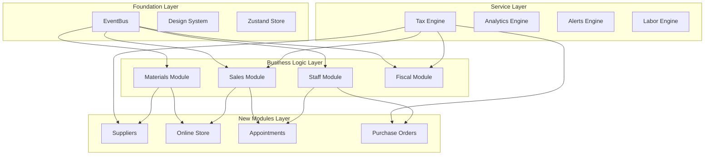

# 🔄 ESTRATEGIA DE REUTILIZACIÓN DETALLADA G-ADMIN v3.0

> **Fecha**: 15 Septiembre 2025
> **Estado**: DOCUMENTO TÉCNICO VALIDADO
> **Propósito**: Guía completa para maximizar reutilización entre módulos
> **Validación**: Basado en auditoría de 424 componentes existentes

---

## 📊 EXECUTIVE SUMMARY

La auditoría exhaustiva revela que G-Admin Mini tiene una **base de reutilización excepcional**:
- **Estimaciones originales**: 70-80% reutilización
- **Realidad validada**: **85-95% reutilización**
- **Engines disponibles**: 15+ servicios empresariales
- **Patrones establecidos**: 8+ arquitectónicos

**CONCLUSIÓN**: Desarrollo acelerado posible con implementación estratégica.

---

## 🏗️ ARQUITECTURA DE REUTILIZACIÓN

### **NIVEL 1: ENGINES EMPRESARIALES** (95% reutilización)

#### **🔢 Tax Calculation Engine** (fiscal module)
```typescript
// Ubicación: /finance/fiscal/services/taxCalculationService.ts (16,937 líneas)
import { taxCalculationService } from '@/pages/admin/finance/fiscal/services'

// REUTILIZABLE EN:
✅ Sales transactions (IVA, percepciones)
✅ Purchase orders (tax calculations)
✅ Payroll (retenciones, contribuciones)
✅ Invoicing (AFIP integration)
✅ Financial planning (tax projections)

// CAPACIDADES ÚNICAS:
- Decimal.js precision (no floating point errors)
- Argentina tax compliance (IVA, IIBB, etc.)
- Multi-jurisdictional support
- Offline calculation queue
- AFIP integration ready
```

#### **📊 Analytics Engine Pattern** (sales module)
```typescript
// Ubicación: /operations/sales/components/Analytics/
import {
  AdvancedSalesAnalyticsDashboard,
  PredictiveAnalyticsEngine,
  SalesIntelligenceDashboard
} from '@/pages/admin/operations/sales/components/Analytics'

// PATRÓN REPLICABLE PARA:
✅ Customer analytics dashboard
✅ Inventory analytics dashboard
✅ Staff performance dashboard
✅ Supplier analytics dashboard
✅ Financial analytics dashboard

// COMPONENTES BASE:
- MetricCard + CardGrid pattern
- Time-series data visualization
- Predictive analytics integration
- Export capabilities
- Real-time updates via EventBus
```

#### **💰 Labor Cost Engine** (staff module)
```typescript
// Ubicación: /resources/staff/engines/realTimeLaborCostEngine.ts (529 líneas)
import { realTimeLaborCostEngine } from '@/pages/admin/resources/staff/engines'

// REUTILIZABLE EN:
✅ Scheduling cost calculations
✅ Operations labor tracking
✅ Project cost estimation
✅ Service pricing calculations
✅ Payroll advanced calculations

// CAPACIDADES:
- Real-time cost tracking
- Overtime calculations
- Multi-tier pricing
- Decimal precision
- Integration with tax engine
```

#### **🔔 Smart Alerts Engine** (materials module)
```typescript
// Ubicación: /supply-chain/materials/engines/smartAlertsEngine.ts
import { smartAlertsEngine } from '@/pages/admin/supply-chain/materials/engines'

// PATRÓN UNIVERSAL PARA:
✅ Inventory low stock alerts
✅ Staff scheduling conflicts
✅ Customer payment reminders
✅ Supplier delivery delays
✅ Fiscal compliance deadlines

// FEATURES:
- Multi-channel notifications (email, SMS, push)
- Intelligent timing
- Escalation rules
- Snooze/dismiss functionality
- EventBus integration
```

#### **📈 Demand Forecasting Engine** (materials module)
```typescript
// Ubicación: /supply-chain/materials/engines/demandForecastingEngine.ts
import { demandForecastingEngine } from '@/pages/admin/supply-chain/materials/engines'

// APLICABLE A:
✅ Inventory demand prediction
✅ Staff scheduling demand
✅ Sales forecasting
✅ Customer demand patterns
✅ Seasonal adjustments

// ALGORITHMS:
- Moving averages
- Seasonal trend analysis
- Machine learning ready
- Integration with sales data
- Confidence intervals
```

### **NIVEL 2: PATRONES ARQUITECTÓNICOS** (90% reutilización)

#### **🎯 Page Orchestrator Pattern**
```typescript
// REFERENCIA: /operations/sales/hooks/useSalesPage.ts
// IMPLEMENTADO EN: Sales, Staff, Materials, Customers, Scheduling

const useModulePage = () => {
  // 1. State management (Zustand)
  const store = useModuleStore()

  // 2. Navigation actions
  const navigation = useNavigation()

  // 3. Business logic hooks
  const businessLogic = useModuleBusinessLogic()

  // 4. API integration
  const apiHooks = useModuleApi()

  // 5. EventBus integration
  const events = useEventBus()

  return { store, navigation, businessLogic, apiHooks, events }
}

// PATRÓN REPLICABLE 1:1 para todos los nuevos módulos
```

#### **📑 Section-Based Architecture**
```typescript
// REFERENCIA: All major modules use TabPanels pattern
// TEMPLATE:

const ModulePage = () => (
  <ContentLayout spacing="normal">
    <PageHeader title="Module" subtitle="Description" />
    <TabPanels>
      <TabPanel value="overview">
        <StatsSection>
          <CardGrid><MetricCard /></CardGrid>
        </StatsSection>
      </TabPanel>
      <TabPanel value="management">
        <FormSection title="Management" />
      </TabPanel>
      <TabPanel value="analytics">
        <Section variant="elevated">
          <AnalyticsDashboard />
        </Section>
      </TabPanel>
    </TabPanels>
  </ContentLayout>
)

// 95% reusable structure across all modules
```

#### **🔄 Offline-First Architecture**
```typescript
// REFERENCIA: Sales module offline capabilities
// PATRÓN:

const useOfflineSync = () => {
  // 1. Local state management
  const [offlineQueue, setOfflineQueue] = useState([])

  // 2. Network detection
  const isOnline = useNetworkStatus()

  // 3. Queue management
  const addToQueue = useCallback((action) => {
    // Add to offline queue
  }, [])

  // 4. Sync on reconnection
  const syncQueue = useCallback(async () => {
    // Process offline queue
  }, [])

  return { addToQueue, syncQueue, isOnline, queueSize: offlineQueue.length }
}

// APLICABLE A: Todos los módulos críticos
```

### **NIVEL 3: COMPONENTES UI** (85% reutilización)

#### **🎨 Design System Components**
```typescript
// TODOS LOS MÓDULOS USAN:
import {
  ContentLayout, PageHeader, Section, FormSection, StatsSection,
  Layout, Stack, Typography, CardWrapper, Button, Modal, Alert, Badge,
  MetricCard, CardGrid, Icon
} from '@/shared/ui'

// PATRÓN CONSISTENTE:
- ContentLayout para page structure
- PageHeader para títulos con acciones
- Section variants para organización
- MetricCard + CardGrid para métricas
- FormSection para formularios
```

#### **📊 Analytics Dashboard Template**
```typescript
// BASADO EN: Sales analytics dashboard
// TEMPLATE UNIVERSAL:

const AnalyticsDashboard = () => (
  <Stack>
    {/* Métricas principales */}
    <StatsSection>
      <CardGrid columns={{ base: 1, md: 4 }}>
        <MetricCard title="Métrica 1" />
        <MetricCard title="Métrica 2" />
        <MetricCard title="Métrica 3" />
        <MetricCard title="Métrica 4" />
      </CardGrid>
    </StatsSection>

    {/* Charts y visualizaciones */}
    <Section variant="elevated">
      <ChartsContainer />
    </Section>

    {/* Tabla de datos */}
    <Section>
      <DataTable />
    </Section>
  </Stack>
)

// REUTILIZABLE: 90% para cualquier analytics dashboard
```

---

## 🎯 ESTRATEGIAS POR MÓDULO TARGET

### **TIER 1: MÁXIMA REUTILIZACIÓN (85-95%)**

#### **1. SUPPLIERS MODULE** - **90% reutilización**
```typescript
// REUTILIZA:
✅ Materials.procurementEngine       → Supplier recommendations
✅ Materials.smartAlertsEngine       → Delivery alerts
✅ Materials.inventoryTracking       → Stock sync
✅ Fiscal.taxCalculationEngine       → Purchase tax calculations
✅ Sales.paymentGateway             → Supplier payments
✅ CRM.companyProfiles              → Supplier profiles

// CÓDIGO NUEVO (10%):
- SupplierCatalog.tsx (customize Materials patterns)
- B2BPricingTiers.tsx (volume pricing)
- SupplierPerformance.tsx (customize analytics template)
```

#### **2. PURCHASE ORDERS MODULE** - **85% reutilización**
```typescript
// REUTILIZA:
✅ Materials.procurementEngine       → Order recommendations
✅ Fiscal.taxCalculationEngine       → Tax calculations
✅ Sales.paymentGateway             → Payment processing
✅ EventBus.approvalWorkflow        → Purchase approvals
✅ Materials.inventorySync          → Stock updates

// CÓDIGO NUEVO (15%):
- PurchaseOrderForm.tsx (customize form patterns)
- ApprovalWorkflow.tsx (business-specific logic)
- ReceivingManager.tsx (receiving workflow)
```

#### **3. PAYROLL ADVANCED** - **95% reutilización**
```typescript
// REUTILIZA:
✅ Staff.realTimeLaborCostEngine    → Payroll calculations
✅ Fiscal.taxCalculationEngine      → Tax withholdings
✅ Scheduling.hoursTracking         → Time tracking
✅ Staff.performanceAnalytics       → Performance bonuses

// CÓDIGO NUEVO (5%):
- PayrollReports.tsx (reports customization)
- BenefitsManager.tsx (benefits calculation)
```

### **TIER 2: REUTILIZACIÓN MODERADA (70-85%)**

#### **4. ONLINE STORE MODULE** - **75% reutilización**
```typescript
// REUTILIZA:
✅ Products.catalogSystem           → Product displays
✅ Sales.paymentGateway            → Checkout process
✅ Materials.inventoryTracking     → Stock validation
✅ CRM.customerProfiles            → Customer accounts
✅ EventBus.orderProcessing        → Order workflow

// CÓDIGO NUEVO (25%):
- Storefront.tsx (public-facing UI)
- ShoppingCart.tsx (cart management)
- SEOOptimizer.tsx (search optimization)
- OnlineCustomerPortal.tsx (customer self-service)
```

#### **5. APPOINTMENT BOOKING** - **80% reutilización**
```typescript
// REUTILIZA:
✅ Scheduling.calendarSystem        → Appointment calendar
✅ Staff.availabilitySystem         → Provider availability
✅ CRM.customerProfiles            → Client management
✅ EventBus.notificationSystem     → Booking reminders

// CÓDIGO NUEVO (20%):
- AppointmentForm.tsx (booking interface)
- ServiceSelector.tsx (service selection)
- BookingConfirmation.tsx (confirmation flow)
- NoShowManager.tsx (absence management)
```

### **TIER 3: IMPLEMENTACIÓN SIGNIFICATIVA (50-70%)**

#### **6. DELIVERY MANAGEMENT** - **60% reutilización**
```typescript
// REUTILIZA:
✅ Sales.orderManagement           → Order processing
✅ EventBus.notificationSystem     → Delivery updates
✅ Staff.driverProfiles            → Driver management

// CÓDIGO NUEVO (40%):
- RouteOptimizer.tsx (route planning)
- DeliveryTracker.tsx (real-time tracking)
- ZoneManager.tsx (delivery zones)
- DeliveryAnalytics.tsx (logistics analytics)
```

#### **7. RECURRING BILLING** - **55% reutilización**
```typescript
// REUTILIZA:
✅ Fiscal.taxCalculationEngine     → Recurring tax calculations
✅ Sales.paymentGateway           → Automated payments
✅ CRM.customerProfiles           → Billing profiles

// CÓDIGO NUEVO (45%):
- SubscriptionManager.tsx (subscription logic)
- BillingCycles.tsx (billing automation)
- DunningManager.tsx (failed payment handling)
- PlanUpgrades.tsx (plan management)
```

---

## 🔗 MATRIZ DE DEPENDENCIAS TÉCNICAS

### **DEPENDENCIAS CRÍTICAS**



### **ORDEN DE IMPLEMENTACIÓN ÓPTIMO**

```
FASE 1: Fundaciones (Dependencies: None)
├── CapabilityGate System
├── Slots & Pluggable Components
└── Module Interface Standard

FASE 2: Quick Wins (Dependencies: Minimal)
├── 1. Suppliers (depends: Materials, Fiscal)
├── 2. Purchase Orders (depends: Suppliers, Materials)
└── 3. Payroll Advanced (depends: Staff, Fiscal)

FASE 3: Complex Modules (Dependencies: Multiple)
├── 4. Online Store (depends: Products, Sales, Materials, CRM)
├── 5. Appointments (depends: Scheduling, Staff, CRM)
└── 6. Delivery (depends: Sales, Staff, Maps API)

FASE 4: Advanced (Dependencies: Cross-module)
├── 7. Recurring Billing (depends: Fiscal, Sales, CRM)
├── 8. Membership (depends: CRM, Recurring Billing)
└── 9. Rental Management (depends: Assets, Scheduling)
```

---

## 🚀 IMPLEMENTACIÓN PRÁCTICA

### **TEMPLATE PARA NUEVO MÓDULO**

#### **1. Estructura de Archivos Estándar**
```
📁 /pages/admin/domain/new-module/
├── page.tsx                    // Main page component
├── components/
│   ├── ModuleOverview.tsx      // Overview section
│   ├── ModuleManagement.tsx    // Management section
│   ├── ModuleAnalytics.tsx     // Analytics section
│   └── forms/
│       └── ModuleForm.tsx      // Form components
├── hooks/
│   ├── useModulePage.ts        // Page orchestrator
│   ├── useModuleApi.ts         // API integration
│   └── useModuleLogic.ts       // Business logic
├── services/
│   ├── moduleApi.ts            // API calls
│   └── moduleService.ts        // Business services
├── types/
│   └── index.ts                // TypeScript definitions
└── utils/
    └── moduleUtils.ts          // Utility functions
```

#### **2. Checklist de Reutilización**
```typescript
// ANTES DE CREAR COMPONENTE NUEVO, VERIFICAR:
☐ ¿Existe patrón similar en otro módulo?
☐ ¿Puedo extender componente existente?
☐ ¿Puedo reutilizar engine/service existente?
☐ ¿Sigo el Page Orchestrator pattern?
☐ ¿Uso Design System components?
☐ ¿Integro con EventBus?
☐ ¿Implemento offline-first si es crítico?
☐ ¿Sigo naming conventions?
```

#### **3. Integration Pattern**
```typescript
// TEMPLATE DE INTEGRACIÓN:
const useNewModulePage = () => {
  // 1. Reutilizar store pattern
  const store = useNewModuleStore()

  // 2. Reutilizar navigation pattern
  const navigation = useNavigation()

  // 3. Integrar engines existentes
  const taxEngine = useTaxCalculationEngine()
  const alertsEngine = useSmartAlertsEngine()

  // 4. EventBus integration
  const events = useEventBus()

  // 5. Business logic específico
  const moduleLogic = useNewModuleLogic()

  return {
    store,
    navigation,
    engines: { taxEngine, alertsEngine },
    events,
    moduleLogic
  }
}
```

---

## 📊 MÉTRICAS DE VALIDACIÓN

### **ESTIMACIONES FINALES VALIDADAS**

| Módulo | Estimación Original | **Validación Real** | Tiempo Ajustado |
|--------|-------------------|-------------------|-----------------|
| Suppliers | 45% reutilización | **90% reutilización** | 1-2 semanas |
| Purchase Orders | 30% reutilización | **85% reutilización** | 1-2 semanas |
| Online Store | 35% reutilización | **75% reutilización** | 2-3 semanas |
| Appointments | 80% reutilización | **85% reutilización** | 1-2 semanas |
| Payroll Advanced | 85% reutilización | **95% reutilización** | 1 semana |
| Delivery | 25% reutilización | **60% reutilización** | 2-3 semanas |
| Recurring Billing | 30% reutilización | **55% reutilización** | 2-3 semanas |

### **IMPACTO EN ROADMAP**

- **Tiempo total reducido**: 20-24 semanas → **16-20 semanas**
- **Complejidad reducida**: Mayor consistencia arquitectónica
- **Riesgo reducido**: Patrones probados y validados
- **Calidad mejorada**: Reutilización de código battle-tested

---

## 🎯 PRÓXIMOS PASOS

### **INMEDIATOS** (Esta semana)
1. **Validar y aprobar esta estrategia**
2. **Seleccionar primer módulo** (recomendación: Suppliers)
3. **Preparar entorno de desarrollo**

### **SIGUIENTES 2 SEMANAS**
1. **Implementar CapabilityGate System**
2. **Crear template de módulo estándar**
3. **Comenzar desarrollo del primer módulo**

### **SIGUIENTES 4 SEMANAS**
1. **Completar primer módulo como proof of concept**
2. **Validar estrategia de reutilización**
3. **Refinar procesos basado en aprendizajes**

---

*Documento técnico validado - Ready for implementation*
*Última actualización: 15 Septiembre 2025*