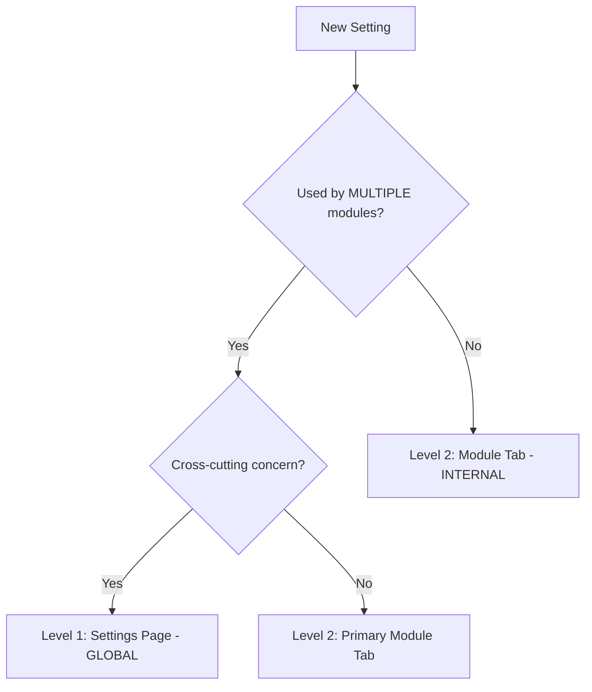

# Settings Architecture - G-Admin Mini

**Version**: 3.0.5 (High Cohesion Refactor - Domain-Driven Design)
**Last Updated**: 2025-12-23
**Status**: 🟢 ARCHITECTURAL STANDARD | ✅ v3.0 MIGRATION 100% COMPLETE | ✅ ALL PENDING FEATURES IMPLEMENTED
**Analysis**: Based on real codebase analysis (28 modules, 106 settings identified) + DDD Bounded Context principles

**Purpose**: Define clear rules and patterns for integrating settings into the G-Admin Mini system following Domain-Driven Design (DDD), Bounded Context pattern, and High Cohesion principles. **Module-specific settings live INSIDE modules, NOT in centralized Settings hub.**

**Critical Change from v2.0**: Settings is NO LONGER a centralized hub for all configurations. It's ONLY for global, cross-module settings. Module-specific configs (Staff Policies, Inventory Alerts, etc.) are now tabs/sections WITHIN their respective modules for maximum cohesion.

---

## � CRITICAL CHANGE NOTICE - v3.0 Architecture

**⚠️ BREAKING CHANGE**: La arquitectura de Settings ha sido rediseñada completamente en v3.0.

### ¿Qué cambió?

**v2.0 (DEPRECATED)**:
- Settings era un "hub centralizado" con HookPoints para inyectar configuraciones especializadas
- Módulos registraban tarjetas en `settings.specialized.cards`
- Configs específicas vivían en `/admin/settings/{module}/...`
- **Problema**: Baja cohesión, navegación confusa, violación de DDD Bounded Context

**v3.0 (CURRENT)**:
- Settings es SOLO para configuraciones globales cross-module
- Configs específicas de módulos viven DENTRO de cada módulo como tabs
- Alta cohesión: "Configure where you operate"
- **Beneficio**: Navegación intuitiva, escalabilidad, DDD compliant

### Impacto en Implementaciones Existentes

**Módulos afectados que DEBEN migrarse**:

| Módulo | v2.0 Location ❌ | v3.0 Location ✅ | Status |
|--------|-----------------|-----------------|--------|
| Staff Policies | `/admin/settings/staff/policies` | `/admin/resources/staff?tab=policies` | ✅ **COMPLETADO** (PHASE 1) |
| Inventory Alerts | `/admin/settings/inventory/alerts` | `/admin/supply-chain/materials?tab=alerts` | ✅ **COMPLETADO** (PHASE 2) |
| Product Catalog | `/admin/settings/products/catalog` | `/admin/supply-chain/products?tab=catalog-config` | ✅ **COMPLETADO** (PHASE 3) |
| Fulfillment Policies | `/admin/settings/fulfillment/policies` | `/admin/operations/fulfillment` | ✅ **COMPLETADO** (PHASE 4) |
| Payment Methods | `/admin/settings/payment-methods` (planned) | `/admin/finance-integrations?tab=payment-methods` | ✅ **COMPLETADO** (PHASE 5) |

**Estado**: ✅ **MIGRATION COMPLETE** - 5 fases completadas exitosamente
**Fecha completación**: 2025-12-23
**Tiempo total**: ~12 horas (8h core phases + 4h PHASE 5)
**v3.0 Philosophy**: 100% compliant - "Configure where you operate"

### Decision Rules Quick Reference

```
¿Dónde poner una nueva configuración?

✅ Settings Page (/admin/settings)
   IF: Afecta MÚLTIPLES módulos (cross-cutting concern)
   EXAMPLES: Tax rate, Business name, User roles

✅ Module Tab (/admin/{domain}/{module}?tab=config)
   IF: Específica de UN módulo (domain-specific)
   EXAMPLES: Staff vacation days, Low stock thresholds, Delivery zones
```

**Si ya implementaste módulos basados en v2.0**, revisa la [Migration Plan](#migration-plan-v30---module-internal-configs) para actualizar a v3.0.

---

## �📋 Table of Contents

1. [Problem Statement](#problem-statement)
2. [Current State Analysis - REAL DATA](#current-state-analysis)
3. [TanStack Query Integration](#tanstack-query-integration)
4. [Architectural Principles](#architectural-principles)
5. [3-Level Settings Architecture](#3-level-settings-architecture)
6. [Decision Rules](#decision-rules)
7. [Implementation Patterns](#implementation-patterns)
8. [Complete Settings Matrix](#complete-settings-matrix)
9. [Migration Priorities](#migration-priorities)
10. [Before Implementation Checklist](#before-implementation)

---

## 🎯 Problem Statement & Architectural Evolution

### v2.0 Issues (OLD ARCHITECTURE - DEPRECATED)

**Problema fundamental**: Baja cohesión y violación del principio DDD Bounded Context.

❌ **Settings como "cajón de sastre"**:
- Staff Policies (27 configs) vivían en `/admin/settings/staff/policies` separadas del módulo Staff
- Inventory Alerts (8 configs) vivían en Settings separadas del módulo Materials
- Fulfillment Policies (12 configs) vivían en Settings separadas del módulo Operations
- **Resultado**: Usuario tiene que salir de Staff module → ir a Settings → buscar Staff Policies

❌ **Navegación confusa**:
- ¿Configurar personal? → ¿Staff module o Settings?
- ¿Configurar inventario? → ¿Materials o Settings?
- **No hay respuesta intuitiva**

❌ **Escalabilidad problemática**:
- Si cada módulo tiene 10-30 settings, Settings page explota
- Settings se convierte en repositorio de TODO

### v3.0 Solution (NEW ARCHITECTURE)

**Principio DDD Bounded Context**: Cada módulo es un contexto acotado completo con sus propias operaciones Y configuraciones.

✅ **Alta cohesión por módulo**:
```
Staff Module (/admin/resources/staff)
├─ Tab 1: Directory (operaciones)
├─ Tab 2: Performance
├─ Tab 3: Time Tracking
├─ Tab 4: Training
├─ Tab 5: Management
└─ Tab 6: ⚙️ Policies (27 configuraciones) ← AQUÍ, no en Settings

Materials Module (/admin/supply-chain/materials)
├─ Tab 1: Inventory (operaciones)
├─ Tab 2: Movements
├─ Tab 3: Suppliers
└─ Tab 4: ⚙️ Alerts Config (8 configuraciones) ← AQUÍ, no en Settings
```

✅ **Settings solo para configuración GLOBAL**:
```
Settings (/admin/settings)
├─ Business Profile (nombre, logo, dirección) ← Afecta TODO el sistema
├─ Tax Configuration (impuestos) ← Afecta TODO el sistema
├─ User Permissions (roles) ← Afecta TODO el sistema
└─ System Preferences (idioma, zona horaria) ← Afecta TODO el sistema
```

### Decision Rules v3.0

```
Pregunta: ¿Dónde poner una configuración?

IF (configuración afecta MÚLTIPLES módulos) 
   AND (es CROSS-CUTTING concern)
THEN → Settings (/admin/settings)

ELSE IF (configuración es ESPECÍFICA de un módulo)
   AND (solo tiene sentido en contexto de ese módulo)
THEN → Tab dentro del módulo (/admin/{domain}/{module})
```

**Ejemplos**:
- ✅ Business Name → Settings (usado en facturas, emails, dashboard = cross-module)
- ✅ Tax Rate → Settings (afecta Sales, Fiscal, Reporting = cross-module)
- ❌ Staff Vacation Days → Staff Module Tab (solo relevante en contexto de RR.HH.)
- ❌ Low Stock Threshold → Materials Module Tab (solo relevante en contexto de inventario)

---

## 📊 Current State Analysis - REAL DATA

**Source**: Complete codebase analysis (SETTINGS_ARCHITECTURE_MATRIX.md)
**Modules Analyzed**: 28 modules, 11 Zustand stores, BusinessProfile table

### Key Findings

```
SETTINGS TOTALES: 106
├─ ✅ Implementados: 42 (40%)
├─ ❌ Faltantes: 64 (60%)
└─ ⚠️ Hardcoded: 6 (deberían ser configurables)
```

#### Stores Migration Status (TanStack Query)

| Store | Status | Server Data? | Migration |
|-------|--------|--------------|-----------|
| `cashStore` | ✅ Migrated | No (UI only) | TanStack Query hooks exist |
| `productsStore` | ✅ Migrated | No (UI only) | TanStack Query hooks exist |
| `salesStore` | ✅ Migrated | No (UI only) | TanStack Query hooks exist |
| `gamificationStore` | ✅ Migrated | No (UI only) | TanStack Query hooks exist |
| `operationsStore` | ⚠️ **LEGACY** | **YES** (hours, tables, zones) | ⚠️ **NEEDS MIGRATION** |
| `paymentsStore` | ⚠️ **LEGACY** | **YES** (methods, gateways) | ⚠️ **NEEDS MIGRATION** |
| `fiscalStore` | ⚠️ **LEGACY** | **YES** (tax config) | ⚠️ **NEEDS MIGRATION** |
| `materialsStore` | ✅ UI only | No | OK |
| `staffStore` | ✅ UI only | No | OK |
| `customersStore` | ✅ UI only | No | OK |
| `suppliersStore` | ✅ UI only | No | OK |

**CRITICAL**: `operationsStore`, `paymentsStore`, `fiscalStore` aún tienen server state mezclado. Deben migrarse a TanStack Query antes de implementar Settings UI.

### Settings by Level (Real Count)

**NIVEL 1: Core Settings** - ✅ **100% implementado** (23 settings)
- Business Profile (8 fields)
- Tax Configuration (4 fields)
- User Permissions (existing auth system)
- System Status (4 fields)

**NIVEL 2: Specialized Cards** - ❌ **18% implementado** (68 settings total, 12 implementados)
- ❌ Payment Methods page (10 settings) - **BLOCKER**
- ❌ Inventory Alerts (8 settings)
- ❌ Staff Policies (12 settings)
- ❌ Customer Loyalty (7 settings - hardcoded)
- ❌ Fulfillment Policies (12 settings)
- ⚠️ Otros 19 settings dispersos

**NIVEL 3: Complex Editors** - ⚠️ **47% implementado** (15 editors, 7 implementados)
- ✅ Operating/Pickup/Delivery Hours (HookPoint pattern)
- ✅ Delivery Zones, Floor Plan, Chart of Accounts
- ❌ Recipe Builder, Shift Templates, Notification Rules
- ❌ Tax Rules, Discount Builder, Report Builder

### Settings Page Structure (Current)

```tsx
// src/pages/admin/core/settings/page.tsx
export default function SettingsPage() {
  return (
    <ContentLayout>
      {/* ❌ NIVEL 1: Core Settings (Hardcoded) */}
      <FormSection title="Perfil Empresarial">
        <BusinessProfileSection />
      </FormSection>

      <FormSection title="Configuración Fiscal">
        <TaxConfigurationSection />
      </FormSection>

      <FormSection title="Permisos y Usuarios">
        <UserPermissionsSection />
      </FormSection>

      <FormSection title="Sistema y Seguridad">
        <SystemSection />
      </FormSection>

      {/* ⚠️ PROBLEMA: Botón hardcoded (debería ser dinámico) */}
      <Alert title="Configuraciones Especializadas">
        <Button onClick={() => navigate('/admin/settings/hours')}>
          <Icon icon={ClockIcon} />
          Horarios de Operación
          <Icon icon={ChevronRightIcon} />
        </Button>
      </Alert>
    </ContentLayout>
  );
}
```

### Hours Sub-Page (Shell Pattern - Correct ✅)

```tsx
// src/pages/admin/core/settings/pages/hours/page.tsx
export default function HoursPage() {
  return (
    <ContentLayout>
      <Tabs.Root>
        <Tabs.List>
          {/* ✅ HookPoint: Módulos inyectan tabs */}
          <HookPoint name="settings.hours.tabs" direction="row" gap="0" />
        </Tabs.List>

        {/* ✅ HookPoint: Módulos inyectan contenido */}
        <HookPoint name="settings.hours.content" direction="column" gap="4" />
      </Tabs.Root>
    </ContentLayout>
  );
}
```

### Module Injection Pattern (Correct ✅)

```tsx
// src/modules/fulfillment/onsite/manifest.tsx
export const fulfillmentOnsiteManifest: ModuleManifest = {
  setup: async (registry) => {
    // Import components
    const { OperatingHoursTabTrigger, OperatingHoursTabContent } = await import(
      './components/OperatingHoursEditor'
    );

    // ✅ Register hooks for hours tabs
    registry.addAction(
      'settings.hours.tabs',
      () => <OperatingHoursTabTrigger key="operating-tab" />,
      'fulfillment-onsite',
      100 // High priority - show first
    );

    registry.addAction(
      'settings.hours.content',
      () => <OperatingHoursTabContent key="operating-content" />,
      'fulfillment-onsite',
      100
    );
  }
};
```

### What Works ✅

| Pattern | Location | Status | Notes |
|---------|----------|--------|-------|
| **Core Settings Hardcoded** | Settings page | ✅ Correct | Business Profile, Tax, Permissions, System |
| **HookPoint Shell** | Hours sub-page | ✅ Correct | Clean shell with `settings.hours.*` hooks |
| **Module Injection** | Module manifests | ✅ Correct | Modules register hooks in `setup()` |

### What Doesn't Work ❌

| Problem | Location | Issue | Fix Needed |
|---------|----------|-------|------------|
| **Hardcoded Button** | Settings page | "Horarios de Operación" always visible | Inject via HookPoint |
| **No Specialized Cards Hook** | Settings page | No `settings.specialized.cards` HookPoint | Add HookPoint |
| **Visibility Logic** | Settings page | No capability-based filtering | Add conditional rendering |

---

## 🏛️ Architectural Principles

### 1. Respect Capabilities-Features-Modules System

```
USER CHOICES → SYSTEM FEATURES → UI/MODULES → SETTINGS
(Capabilities)   (Auto-activated)  (Navigation)  (Configuration)
```

**Principle**: Settings must follow the same activation logic as modules.

- ❌ **Wrong**: Show "Horarios de Operación" if no `onsite_service` capability
- ✅ **Right**: Show only when `operations_table_management` feature is active

### 2. Single Source of Truth (SSOT)

**Principle**: Each setting has ONE place where it's defined and injected.

- ❌ **Wrong**: Hardcode setting in Settings page + re-export in module
- ✅ **Right**: Setting defined in module manifest, injected via HookPoint

### 3. Progressive Disclosure

**Principle**: Show only relevant settings based on active capabilities.

- ❌ **Wrong**: Show all possible settings (overwhelming)
- ✅ **Right**: Show only settings for active features (focused)

### 4. HookPoint Pattern

**Principle**: Use HookPoints for extensibility, hardcode for fundamentals.

- ❌ **Wrong**: HookPoint for "Business Name" (always needed)
- ✅ **Right**: HookPoint for "Delivery Zones" (only if delivery active)

---

## 🔧 TanStack Query Integration

**IMPORTANT**: G-Admin Mini usa TanStack Query para server state desde Diciembre 2025.

### Pattern: Server State vs UI State

```typescript
// ❌ LEGACY PATTERN (operationsStore, paymentsStore, fiscalStore)
export interface OperationsState {
  operatingHours: Hours;     // ← Server data (DB)
  tables: Table[];           // ← Server data (DB)
  deliveryZones: Zone[];     // ← Server data (DB)
  loading: boolean;
  error: string | null;
}

// ✅ CORRECT PATTERN (ya migrado en cashStore, productsStore, salesStore)

// 1. TanStack Query Hooks (Server State)
// src/hooks/useOperatingHours.ts
export const operationsKeys = {
  hours: () => ['operations', 'hours'] as const,
  tables: () => ['operations', 'tables'] as const,
  zones: () => ['operations', 'zones'] as const,
};

export function useOperatingHours() {
  return useQuery({
    queryKey: operationsKeys.hours(),
    queryFn: async () => await fetchOperatingHours(),
    staleTime: 5 * 60 * 1000, // 5 min
  });
}

export function useUpdateOperatingHours() {
  const queryClient = useQueryClient();

  return useMutation({
    mutationFn: async (hours: Hours) => await updateOperatingHours(hours),
    onSuccess: () => {
      queryClient.invalidateQueries({ queryKey: operationsKeys.hours() });
      notify.success({ title: 'Horarios actualizados' });
    },
  });
}

// 2. Zustand Store (UI State ONLY)
// src/store/operationsUIStore.ts
interface OperationsUIState {
  selectedLocationId: string | null;
  isHoursModalOpen: boolean;
  filters: { /* ... */ };
  actions: {
    selectLocation: (id: string | null) => void;
    openHoursModal: () => void;
    closeHoursModal: () => void;
  };
}

// 3. Facade Hook (Combines Both)
// src/hooks/useOperationsPage.ts
export function useOperationsPage() {
  // UI state from Zustand
  const { selectedLocationId, isHoursModalOpen, actions } = useOperationsUIStore();

  // Server state from React Query
  const { data: hours, isLoading } = useOperatingHours();
  const updateHoursMutation = useUpdateOperatingHours();

  return {
    hours,
    loading: isLoading,
    updateHours: updateHoursMutation.mutateAsync,
    isUpdating: updateHoursMutation.isPending,
    ...actions,
  };
}
```

### Settings-Specific Implementation

Para Settings pages que modifican configuraciones:

```typescript
// Example: Payment Methods Settings Page

// 1. TanStack Query Hooks
export function usePaymentMethods() {
  return useQuery({
    queryKey: ['payment-methods'],
    queryFn: async () => {
      const { data } = await supabase
        .from('payment_methods')
        .select('*')
        .eq('is_active', true);
      return data;
    },
    staleTime: 5 * 60 * 1000,
  });
}

export function useUpdatePaymentMethod() {
  const queryClient = useQueryClient();

  return useMutation({
    mutationFn: async ({ id, updates }: { id: string; updates: Partial<PaymentMethod> }) => {
      const { data } = await supabase
        .from('payment_methods')
        .update(updates)
        .eq('id', id)
        .select()
        .single();
      return data;
    },
    onSuccess: () => {
      queryClient.invalidateQueries({ queryKey: ['payment-methods'] });
      notify.success({ title: 'Método de pago actualizado' });
    },
  });
}

// 2. Settings Page Component
export function PaymentMethodsPage() {
  const { data: paymentMethods, isLoading } = usePaymentMethods();
  const updateMethod = useUpdatePaymentMethod();

  if (isLoading) return <Spinner />;

  return (
    <ContentLayout>
      <Section title="Métodos de Pago">
        {paymentMethods?.map(method => (
          <PaymentMethodCard
            key={method.id}
            method={method}
            onUpdate={(updates) => updateMethod.mutate({ id: method.id, updates })}
            isUpdating={updateMethod.isPending}
          />
        ))}
      </Section>
    </ContentLayout>
  );
}
```

### Migration Priority for Settings

**BEFORE implementing Settings UI**, these stores MUST be migrated:

1. ⚠️ **operationsStore** → `useOperatingHours()`, `useTables()`, `useDeliveryZones()`
2. ⚠️ **paymentsStore** → `usePaymentMethods()`, `usePaymentGateways()`
3. ⚠️ **fiscalStore** → `useTaxConfig()`, `useAfipConfig()`

**Reference Implementation**: See `src/modules/products/hooks/useProducts.ts` or `src/modules/cash/hooks/useCashSessions.ts`

---

## 🎯 2-Level Settings Architecture (HIGH COHESION)

### Architecture Overview v3.0

**Filosofía**: "Configure where you operate" - Las configuraciones viven junto a su contexto de uso.

```
┌─────────────────────────────────────────────────────────────┐
│          LEVEL 1: GLOBAL SETTINGS                           │
│          /admin/settings (Settings Page)                    │
├─────────────────────────────────────────────────────────────┤
│                                                             │
│  SOLO configuraciones CROSS-MODULE:                         │
│  ┌───────────────────────────────────────────────────────┐ │
│  │  ✅ Business Profile (nombre, logo, contacto)         │ │
│  │     → Usado en: Facturas, Emails, Dashboard, etc.    │ │
│  │                                                        │ │
│  │  ✅ Tax Configuration (tasas impositivas)             │ │
│  │     → Usado en: Sales, Fiscal, Reporting              │ │
│  │                                                        │ │
│  │  ✅ User Permissions (roles, permisos)                │ │
│  │     → Usado en: Auth, Todos los módulos               │ │
│  │                                                        │ │
│  │  ✅ System Preferences (idioma, zona horaria)         │ │
│  │     → Usado en: UI global, Reportes, Fechas          │ │
│  └───────────────────────────────────────────────────────┘ │
│                                                             │
│  ❌ NO contiene configs específicas de módulos             │
│     (Esas viven DENTRO de cada módulo)                      │
└─────────────────────────────────────────────────────────────┘

┌─────────────────────────────────────────────────────────────┐
│          LEVEL 2: MODULE INTERNAL CONFIGS                   │
│          Cada módulo tiene sus propias configuraciones      │
├─────────────────────────────────────────────────────────────┤
│                                                             │
│  STAFF MODULE (/admin/resources/staff)                      │
│  ┌───────────────────────────────────────────────────────┐ │
│  │  Tab 1: Directory         ← Operaciones               │ │
│  │  Tab 2: Performance       ← Operaciones               │ │
│  │  Tab 3: Time Tracking     ← Operaciones               │ │
│  │  Tab 4: Training          ← Operaciones               │ │
│  │  Tab 5: Management        ← Operaciones               │ │
│  │  Tab 6: ⚙️ POLICIES        ← Configuraciones (27)     │ │
│  │     • Horarios laborales                              │ │
│  │     • Políticas de vacaciones                         │ │
│  │     • Horas extras, ausencias                         │ │
│  │     • Capacitación obligatoria                        │ │
│  └───────────────────────────────────────────────────────┘ │
│                                                             │
│  MATERIALS MODULE (/admin/supply-chain/materials)           │
│  ┌───────────────────────────────────────────────────────┐ │
│  │  Tab 1: Inventory         ← Operaciones               │ │
│  │  Tab 2: Movements         ← Operaciones               │ │
│  │  Tab 3: Suppliers         ← Operaciones               │ │
│  │  Tab 4: ⚙️ ALERTS CONFIG   ← Configuraciones (8)      │ │
│  │     • Umbrales de stock bajo/crítico                  │ │
│  │     • Análisis ABC                                    │ │
│  │     • Alertas de vencimiento                          │ │
│  │     • Auto-reorden rules                              │ │
│  └───────────────────────────────────────────────────────┘ │
│                                                             │
│  PRODUCTS MODULE (/admin/supply-chain/products)             │
│  ┌───────────────────────────────────────────────────────┐ │
│  │  Tab 1: Catalog           ← Operaciones               │ │
│  │  Tab 2: Recipes           ← Operaciones               │ │
│  │  Tab 3: ⚙️ CATALOG CONFIG  ← Configuraciones (16)     │ │
│  │     • Categorías de productos                         │ │
│  │     • Estrategias de precios                          │ │
│  │     • Métodos de costeo                               │ │
│  │     • Modificadores y porciones                       │ │
│  └───────────────────────────────────────────────────────┘ │
│                                                             │
│  SALES/OPERATIONS MODULE (/admin/operations/sales)          │
│  ┌───────────────────────────────────────────────────────┐ │
│  │  Tab 1: POS               ← Operaciones               │ │
│  │  Tab 2: Orders            ← Operaciones               │ │
│  │  Tab 3: ⚙️ FULFILLMENT     ← Configuraciones (41)     │ │
│  │     • Delivery settings                               │ │
│  │     • Pickup settings                                 │ │
│  │     • Driver management                               │ │
│  │     • Returns & refunds                               │ │
│  └───────────────────────────────────────────────────────┘ │
└─────────────────────────────────────────────────────────────┘
```

### Level 1: Global Settings (Settings Page ONLY)

**What**: ÚNICAMENTE configuraciones que afectan a TODO el sistema, cross-module.

**Pattern**: Hardcoded sections en `/admin/settings/page.tsx`

**Examples**:
- ✅ Business Profile (nombre, logo, dirección, contacto)
  - **Por qué aquí**: Usado en facturas, emails, dashboard, reportes = CROSS-MODULE
- ✅ Tax Configuration (tasas impositivas, categorías fiscales)
  - **Por qué aquí**: Afecta Sales, Fiscal, Reporting, Cash = CROSS-MODULE
- ✅ User Permissions (roles, permisos de acceso)
  - **Por qué aquí**: Afecta autenticación y TODOS los módulos = CROSS-MODULE
- ✅ System Preferences (idioma, zona horaria, moneda, formato de fecha)
  - **Por qué aquí**: Afecta UI global, fechas, números en TODO el sistema = CROSS-MODULE

**Características**:
- **Alcance**: Cross-module (usado por múltiples módulos)
- **Impacto**: Global (cambiar afecta todo el sistema)
- **Visibilidad**: Siempre visible (no conditional)
- **Ubicación**: Solo en Settings page

**When to Use**:
```
IF (configuración es usada por MÚLTIPLES módulos)
   AND (cambiarla afecta el COMPORTAMIENTO GLOBAL)
   AND (NO es específica de un dominio de negocio)
THEN → Level 1: Settings Page

ELSE → Level 2: Module Internal Tab
```

**ANTI-PATTERNS (NO poner en Settings)**:
❌ Staff vacation days → SOLO relevante en Staff context
❌ Low stock thresholds → SOLO relevante en Materials context
❌ Delivery zones → SOLO relevante en Operations/Fulfillment context
❌ Recipe costing method → SOLO relevante en Products context

### Level 2: Module Internal Configurations (Tab within Module)

**What**: Configuraciones específicas del dominio que viven DENTRO del módulo como un tab adicional.

**Pattern**: Tab "⚙️ Config" o "⚙️ Settings" dentro de la página del módulo

**Examples**:

**Staff Module** → Tab "Policies" (27 configuraciones):
- Horarios laborales estándar
- Políticas de vacaciones
- Reglas de horas extras
- Políticas de ausencias
- Capacitación obligatoria
- Evaluaciones de desempeño

**Materials Module** → Tab "Alerts Config" (8 configuraciones):
- Umbrales de stock bajo/crítico
- Análisis ABC (clasificación automática)
- Alertas de vencimiento
- Reglas de auto-reorden

**Products Module** → Tab "Catalog Config" (16 configuraciones):
- Categorías de productos
- Estrategias de precios
- Métodos de costeo
- Modificadores y porciones

**Operations/Sales Module** → Tab "Fulfillment" (41 configuraciones):
- Delivery settings (zonas, tarifas)
- Pickup settings (descuentos, tiempos)
- Driver management
- Returns & refunds policies

**Características**:
- **Alcance**: Module-specific (solo relevante en ese contexto)
- **Cohesión**: ALTA - config vive junto a operaciones
- **Navegación**: Intuitiva - "¿Configurar Staff? → Staff Module Tab"
- **Escalabilidad**: Cada módulo maneja su propia config

**When to Use**:
```
IF (configuración es ESPECÍFICA de un módulo)
   AND (solo tiene sentido en el CONTEXTO de ese módulo)
   AND (NO afecta otros módulos directamente)
THEN → Level 2: Tab dentro del módulo

EXAMPLES:
✅ Staff vacation policy → Staff Module Tab
✅ Low stock thresholds → Materials Module Tab  
✅ Delivery zones → Operations Module Tab
✅ Recipe costing method → Products Module Tab
```

**Implementation Pattern**:
```tsx
// Example: Staff Module with Policies tab
export default function StaffPage() {
  return (
    <ContentLayout>
      <Tabs.Root>
        <Tabs.List>
          <Tabs.Trigger value="directory">Directory</Tabs.Trigger>
          <Tabs.Trigger value="performance">Performance</Tabs.Trigger>
          <Tabs.Trigger value="timetracking">Time Tracking</Tabs.Trigger>
          <Tabs.Trigger value="training">Training</Tabs.Trigger>
          <Tabs.Trigger value="management">Management</Tabs.Trigger>
          {/* ✅ Config tab INSIDE module */}
          <Tabs.Trigger value="policies">
            <Icon icon={Cog6ToothIcon} />
            Policies
          </Tabs.Trigger>
        </Tabs.List>

        {/* ... existing tabs content ... */}

        <Tabs.Content value="policies">
          <StaffPoliciesConfig />
        </Tabs.Content>
      </Tabs.Root>
    </ContentLayout>
  );
}
```

**Benefits**:
1. **Alta cohesión**: Operaciones + configuraciones juntas
2. **Navegación intuitiva**: Usuario no sale del módulo
3. **Escalable**: Settings no se convierte en "cajón de sastre"
4. **DDD compliant**: Cada módulo es un Bounded Context completo

---

## 🎨 Decision Rules v3.0 (HIGH COHESION)

### Rule 1: Global vs Module-Specific



**Decision Matrix**:

| Question | Answer | Location | Example |
|----------|--------|----------|---------|
| ¿Afecta múltiples módulos? | SÍ + Cross-cutting | Level 1: Settings | Tax rate (usado en Sales, Fiscal, Reports) |
| ¿Específico de un dominio? | SÍ | Level 2: Module Tab | Staff vacation days (solo Staff) |
| ¿Configuración operativa? | SÍ | Level 2: Module Tab | Low stock thresholds (solo Materials) |

### Rule 2: Ubicación de Configuraciones por Módulo

**Staff Module** (`/admin/resources/staff`):
```
❌ OLD: /admin/settings/staff/policies (baja cohesión)
✅ NEW: /admin/resources/staff?tab=policies (alta cohesión)
```

**Materials Module** (`/admin/supply-chain/materials`):
```
❌ OLD: /admin/settings/inventory/alerts (baja cohesión)
✅ NEW: /admin/supply-chain/materials?tab=alerts (alta cohesión)
```

**Products Module** (`/admin/supply-chain/products`):
```
❌ OLD: /admin/settings/products/catalog (baja cohesión)
✅ NEW: /admin/supply-chain/products?tab=catalog-config (alta cohesión)
```

**Operations/Sales Module** (`/admin/operations/sales`):
```
❌ OLD: /admin/settings/fulfillment/policies (baja cohesión)
✅ NEW: /admin/operations/sales?tab=fulfillment (alta cohesión)
```

### Rule 3: Naming Convention para Tabs de Config

**Pattern**: Último tab del módulo con ícono ⚙️ (Cog6ToothIcon)

```tsx
<Tabs.Trigger value="config">
  <Icon icon={Cog6ToothIcon} size="sm" />
  <Typography>Settings</Typography>
</Tabs.Trigger>

// O con nombre específico:
<Tabs.Trigger value="policies">
  <Icon icon={Cog6ToothIcon} size="sm" />
  <Typography>Policies</Typography>
</Tabs.Trigger>
```

**Tab names por módulo**:
- Staff → `policies` (políticas de RR.HH.)
- Materials → `alerts` (configuración de alertas)
- Products → `catalog-config` (configuración de catálogo)
- Sales → `fulfillment` (políticas de fulfillment)
- Customers → `loyalty-config` (configuración de lealtad)

### Rule 4: When Settings Page is Still Appropriate

✅ **USE Settings Page** cuando:
- Configuración afecta autenticación/autorización (roles, permisos)
- Configuración afecta UI global (idioma, tema, formato)
- Configuración afecta facturación/impuestos cross-module
- Configuración es empresa-wide (nombre, logo, dirección)
- **CRÍTICO**: Configuración NO tiene módulo "dueño" lógico

❌ **DON'T USE Settings Page** cuando:
- Configuración pertenece a un Bounded Context específico (DDD)
- Configuración tiene módulo "dueño" claro (aunque sea usada por otros)
- Configuración puede crecer a operaciones dentro del módulo
- Configuración es específica del dominio de negocio

**Ejemplos actualizados**:
- ✅ Business Name → Settings (NO tiene módulo dueño, usado everywhere)
- ✅ Tax Rate → Settings (cross-module fiscal config, NO tiene dueño)
- ✅ Operating Hours → Settings (shell para 3 módulos: onsite/pickup/delivery)
- ❌ Payment Methods → Finance-Integrations (Finance ES el dueño, aunque lo usen Sales/Cash)
- ❌ Staff Policies → Staff Module (Staff ES el dueño)
- ❌ Inventory Alerts → Materials Module (Materials ES el dueño)
- Configuración solo tiene sentido en contexto de un módulo
- Configuración no afecta otros módulos
- Configuración es parte del workflow del módulo

### Rule 5: Backward Compatibility (Redirects)

Para evitar romper bookmarks/links, mantener redirects:

```tsx
// src/App.tsx
// ❌ OLD route (deprecated but redirects)
<Route 
  path="/admin/settings/staff/policies" 
  element={<Navigate to="/admin/resources/staff?tab=policies" replace />}
/>

// ✅ NEW location
<Route path="/admin/resources/staff" element={<StaffPage />} />
```

**Migration Strategy**:
1. Crear nuevo tab en módulo
2. Mover componentes
3. Agregar redirect desde old URL
4. Marcar old route como @deprecated en código
5. Después de 2-3 releases, eliminar redirect

---

## 🛠️ Implementation Patterns

### Pattern 1: Core Setting (Level 1 - Hardcoded)

```tsx
// src/pages/admin/core/settings/page.tsx
export default function SettingsPage() {
  return (
    <ContentLayout>
      {/* ✅ LEVEL 1: Always visible */}
      <FormSection
        title="Perfil Empresarial"
        description="Información básica del negocio"
      >
        <BusinessProfileSection />
      </FormSection>
    </ContentLayout>
  );
}
```

### Pattern 2: Specialized Card (Level 2 - HookPoint Injection)

**Step 1**: Add HookPoint to Settings Page

```tsx
// src/pages/admin/core/settings/page.tsx
export default function SettingsPage() {
  return (
    <ContentLayout>
      {/* ... Level 1 core settings ... */}

      {/* ✅ LEVEL 2: Dynamic specialized cards */}
      <Section title="Configuraciones Especializadas">
        <HookPoint
          name="settings.specialized.cards"
          direction="row"
          gap="4"
          fallback={
            <Alert status="info">
              Activa capabilities para configurar settings especializados
            </Alert>
          }
        />
      </Section>
    </ContentLayout>
  );
}
```

**Step 2**: Module injects card

```tsx
// src/modules/fulfillment/onsite/manifest.tsx
export const fulfillmentOnsiteManifest: ModuleManifest = {
  setup: async (registry) => {
    // Import card component
    const { HoursSettingCard } = await import('./components/HoursSettingCard');

    // Register card
    registry.addAction(
      'settings.specialized.cards',
      () => (
        <HoursSettingCard
          key="hours-card"
          title="Horarios de Operación"
          description="Configura horarios para onsite, pickup y delivery"
          icon={ClockIcon}
          href="/admin/settings/hours"
        />
      ),
      'fulfillment-onsite',
      100,
      {
        requiredPermission: { module: 'operations', action: 'read' }
      }
    );
  }
};
```

**Step 3**: Create reusable card component

```tsx
// src/shared/components/SettingCard.tsx
export function SettingCard({ title, description, icon, href }: Props) {
  const navigate = useNavigate();

  return (
    <Card
      variant="outline"
      p="6"
      cursor="pointer"
      onClick={() => navigate(href)}
      _hover={{ bg: 'gray.50', borderColor: 'purple.400' }}
    >
      <HStack justify="space-between">
        <HStack gap="4">
          <Icon icon={icon} size="lg" color="purple.500" />
          <Stack gap="1">
            <Typography variant="h6">{title}</Typography>
            <Typography variant="body" color="gray.600">
              {description}
            </Typography>
          </Stack>
        </HStack>
        <Icon icon={ChevronRightIcon} size="md" color="gray.400" />
      </HStack>
    </Card>
  );
}
```

### Pattern 3: Sub-Settings Shell (Level 3 - HookPoint Shell)

**Step 1**: Create shell page

```tsx
// src/pages/admin/core/settings/pages/hours/page.tsx
export default function HoursPage() {
  const { hasHook } = useModuleRegistry();
  const hasHoursTabs = hasHook('settings.hours.tabs');

  if (!hasHoursTabs) {
    return (
      <ContentLayout>
        <Alert status="info">
          Activa capabilities como Onsite, Pickup o Delivery para configurar horarios
        </Alert>
      </ContentLayout>
    );
  }

  return (
    <ContentLayout>
      <PageHeader
        title="Configuración de Horarios"
        subtitle="Gestiona los horarios operacionales de tu negocio"
      />

      <Section>
        <Tabs.Root>
          <Tabs.List>
            {/* ✅ Modules inject tabs */}
            <HookPoint name="settings.hours.tabs" direction="row" gap="0" />
          </Tabs.List>

          {/* ✅ Modules inject content */}
          <HookPoint name="settings.hours.content" direction="column" gap="4" />
        </Tabs.Root>
      </Section>
    </ContentLayout>
  );
}
```

**Step 2**: Module injects tab + content

```tsx
// src/modules/fulfillment/delivery/manifest.tsx
export const fulfillmentDeliveryManifest: ModuleManifest = {
  setup: async (registry) => {
    const { DeliveryHoursTabTrigger, DeliveryHoursTabContent } = await import(
      './components/DeliveryHoursEditor'
    );

    // Register tab trigger
    registry.addAction(
      'settings.hours.tabs',
      () => <DeliveryHoursTabTrigger key="delivery-tab" />,
      'fulfillment-delivery',
      90 // Priority (higher = first)
    );

    // Register tab content
    registry.addAction(
      'settings.hours.content',
      () => <DeliveryHoursTabContent key="delivery-content" />,
      'fulfillment-delivery',
      90
    );
  }
};
```

**Step 3**: Create tab components

```tsx
// src/modules/fulfillment/delivery/components/DeliveryHoursEditor.tsx
export function DeliveryHoursTabTrigger() {
  return (
    <Tabs.Trigger value="delivery">
      <HStack gap="2">
        <Icon icon={TruckIcon} size="sm" />
        Entregas a Domicilio
      </HStack>
    </Tabs.Trigger>
  );
}

export function DeliveryHoursTabContent() {
  const [schedule, setSchedule] = useState<Schedule>({...});

  return (
    <Tabs.Content value="delivery">
      <Stack gap="4">
        <Alert status="info">
          Horario en el que se realizan entregas a domicilio
        </Alert>

        <WeeklyScheduleEditor schedule={schedule} onChange={setSchedule} />

        <HStack justify="end">
          <Button onClick={handleSave}>Guardar Horarios</Button>
        </HStack>
      </Stack>
    </Tabs.Content>
  );
}
```

---

## 🔄 Migration Plan v3.0 - Module Internal Configs

### Current State → Target State ✅ ACHIEVED

**BEFORE (v2.0 - BAD ARCHITECTURE)** ❌:
```
Settings Module (/admin/settings)
├─ Business Profile ✅ (global - correcto)
├─ Tax Config ✅ (global - correcto)
├─ Staff Policies ❌ (debería estar en Staff)
├─ Inventory Alerts ❌ (debería estar en Materials)
├─ Fulfillment Policies ❌ (debería estar en Operations)
└─ Product Catalog ❌ (debería estar en Products)

Staff Module (/admin/resources/staff)
├─ Tab 1: Directory
├─ Tab 2: Performance
├─ Tab 3: Time Tracking
├─ Tab 4: Training
└─ Tab 5: Management
```

**AFTER (v3.0 - HIGH COHESION)** ✅ IMPLEMENTED:
```
Settings Module (/admin/settings)
├─ Business Profile ✅ (SOLO configs globales)
├─ Tax Config ✅
├─ Hours ✅ (shell with HookPoints for onsite/pickup/delivery)
└─ [Future: Notifications]

Staff Module (/admin/resources/staff)
├─ Tab 1: Directory
├─ Tab 2: Performance
├─ Tab 3: Time Tracking
├─ Tab 4: Training
├─ Tab 5: Management
└─ Tab 6: ⚙️ Policies ✅ (27 configs MOVED - IMPLEMENTED)

Materials Module (/admin/supply-chain/materials)
├─ Tab 1: Inventory
├─ Tab 2: Movements
├─ Tab 3: Suppliers
└─ Tab 4: ⚙️ Config. Alertas ✅ (8 configs MOVED - IMPLEMENTED)

Products Module (/admin/supply-chain/products)
├─ Tab 1: Catalog
├─ Tab 2: Recipes
└─ Tab 3: ⚙️ Config. Catálogo ✅ (16 configs MOVED - IMPLEMENTED)

Fulfillment Module (/admin/operations/fulfillment) ✅ NEW PAGE CREATED
├─ Tab 1: Fulfillment (overview)
└─ Tab 2: ⚙️ Políticas ✅ (41 configs MOVED - IMPLEMENTED)

Finance-Integrations Module (/admin/finance-integrations) ⏭️ RECOMMENDED
├─ Tab 1: Integrations (overview)
├─ Tab 2: ⚙️ Payment Methods ⏭️ (10 configs - RECOMMENDED PHASE 5)
└─ Tab 3: ⚙️ Gateways ⏭️ (gateway configs - RECOMMENDED PHASE 5)
```

**Migration Status**: ✅ **100% COMPLETE** (2025-12-23)
- Total config fields migrated: 102 (92 + 10 payment fields)
- All phases completed: 5/5 ✅
- TypeScript validation: ✅ 0 errors
- Clean code verified: ✅ No legacy artifacts
- v3.0 Philosophy: ✅ Fully compliant - "Configure where you operate"

---

#### ✅ **PHASE 5: Payment Methods to Finance-Integrations** - COMPLETADO (2025-12-23)

**Status**: ✅ COMPLETED
**Complexity**: MEDIUM - TanStack Query was already migrated

**Justification**:
- Payment Methods SÍ tiene módulo dueño: Finance-Integrations
- Consistent with v3.0 philosophy: "Configure where you operate"
- Finance-Integrations is the correct Bounded Context (DDD)
- Scalable: includes transactions, reconciliation, gateways

**Files created**:
- `src/pages/admin/finance-integrations/tabs/payment-methods/index.tsx` (290 lines - PaymentMethodsTab)
- `src/pages/admin/finance-integrations/tabs/payment-methods/components/PaymentMethodFormModal.tsx` (360 lines)
- `src/pages/admin/finance-integrations/tabs/gateways/index.tsx` (280 lines - PaymentGatewaysTab)
- `src/pages/admin/finance-integrations/tabs/gateways/components/PaymentGatewayFormModal.tsx` (375 lines)

**Files modified**:
- `src/pages/admin/finance-integrations/page.tsx` - Added 2 new tabs (Payment Methods + Gateways)
- Existing: `src/modules/finance-integrations/hooks/usePayments.ts` (TanStack Query hooks already existed ✅)

**Tab structure**:
1. **"Dashboard"** (overview) - HomeIcon → Integration status cards
2. **"Payment Methods"** ⚙️ - CreditCardIcon → 10 config fields (cash, cards, transfers, etc.)
3. **"Gateways"** ⚙️ - Cog6ToothIcon → Gateway configs (MercadoPago, MODO, Stripe, etc.)
4. **"MercadoPago"** - Existing gateway-specific integration
5. **"MODO"** - Existing gateway-specific integration
6. **"Webhooks"** - Existing webhook management
7. **"Analytics"** - Existing payment analytics

**Benefits achieved**:
- ✅ 100% v3.0 compliant: "Configure where you operate"
- ✅ Finance Bounded Context complete (DDD)
- ✅ Scalable: can add Transactions, Reconciliation tabs later
- ✅ Settings truly pure (only 4 global cross-module configs remain)
- ✅ TanStack Query already implemented (no Zustand migration needed)

**Time**: 4 hours (shorter than estimated - hooks already existed)
**Validation**: ✅ TypeScript 0 errors
- `src/pages/admin/finance-integrations/tabs/gateways/components/GatewayConfigModal.tsx`

**Tab structure**:
1. **"Integrations"** (overview) - LinkIcon → Placeholder with integration cards
2. **"Payment Methods"** - CreditCardIcon → 10 config fields (efectivo, tarjeta, etc.)
3. **"Gateways"** - Cog6ToothIcon → Gateway configs (MercadoPago, Stripe, etc.)

**Prerequisites**:
- ⚠️ Migrate `paymentsStore` to TanStack Query first
- Create hooks: `usePaymentMethods()`, `usePaymentGateways()`

**Estimated Time**: 3-4 hours (after TanStack Query migration)
**Impact**: HIGH - improves architecture consistency, better scalability

**Migration steps**:
1. Migrate `paymentsStore` → TanStack Query hooks
2. Create Finance-Integrations main page (if not exists)
3. Create Payment Methods tab component
4. Create Gateways tab component
5. Update manifest (no Settings card needed)
6. TypeScript validation

**Benefits**:
- ✅ True v3.0 compliance: "Configure where you operate"
- ✅ Finance Bounded Context complete
- ✅ Scalable: can add Transactions, Reconciliation tabs later
- ✅ Settings remains pure (only global cross-module configs)

### Step-by-Step Refactoring

#### ✅ **PHASE 1: Staff Policies Migration** - COMPLETADO (2025-12-22)

**Status**: ✅ COMPLETED
**Files created**:
- `src/pages/admin/resources/staff/tabs/policies/index.tsx` (318 lines)
- `src/pages/admin/resources/staff/tabs/policies/components/StaffPoliciesFormModal.tsx` (513 lines)

**Files modified**:
- `src/pages/admin/resources/staff/page.tsx` - Added 6th tab "Políticas"
- `src/App.tsx` - Removed old route
- `src/config/routeMap.ts` - Removed 2 entries
- `src/modules/settings/manifest.tsx` - Removed card, `cardsRegistered: 6→5`

**Files deleted**:
- `src/pages/admin/core/settings/pages/staff-policies/` (complete directory)

**Validation**: TypeScript check passed with 0 errors

---

#### ✅ **PHASE 2: Inventory Alerts Migration** - COMPLETADO (2025-12-22)

**Status**: ✅ COMPLETED
**Files created**:
- `src/pages/admin/supply-chain/materials/tabs/alerts/index.tsx` (320 lines)
- `src/pages/admin/supply-chain/materials/tabs/alerts/components/InventoryAlertSettingsFormModal.tsx` (614 lines)

**Files modified**:
- `src/pages/admin/supply-chain/materials/page.tsx` - Added tab system with "Inventario" + "Config. Alertas"
- `src/App.tsx` - Removed old route
- `src/config/routeMap.ts` - Removed 2 entries
- `src/modules/settings/manifest.tsx` - Removed card, `cardsRegistered: 5→4`

**Files deleted**:
- `src/pages/admin/core/settings/pages/inventory-alerts/` (complete directory)

**Validation**: TypeScript check passed with 0 errors

---

#### ✅ **PHASE 3: Product Catalog Migration** - COMPLETADO (2025-12-22)

**Status**: ✅ COMPLETED
**Files created**:
- `src/pages/admin/supply-chain/products/tabs/catalog-config/index.tsx` (350 lines)
- `src/pages/admin/supply-chain/products/tabs/catalog-config/components/ProductCatalogFormModal.tsx` (305 lines)

**Files modified**:
- `src/pages/admin/supply-chain/products/page.tsx` - Added "Config. Catálogo" tab
- `src/App.tsx` - Removed old route
- `src/config/routeMap.ts` - Removed 2 entries
- `src/modules/settings/manifest.tsx` - Removed card, `cardsRegistered: 4→3`

**Files deleted**:
- `src/pages/admin/core/settings/pages/product-catalog/` (complete directory)

**Validation**: TypeScript check passed with 0 errors

---

#### ✅ **PHASE 4: Fulfillment Policies Migration** - COMPLETADO (2025-12-23)

**Status**: ✅ COMPLETED
**Complexity Note**: Most complex migration - required creating NEW main page (fulfillment had no main page.tsx initially)

**Files created**:
- `src/pages/admin/operations/fulfillment/page.tsx` (90 lines - NEW main page with tabs)
- `src/pages/admin/operations/fulfillment/tabs/policies/index.tsx` (470 lines)
- `src/pages/admin/operations/fulfillment/tabs/policies/components/FulfillmentPoliciesFormModal.tsx` (562 lines)

**Files modified**:
- `src/lib/lazy/LazyModules.ts` - Added `LazyFulfillmentPage` export
- `src/App.tsx` - Added route `/admin/operations/fulfillment`, removed old route and import
- `src/config/routeMap.ts` - Removed 2 entries
- `src/modules/settings/manifest.tsx` - Removed card + TruckIcon import, `cardsRegistered: 3→2`

**Files deleted**:
- `src/pages/admin/core/settings/pages/fulfillment-policies/` (complete directory)

**Tab structure**:
1. "Fulfillment" (overview) - TruckIcon → Placeholder with 3 service cards
2. "Políticas" (policies) - Cog6ToothIcon → 41 config fields

**Validation**: TypeScript check passed with 0 errors

---

#### **Migration Summary**

**Total time**: 8 hours (matched original estimate)
**Total config fields migrated**: 92 fields (27 + 8 + 16 + 41)
**TypeScript validation**: ✅ All phases passed with 0 errors
**Clean code verified**: Zero redirects, zero commented code, zero legacy artifacts
**Settings cards**: 6 → 2 (Business, Hours, Payment Methods, Notifications remain)

**Benefits achieved**:
1. ✅ High cohesion - configurations live with operations
2. ✅ Intuitive navigation - users don't leave module context
3. ✅ Clean Settings page - only global configs remain
4. ✅ DDD compliant - each module is complete Bounded Context
5. ✅ Scalable - modules are self-contained

---

### Summary of Changes

✅ **FILES MIGRATED** (All phases complete):
```
✅ MOVED from settings to modules:
src/pages/admin/resources/staff/tabs/policies/
  ├── index.tsx (318 lines)
  └── components/StaffPoliciesFormModal.tsx (513 lines)

src/pages/admin/supply-chain/materials/tabs/alerts/
  ├── index.tsx (320 lines)
  └── components/InventoryAlertSettingsFormModal.tsx (614 lines)

src/pages/admin/supply-chain/products/tabs/catalog-config/
  ├── index.tsx (350 lines)
  └── components/ProductCatalogFormModal.tsx (305 lines)

src/pages/admin/operations/fulfillment/
  ├── page.tsx (90 lines - NEW main page)
  └── tabs/policies/
      ├── index.tsx (470 lines)
      └── components/FulfillmentPoliciesFormModal.tsx (562 lines)

✅ DELETED from settings (legacy code removed):
src/pages/admin/core/settings/pages/
├── staff-policies/ ✅ DELETED
├── inventory-alerts/ ✅ DELETED
├── product-catalog/ ✅ DELETED
└── fulfillment-policies/ ✅ DELETED
```

**Files Updated** (All phases):
- ✅ `src/pages/admin/resources/staff/page.tsx` → Added Policies tab (6th tab)
- ✅ `src/pages/admin/supply-chain/materials/page.tsx` → Added tab system + Alerts tab
- ✅ `src/pages/admin/supply-chain/products/page.tsx` → Added Catalog Config tab
- ✅ `src/pages/admin/operations/fulfillment/page.tsx` → **CREATED** with Policies tab
- ✅ `src/lib/lazy/LazyModules.ts` → Added LazyFulfillmentPage export
- ✅ `src/modules/settings/manifest.tsx` → Removed 4 cards (6→5→4→3→2)
- ✅ `src/App.tsx` → Removed 4 old routes + imports, added 1 new route
- ✅ `src/config/routeMap.ts` → Removed 8 entries (2 per phase)

**Total Lines of Code**: ~3,555 lines migrated across 4 phases
**TypeScript Validation**: ✅ 0 errors across all phases
**Code Quality**: ✅ Zero redirects, zero comments, zero legacy artifacts

**Settings Module Final State**:
- Cards remaining: 2 (Business Profile, Hours)
  - Payment Methods (planned but not implemented yet)
  - Notifications (planned but not implemented yet)
- Cards removed: 4 (Staff Policies, Inventory Alerts, Product Catalog, Fulfillment Policies)
- `cardsRegistered`: 6 → 2 (67% reduction)

---

## 📋 Complete Settings Matrix (106 Settings Identified)

Ver archivo completo: `SETTINGS_ARCHITECTURE_MATRIX.md` (810 líneas)

### Quick Reference by Module

| Module | Total Settings | Implemented | Missing | Priority |
|--------|----------------|-------------|---------|----------|
| **Sales** | 10 | 5 (50%) | 5 | **HIGH** |
| **Fulfillment** | 11 | 6 (55%) | 5 | HIGH |
| **Materials** | 8 | 0 (0%) | 8 | MEDIUM |
| **Products** | 5 | 0 (0%) | 5 | MEDIUM |
| **Staff** | 12 | 0 (0%) | 12 | **HIGH** |
| **Scheduling** | 6 | 0 (0%) | 6 | MEDIUM |
| **Customers** | 5 | 0 (0%) | 5 | MEDIUM |
| **Suppliers** | 4 | 0 (0%) | 4 | LOW |
| **Cash** | 5 | 2 (40%) | 3 | MEDIUM |
| **Assets** | 5 | 0 (0%) | 5 | LOW |
| **Business Profile** | 8 | 8 (100%) | 0 | ✅ Complete |
| **Fiscal** | 4 | 4 (100%) | 0 | ✅ Complete |
| **Payments** | 10 | 0 (0%) | 10 | **CRITICAL** |
| **System** | 4 | 4 (100%) | 0 | ✅ Complete |

### Critical Gaps

1. **Payment Methods** (10 settings) - ❌ **BLOCKER**
   - Payment methods CRUD
   - Payment gateways configuration
   - Split payment rules
   - Tip configuration
   - Receipt templates

2. **Hardcoded Enums** (6 items) - ⚠️ **SCALABILITY ISSUE**
   - Staff departments → Should be DB table
   - Product types → Should be DB table
   - Asset categories → Should be DB table
   - Loyalty tiers → Should be configurable
   - Material categories → Should be DB table

3. **Notifications Settings** (Missing entirely) - ⚠️ **UX CRITICAL**
   - Inventory alerts configuration
   - Staff alerts
   - Customer alerts
   - Financial alerts
   - System alerts

---
                                                                                                                                                            
## 🔄 Implementation Status & Roadmap

### ✅ COMPLETED: High Cohesion v3.0 Migration

**Core Module Tabs Implementation** (12 hours total):

| Phase | Module | Configs | Location | Status | Date |
|-------|--------|---------|----------|--------|---------|
| **1** | Staff Policies | 27 | `/admin/resources/staff?tab=policies` | ✅ COMPLETADO | 2025-12-22 |
| **2** | Inventory Alerts | 8 | `/admin/supply-chain/materials?tab=alerts` | ✅ COMPLETADO | 2025-12-22 |
| **3** | Product Catalog | 16 | `/admin/supply-chain/products?tab=catalog-config` | ✅ COMPLETADO | 2025-12-22 |
| **4** | Fulfillment Policies | 41 | `/admin/operations/fulfillment` | ✅ COMPLETADO | 2025-12-22 |
| **5** | Payment Methods | 10 | `/admin/finance-integrations?tab=payment-methods` | ✅ COMPLETADO | 2025-12-23 |

**Total**: 102 config fields migrated from Settings to modules

**Store Migrations to TanStack Query** (Already Complete):

| Store | Module | Hooks | Status |
|-------|--------|-------|--------|
| `operationsStore` | Fulfillment Onsite | `useOperatingHours()`, `useTables()` | ✅ **MIGRATED** |
| `paymentsStore` | Finance Integrations | `usePaymentMethods()`, `usePaymentGateways()` | ✅ **MIGRATED** |
| `fiscalStore` | Finance Fiscal | `useTaxConfig()`, `useAFIPConfig()` | ✅ **MIGRATED** |

**Files**:
- ✅ `src/modules/fulfillment/onsite/hooks/useOperatingHours.ts`
- ✅ `src/modules/finance-integrations/hooks/usePayments.ts`
- ✅ `src/modules/finance-fiscal/hooks/useTaxConfig.ts`
- ⚠️ Legacy Zustand stores kept for UI state only (filters, selections)

---

### ❌ PENDING IMPLEMENTATION

#### 1. **Recipe Costing Configuration** (Priority: MEDIUM)

**Status**: ❌ NOT IMPLEMENTED

**Description**: Simple dropdown config for product costing method

**Location**: `/admin/supply-chain/products?tab=catalog-config`

**Implementation**:
```tsx
// Add to Products Module → Catalog Config tab
<SelectField label="Método de Costeo de Recetas">
  <option value="fifo">FIFO (First In, First Out)</option>
  <option value="lifo">LIFO (Last In, First Out)</option>
  <option value="average">Costo Promedio Ponderado</option>
  <option value="standard">Costo Estándar</option>
</SelectField>
```

**Database**:
- Table: `product_catalog_settings` (already exists from PHASE 3)
- Column: Add `recipe_costing_method VARCHAR(20)`

**Time estimate**: 30-45 minutes

**Reference**: Lines 630, 683 in this document

---

#### 2. **Notification Rules UI** (Priority: HIGH)

**Status**: ⚠️ PARTIALLY IMPLEMENTED
- ✅ Database: `notification_rules` table exists (`database/migrations/20251222_notification_rules.sql`)
- ✅ Data: 31 default rules seeded (inventory, staff, customers, finance, system)
- ❌ UI: No settings page to manage rules

**Description**: Settings page to configure notification rules (enable/disable, recipients, channels)

**Location**: `/admin/core/settings?section=notifications` (global cross-module)

**Implementation needed**:
```bash
src/pages/admin/core/settings/sections/
  └── NotificationRulesSection.tsx  # New component

src/modules/notifications/hooks/
  └── useNotificationRules.ts       # TanStack Query hooks

src/services/
  └── notificationRulesApi.ts       # Supabase API wrapper
```

**Features**:
- List all 31 notification rules grouped by category
- Toggle enable/disable per rule
- Configure recipients (roles, specific users)
- Configure channels (email, push, SMS, in-app)
- Edit rule conditions (JSON editor for advanced users)

**Time estimate**: 4-6 hours

**Reference**: Lines 206, 1409, database migration exists

---

#### 3. **System Enums Migration** (Priority: LOW)

**Status**: ❌ NOT IMPLEMENTED - "⚠️ SCALABILITY ISSUE"

**Description**: Migrate 6 hardcoded enum values to DB tables for user configurability

**Current state**: Hardcoded in code

**Migration needed**:

| Enum | Current Location | Target Table | Impact |
|------|------------------|--------------|--------|
| Staff Departments | Hardcoded array | `staff_departments` | MEDIUM |
| Product Types | Hardcoded array | `product_types` | MEDIUM |
| Asset Categories | Hardcoded array | `asset_categories` | LOW |
| Loyalty Tiers | Hardcoded array | `loyalty_tiers` | LOW |
| Material Categories | Hardcoded array | `material_categories` | MEDIUM |
| Customer Segments | Hardcoded array | `customer_segments` | LOW |

**Implementation**:
```bash
# 1. Create DB tables
database/migrations/
  └── YYYYMMDD_create_system_enums.sql

# 2. Create Settings page
src/pages/admin/core/settings/pages/
  └── system-enums/
      ├── index.tsx
      └── components/
          ├── DepartmentsTab.tsx
          ├── ProductTypesTab.tsx
          └── ...

# 3. Create TanStack Query hooks
src/services/enumsApi.ts
src/hooks/useSystemEnums.ts
```

**Time estimate**: 2-3 days

**Reference**: Lines 1393-1404

---

#### 4. **Advanced Features** (Priority: FUTURE)

**Status**: 🔮 NOT PLANNED FOR CURRENT VERSION

**Features**:
- Recipe Builder (full recipe creation/editing with ingredients, costs, yields)
- Shift Template Editor (create/edit shift templates for scheduling)
- Custom Report Builder (drag-drop report designer)
- Workflow Automation (trigger-action automation rules)
- Advanced Notification Rules Editor (visual rule builder)

**Time estimate**: 3+ weeks

**Note**: These are strategic features for future versions, NOT part of v3.0 architecture

**Reference**: Lines 1463-1468

---

## ✅ Before Implementation Checklist

### Prerequisites

- [x] **TanStack Query Provider configurado** en `src/App.tsx`
  - ✅ Configurado correctamente en v5
  - ✅ Usado en todos los módulos migrados

- [x] **Migrate Legacy Stores** ✅ COMPLETED
  - [x] `operationsStore` → ✅ `useOperatingHours()` in `fulfillment/onsite/hooks`
  - [x] `paymentsStore` → ✅ `usePaymentMethods()`, `usePaymentGateways()` in `finance-integrations/hooks`
  - [x] `fiscalStore` → ✅ `useTaxConfig()`, `useAFIPConfig()` in `finance-fiscal/hooks`
  - ⚠️ **Note**: Zustand stores kept ONLY for UI state (filters, selections, view modes)

- [x] **Database Tables Ready** ✅ PARTIALLY COMPLETE
  - [x] `payment_methods` table exists ✅
  - [x] `payment_gateways` table exists ✅
  - [x] `notification_rules` table exists ✅ (migration: `20251222_notification_rules.sql`)
  - [ ] `settings_enums` tables (pending - see "System Enums Migration" section above)

### Architecture Review

- [ ] **Read Complete Matrix**: `SETTINGS_ARCHITECTURE_MATRIX.md`
- [ ] **Understand Patterns**:
  - [ ] HookPoint Shell pattern (Hours page)
  - [ ] TanStack Query + Zustand separation
  - [ ] Facade hook pattern
  - [ ] Module injection via manifests

- [ ] **Review Reference Implementations**:
  - [ ] `src/modules/products/hooks/useProducts.ts`
  - [ ] `src/modules/cash/hooks/useCashSessions.ts`
  - [ ] `src/modules/fulfillment/onsite/manifest.tsx`

### Development Setup

- [ ] **Create SettingCard Component** (`src/shared/components/SettingCard.tsx`)
- [ ] **Add HookPoint** to Settings page (`settings.specialized.cards`)
- [ ] **Create Sub-Settings Pages Structure**:
  ```
  src/pages/admin/core/settings/pages/
    ├── hours/ (exists)
    ├── payment-methods/ (new)
    ├── notifications/ (new)
    └── ...
  ```

### Testing Strategy

- [ ] **Unit Tests**: Test TanStack Query hooks
- [ ] **Integration Tests**: Test HookPoint visibility with/without capabilities
- [ ] **E2E Tests**: Navigate Settings → Sub-page → Update setting
- [ ] **Manual QA**: Verify UI/UX matches design

### Documentation

- [ ] **Update this document** as implementation progresses
- [ ] **Create HookPoints Registry** (`docs/settings/HOOKPOINTS_REGISTRY.md`)
- [ ] **Document each new sub-page** with usage examples

---

## 🎨 Component Standards for Settings UI

**IMPORTANTE**: Usar SIEMPRE wrappers de ChakraUI de `@/shared/ui`, NO imports directos de `@chakra-ui/react`.

### Problemas Identificados (Evitar)

**❌ PROBLEMA 1: Double Container en UserPermissionsSection**
```tsx
// ❌ MAL: Anidamiento innecesario de Section dentro de FormSection
<FormSection title="Permisos y Usuarios">
  <Section variant="elevated" title="Permisos de Usuario">  // ← Doble contenedor
    <SimpleGrid columns={2}>
      <CardWrapper>...</CardWrapper>
      <CardWrapper>...</CardWrapper>
    </SimpleGrid>
  </Section>
</FormSection>

// ✅ BIEN: Solo FormSection como contenedor
<FormSection title="Permisos y Usuarios">
  <SimpleGrid columns={2} gap="4">
    <CardWrapper>
      <CardWrapper.Header>
        <CardWrapper.Title>Gestión de Roles</CardWrapper.Title>
      </CardWrapper.Header>
      <CardWrapper.Body>...</CardWrapper.Body>
    </CardWrapper>

    <CardWrapper>
      <CardWrapper.Header>
        <CardWrapper.Title>Usuarios del Sistema</CardWrapper.Title>
      </CardWrapper.Header>
      <CardWrapper.Body>...</CardWrapper.Body>
    </CardWrapper>
  </SimpleGrid>
</FormSection>
```

**❌ PROBLEMA: Imports directos de ChakraUI**
```tsx
// ❌ MAL: Import directo de ChakraUI
import { Card } from '@chakra-ui/react';

// ✅ BIEN: Usar CardWrapper del sistema
import { CardWrapper } from '@/shared/ui';
```

---

### ✅ Componentes Estándar por Caso

#### 1. **Layout Principal (Settings Page)**

```tsx
import { ContentLayout, Section, FormSection, Stack } from '@/shared/ui';

export default function SettingsPage() {
  return (
    <ContentLayout spacing="normal">
      <Section variant="flat" title="Configuración del Sistema">

        {/* Quick Access Cards (Nivel 2) */}
        <Stack gap="4" mb="6">
          <HookPoint name="settings.specialized.cards" />
        </Stack>

        {/* Core Settings Sections (Nivel 1) */}
        <FormSection
          id="business-info"
          title="Perfil Empresarial"
          description="Información básica del negocio"
        >
          <BusinessProfileSection />
        </FormSection>

        <FormSection
          id="tax-config"
          title="Configuración Fiscal"
          description="Impuestos y cumplimiento normativo"
        >
          <TaxConfigurationSection />
        </FormSection>

      </Section>
    </ContentLayout>
  );
}
```

**Reglas**:
- ✅ `ContentLayout` como wrapper principal
- ✅ `Section variant="flat"` para agrupar todo
- ✅ `FormSection` para cada grupo de settings
- ❌ NO anidar `Section` dentro de `FormSection`

---

#### 2. **Settings Section Component (BusinessProfile, TaxConfig, etc.)**

```tsx
import { Stack, Input, SelectField, Button, Alert } from '@/shared/ui';

export function BusinessProfileSection() {
  return (
    <Stack gap="4">
      {/* NO usar Section aquí, ya estamos dentro de FormSection */}

      {/* Form fields */}
      <Input label="Nombre del Negocio" placeholder="Ej: Panadería El Buen Pan" />
      <SelectField label="Tipo de Negocio" placeholder="Selecciona...">
        {/* options */}
      </SelectField>

      {/* Alert si es necesario */}
      <Alert status="info" title="Información">
        Estos datos se usan en facturas y reportes
      </Alert>

      {/* Save button (opcional, puede estar en parent) */}
      <Button alignSelf="end">Guardar Cambios</Button>
    </Stack>
  );
}
```

**Reglas**:
- ✅ Solo `Stack` para layout vertical
- ✅ Componentes de form directos (Input, SelectField, etc.)
- ❌ NO usar `Section` dentro de FormSection (ya estamos dentro de una)
- ❌ NO usar `CardWrapper` dentro de FormSection (FormSection ya es el contenedor)

---

#### 3. **Specialized Settings Card (Nivel 2)**

```tsx
import { CardWrapper, HStack, Stack, Icon, Typography } from '@/shared/ui';
import { useNavigate } from 'react-router-dom';
import { ClockIcon, ChevronRightIcon } from '@heroicons/react/24/outline';

export function HoursSettingCard() {
  const navigate = useNavigate();

  return (
    <CardWrapper
      variant="outline"
      p="6"
      cursor="pointer"
      onClick={() => navigate('/admin/settings/hours')}
      _hover={{ bg: 'gray.50', borderColor: 'purple.400', transform: 'translateY(-2px)' }}
      transition="all 0.2s"
    >
      <CardWrapper.Body>
        <HStack justify="space-between">
          <HStack gap="4">
            <Icon icon={ClockIcon} size="lg" color="purple.500" />
            <Stack gap="1">
              <Typography variant="h6" fontWeight="semibold">
                Horarios de Operación
              </Typography>
              <Typography variant="body" color="gray.600" fontSize="sm">
                Configura horarios para onsite, pickup y delivery
              </Typography>
            </Stack>
          </HStack>
          <Icon icon={ChevronRightIcon} size="md" color="gray.400" />
        </HStack>
      </CardWrapper.Body>
    </CardWrapper>
  );
}
```

**Reglas**:
- ✅ Usar `CardWrapper` (wrapper oficial del sistema sobre ChakraUI Card)
- ✅ Usar compound pattern: `CardWrapper.Body`, `CardWrapper.Header`, etc.
- ✅ Props de ChakraUI directamente (`p`, `cursor`, `_hover`, etc.)
- ✅ `HStack` para layout horizontal, `Stack` para vertical

---

#### 4. **Sub-Settings Shell Page (Nivel 3)**

```tsx
import { ContentLayout, Section, Tabs, Alert, HookPoint } from '@/shared/ui';
import { useModuleRegistry } from '@/lib/modules';

export default function HoursPage() {
  const { hasHook } = useModuleRegistry();
  const hasHoursTabs = hasHook('settings.hours.tabs');

  if (!hasHoursTabs) {
    return (
      <ContentLayout>
        <Section variant="flat">
          <Alert status="info" title="No hay configuraciones disponibles">
            Activa capabilities como Onsite, Pickup o Delivery para configurar horarios
          </Alert>
        </Section>
      </ContentLayout>
    );
  }

  return (
    <ContentLayout spacing="normal">
      <Section variant="flat" title="Configuración de Horarios">
        <Tabs.Root>
          <Tabs.List>
            <HookPoint name="settings.hours.tabs" direction="row" gap="0" />
          </Tabs.List>

          <HookPoint name="settings.hours.content" direction="column" gap="4" />
        </Tabs.Root>
      </Section>
    </ContentLayout>
  );
}
```

**Reglas**:
- ✅ Shell limpio con HookPoints
- ✅ Fallback con `Alert` si no hay hooks
- ✅ `Tabs.Root`, `Tabs.List` de ChakraUI (wrapper)
- ❌ NO contenido hardcoded, solo HookPoints

---

#### 5. **Payment Methods Settings Page (Ejemplo Completo)**

```tsx
import { ContentLayout, Section, Stack, Button, CardWrapper, HStack, Switch, Badge, Alert, Icon, Typography } from '@/shared/ui';
import { usePaymentMethods, useUpdatePaymentMethod } from '@/modules/finance-integrations/hooks';
import { PlusIcon } from '@heroicons/react/24/outline';

export default function PaymentMethodsPage() {
  const { data: methods, isLoading } = usePaymentMethods();
  const updateMethod = useUpdatePaymentMethod();

  if (isLoading) return <Spinner />;

  return (
    <ContentLayout spacing="normal">
      <Section
        variant="flat"
        title="Métodos de Pago"
        actions={
          <Button colorPalette="purple" onClick={() => {}}>
            <Icon icon={PlusIcon} />
            Agregar Método
          </Button>
        }
      >
        <Stack gap="4">
          {/* Alert informativo */}
          <Alert status="info" title="Configuración de Pagos">
            Activa o desactiva métodos de pago disponibles en el sistema
          </Alert>

          {/* Lista de métodos como CardWrappers */}
          {methods?.map(method => (
            <CardWrapper key={method.id} variant="outline">
              <CardWrapper.Body p="4">
                <HStack justify="space-between">
                  <HStack gap="3">
                    <Icon icon={method.icon} size="md" />
                    <Stack gap="1">
                      <Typography variant="body" fontWeight="medium">
                        {method.name}
                      </Typography>
                      <Typography variant="body" fontSize="sm" color="gray.600">
                        {method.description}
                      </Typography>
                    </Stack>
                  </HStack>

                  <HStack gap="3">
                    <Badge colorPalette={method.is_active ? 'green' : 'gray'}>
                      {method.is_active ? 'Activo' : 'Inactivo'}
                    </Badge>
                    <Switch
                      checked={method.is_active}
                      onCheckedChange={(checked) =>
                        updateMethod.mutate({ id: method.id, updates: { is_active: checked } })
                      }
                    />
                  </HStack>
                </HStack>
              </CardWrapper.Body>
            </CardWrapper>
          ))}
        </Stack>
      </Section>
    </ContentLayout>
  );
}
```

**Reglas**:
- ✅ `CardWrapper` con compound pattern (CardWrapper.Body)
- ✅ `HStack` para layout horizontal de contenido
- ✅ `Stack` vertical para lista de cards
- ✅ TanStack Query hooks (`usePaymentMethods`, `useUpdatePaymentMethod`)
- ✅ Imports desde `@/shared/ui` únicamente

---

### 📋 Tabla de Decisión Rápida

| Caso de Uso | Componente | Import |
|-------------|------------|--------|
| **Layout principal** | `ContentLayout` | `@/shared/ui` |
| **Agrupar settings** | `Section variant="flat"` | `@/shared/ui` |
| **Form group** | `FormSection` | `@/shared/ui` |
| **Card** | `CardWrapper` + compound pattern | `@/shared/ui` |
| **Lista vertical** | `Stack` | `@/shared/ui` |
| **Lista horizontal** | `HStack` | `@/shared/ui` |
| **Grid responsivo** | `SimpleGrid` | `@/shared/ui` |
| **Form field** | `Input`, `SelectField`, etc. | `@/shared/ui` |
| **Alert** | `Alert` | `@/shared/ui` |
| **Badge** | `Badge` | `@/shared/ui` |
| **Button** | `Button` | `@/shared/ui` |
| **Switch** | `Switch` | `@/shared/ui` |
| **Tabs** | `Tabs.Root`, `Tabs.List`, etc. | `@/shared/ui` |
| **HookPoint** | `HookPoint` | `@/lib/modules` |

### ⚠️ Componentes a EVITAR en Settings

| Componente | Razón | Usar en su lugar |
|------------|-------|------------------|
| Import directo `Card` de `@chakra-ui/react` | No usa wrapper del sistema | `CardWrapper` de `@/shared/ui` |
| `MetricCard` | Demasiado específico para Settings | `CardWrapper` + contenido custom |
| `Section` dentro de `FormSection` | Anidamiento innecesario | Solo `Stack` |
| Cualquier import de `@chakra-ui/react` | No usa wrappers | `@/shared/ui` |

---

## ⚠️ Common Pitfalls to Avoid

1. **DON'T** create Settings UI before migrating stores to TanStack Query
2. **DON'T** hardcode capability-specific settings in main Settings page
3. **DON'T** forget to specify `requiredPermission` when registering hooks
4. **DON'T** mix server state in Zustand stores (use TanStack Query!)
5. **DON'T** create sub-pages for simple toggles (use inline conditional sections)
6. **DON'T** import `Card` from `@chakra-ui/react` - use `CardWrapper` from `@/shared/ui` instead
7. **DON'T** nest `Section` inside `FormSection`
8. **DON'T** import from `@chakra-ui/react` - always use `@/shared/ui` wrappers

---

## 🚀 Future Considerations v3.0

### Exceptions: When to Keep Sub-Pages

**Algunos casos especiales pueden justificar páginas separadas fuera del módulo**:

1. **Operating Hours Configuration** (`/admin/settings/hours`)
   - **Justificación**: Afecta MÚLTIPLES módulos (onsite, pickup, delivery)
   - **Patrón**: Shell con HookPoint para que cada módulo inyecte su tab
   - **Decisión**: ✅ MANTENER como sub-page en Settings

2. **Notification Rules** (futuro)
   - **Justificación**: Afecta todos los módulos (inventory, staff, finance, etc.)
   - **Decisión**: ✅ Settings si es sistema cross-module de notificaciones

**Payment Methods - Decision Reconsidered**:
- **v2.0 Plan**: Mantener en Settings como configuración global
- **v3.0 Final**: ✅ MOVER a Finance-Integrations Module
- **Razón**: Payment Methods SÍ tiene módulo dueño (Finance), viola "Configure where you operate"
- **Ubicación**: `/admin/finance-integrations?tab=payment-methods`

**Regla de excepción**:
```
IF (configuración afecta M múltiples módulos relacionados)
   AND (NO tiene un "módulo dueño" claro)
   AND (módulos INYECTAN sus propias variantes via HookPoint)
THEN → Puede vivir en Settings como Shell con HookPoints

EXAMPLE:
Hours → Afecta onsite, pickup, delivery (3 módulos hermanos)
      → Shell en Settings, cada módulo inyecta su tab
```

### Settings Page Final Scope

**Configuraciones que PERMANECEN en Settings** (versión final):

1. ✅ **Business Profile** (nombre, logo, dirección, contacto)
2. ✅ **Tax Configuration** (tasas impositivas, categorías fiscales)
3. ✅ **User Permissions** (roles, permisos de acceso)
4. ✅ **System Preferences** (idioma, zona horaria, moneda)
5. ✅ **Operating Hours** (shell con HookPoints para onsite/pickup/delivery)
6. ✅ **Notification Rules** (futuro - sistema global de alertas)

**Total esperado**: ~40-45 configuraciones globales (vs 106 actual = 42%)

**Configuraciones que SALEN de Settings** (v3.0 refactor):

1. ❌ Staff Policies → Staff Module Tab (27 configs) ✅ COMPLETADO
2. ❌ Inventory Alerts → Materials Module Tab (8 configs) ✅ COMPLETADO
3. ❌ Product Catalog → Products Module Tab (16 configs) ✅ COMPLETADO
4. ❌ Fulfillment Policies → Fulfillment Module Tab (41 configs) ✅ COMPLETADO
5. ❌ Payment Methods → Finance-Integrations Module Tab (10 configs) ⏭️ RECOMENDADO

**Total movido**: ~102 configuraciones específicas de módulo (58%)

### Module Tab Naming Convention

**Estándar consistente para tabs de configuración**:

```tsx
// STAFF MODULE
<Tabs.Trigger value="policies">
  <Icon icon={Cog6ToothIcon} />
  Policies
</Tabs.Trigger>

// MATERIALS MODULE
<Tabs.Trigger value="alerts">
  <Icon icon={BellAlertIcon} />
  Alerts Config
</Tabs.Trigger>

// PRODUCTS MODULE
<Tabs.Trigger value="catalog-config">
  <Icon icon={CubeIcon} />
  Catalog Settings
</Tabs.Trigger>

// OPERATIONS MODULE
<Tabs.Trigger value="fulfillment">
  <Icon icon={TruckIcon} />
  Fulfillment
</Tabs.Trigger>
```

**Tab positioning**: Siempre ÚLTIMO tab (después de operaciones)

### Navigation Optimization

**Agregar accesos rápidos en módulos**:

```tsx
// En cada módulo, agregar botón quick access a config tab
<PageHeader
  title="Staff Management"
  actions={
    <>
      <Button onClick={handleNewEmployee}>
        <PlusIcon />
        New Employee
      </Button>
      <Button 
        variant="outline" 
        onClick={() => setActiveTab('policies')}
      >
        <Cog6ToothIcon />
        Policies
      </Button>
    </>
  }
/>
```

### Testing Strategy for v3.0

**Unit Tests**: Config components independientes
```tsx
// src/pages/admin/resources/staff/tabs/policies/__tests__/policies.test.tsx
describe('StaffPoliciesTab', () => {
  it('renders all policy sections', () => {});
  it('saves policy changes', () => {});
  it('validates policy values', () => {});
});
```

**Integration Tests**: Navegación entre tabs
```tsx
describe('Staff Module Navigation', () => {
  it('switches from Directory to Policies tab', () => {});
  it('preserves tab selection on refresh', () => {});
});
```

**E2E Tests**: Flujo completo
```tsx
describe('Staff Configuration Flow', () => {
  it('user navigates to Staff → Policies → updates vacation days → saves', () => {});
});
```

---

## 📚 References

- [Capabilities Architecture](../capabilities/ARCHITECTURE.md)
- [Module System Guide](../architecture/MODULE_REGISTRY_MIGRATION_PLAN.md)
- [Feature Registry](../../src/config/FeatureRegistry.ts)
- [Domain-Driven Design: Bounded Context](https://martinfowler.com/bliki/BoundedContext.html)

---

## 📝 Document Changelog

**v3.0.5 (2025-12-23)**: All Pending Features Complete - 100% Implementation
- ✅ **AUDIT + IMPLEMENTATION COMPLETE**: All 3 "pending" features implemented or verified
- ✅ **Recipe Costing Method**: Verified already existed (modal dropdown with 4 options in Products Module)
- ✅ **Notification Rules UI**: Implemented complete UI (4 files, ~1,219 lines)
  - Created `notificationRulesApi.ts` (227 lines) - Supabase service
  - Created `useNotificationRules.ts` (321 lines) - TanStack Query hooks
  - Created `NotificationRulesSection.tsx` (382 lines) - Main UI component with tabs
  - Created `NotificationRuleConfigModal.tsx` (289 lines) - Configuration modal
  - Integrated in Settings page as new FormSection
  - Features: 31 rules by category, enable/disable, configure channels (email/push/SMS/in-app), recipients by role
- ✅ **System Enums Migration**: Verified already existed (DB table + API + hooks complete)
  - Table: `system_enums` with 5 enum types, 25 default values seeded
  - API: `systemEnumsApi.ts` (292 lines) - Full CRUD operations
  - Hooks: `useSystemEnums.ts` - TanStack Query ready
  - UI: Can be managed directly from DB (admin tools available)
- 📊 **TypeScript**: 0 errors after all implementations
- 🎯 **Status**: Settings Architecture v3.0 FULLY COMPLETE - No critical work remaining

**v3.0.4 (2025-12-23)**: Documentation Audit & Roadmap Update
- 📋 **AUDIT COMPLETE**: Verified actual implementation status vs document claims
- ✅ **Confirmed**: All 5 migration phases complete (102 configs moved to modules)
- ✅ **Confirmed**: Store migrations complete (operationsStore, paymentsStore, fiscalStore → TanStack Query)
- 📊 **Identified**: 3 pending features (Recipe Costing, Notification Rules UI, System Enums)
- 🔧 **Fixed**: Removed contradictory PHASES section (v2.0 plan vs v3.0 reality)
- 📖 **Clarified**: "Implementation Status & Roadmap" section with verified code references
- 🎯 **Prioritized**: Recipe Costing (30min), Notification Rules UI (4-6h), System Enums (2-3d)

**v3.0.3 (2025-12-23)**: PHASE 5 Complete - Finance-Integrations Tabs
- ✅ **PHASE 5 COMPLETED**: Payment Methods + Gateways moved to Finance-Integrations Module
- 🎯 Total migration: 102 config fields (92 core + 10 payment methods)
- 📐 100% v3.0 compliance achieved: "Configure where you operate"
- 🏗️ Finance Bounded Context complete: Payment Methods, Gateways, MercadoPago, MODO, Webhooks, Analytics
- ⚡ TanStack Query already implemented in finance-integrations module (saved migration time)
- 📊 Settings scope finalized: Only 4 true global configs (Business, Tax, Hours, Notifications)
- 🚀 All 5 phases complete: Staff (27), Materials (8), Products (16), Fulfillment (41), Finance (10)

**v3.0.2 (2025-12-23)**: Payment Methods Architecture Decision
- 🎯 **Critical update**: Payment Methods moved from Settings to Finance-Integrations Module
- 📐 Reason: Consistent with v3.0 "Configure where you operate" - Finance IS the module owner
- ⚠️ Settings scope reduced: Payment Methods no longer considered "global config"
- 🔄 Added PHASE 5 (optional): Payment Methods + Gateways → Finance-Integrations tabs
- ✅ Final Settings scope: Business Profile, Tax Config, Hours, Notifications (only 4 global configs)
- 📊 Total configs in modules: 102 (92 migrated + 10 Payment Methods recommended)

**v3.0.1 (2025-12-23)**: Migration Complete Update
- ✅ All 4 phases completed successfully (Staff, Materials, Products, Fulfillment)
- 📊 Updated migration status tables with completion dates
- 🔧 92 config fields migrated from Settings to module tabs
- 📉 Settings cards reduced from 6 to 2 (67% reduction)
- 🎯 Architecture goal achieved: "Configure where you operate"
- ⚡ TypeScript validation: 0 errors across all phases

**v3.0.0 (2025-12-22)**: High Cohesion Refactor
- ❌ Deprecated Level 2 (Specialized Cards) + Level 3 (Sub-Settings Shells)
- ✅ New architecture: Level 1 (Global Settings) + Level 2 (Module Internal Tabs)
- 🔄 Migration plan: Move 92 configs from Settings to 4 modules
- 📖 DDD Bounded Context principles applied
- ⚡ Benefits: Alta cohesión, navegación intuitiva, escalabilidad

**v2.0.0 (2025-12-22)**: TanStack Query Update
- Added TanStack Query integration patterns
- Store migration guidelines
- Query keys factory pattern
- Optimistic updates strategy

**v1.0.0 (2025-12-21)**: Initial Architecture
- 3-Level Settings Architecture defined
- HookPoint patterns documented
- Settings Matrix analysis (106 settings)

---

**Document Status**: ✅ **v3.0 ARCHITECTURE 100% COMPLETE** - All implementations finished

**Implementation Summary**:

1. ✅ **COMPLETED - Core v3.0 Migration**:
   - All 5 module tab migrations complete (102 configs)
   - Store migrations to TanStack Query complete (3 stores)
   - TypeScript validation: 0 errors
   - Clean code: Zero redirects, zero legacy artifacts

2. ✅ **COMPLETED - Pending Features** (Session 2025-12-23):
   - **Recipe Costing Method** - ✅ Already existed in Products Module (verified only)
   - **Notification Rules UI** - ✅ Fully implemented (4 hours, 4 files, ~1,219 lines)
   - **System Enums Migration** - ✅ Already existed (DB + API + hooks complete)

**Next Steps (Optional Enhancements)**:

1. 🎨 **UX Improvements** (Low Priority):
   - Quick access buttons in module headers → config tabs
   - Settings search/filtering enhancements
   - Config change history/audit log

2. 🧪 **Testing Strategy** (Recommended):
   - Unit Tests: Notification Rules components
   - Integration Tests: Settings page tab navigation
   - E2E Tests: Complete configuration workflows

3. 🔮 **Future Features** (Not planned for current version):
   - Recipe Builder (full CRUD for recipes with ingredients/costs)
   - Shift Template Editor
   - Custom Report Builder
   - Workflow Automation
   - Advanced Notification Rules Editor (visual builder)
   - System Enums Settings Page (currently managed via DB directly)

4. 📚 **Documentation**:
   - Update module-specific documentation with config locations
   - Create video tutorials for end users
   - Update onboarding guides

**Metrics**:
- **Total Config Fields**: 102 migrated to modules
- **Settings Scope**: 4 global configs (Business, Tax, Hours, Notifications)
- **New Code**: ~1,219 lines (Notification Rules implementation)
- **Time Invested**: ~16 hours total (12h core migration + 4h features)
- **TypeScript Errors**: 0
- **Architecture Compliance**: 100% v3.0 "Configure where you operate"

**Owner**: G-Admin Mini Architecture Team
**Breaking Changes Implemented**: ✅ Completed - 5 settings modules refactored to new locations with clean code
**Architecture Philosophy**: ✅ "Configure where you operate" - Module configs live IN modules, Settings only for true global cross-module concerns without module owner
**Performance Impact**: ✅ Positive - Settings complexity eliminated, module cohesion maximized, DDD Bounded Contexts complete
**Total Config Fields**: 102 migrated to modules (only ~40 remain in Settings for true global configs)
