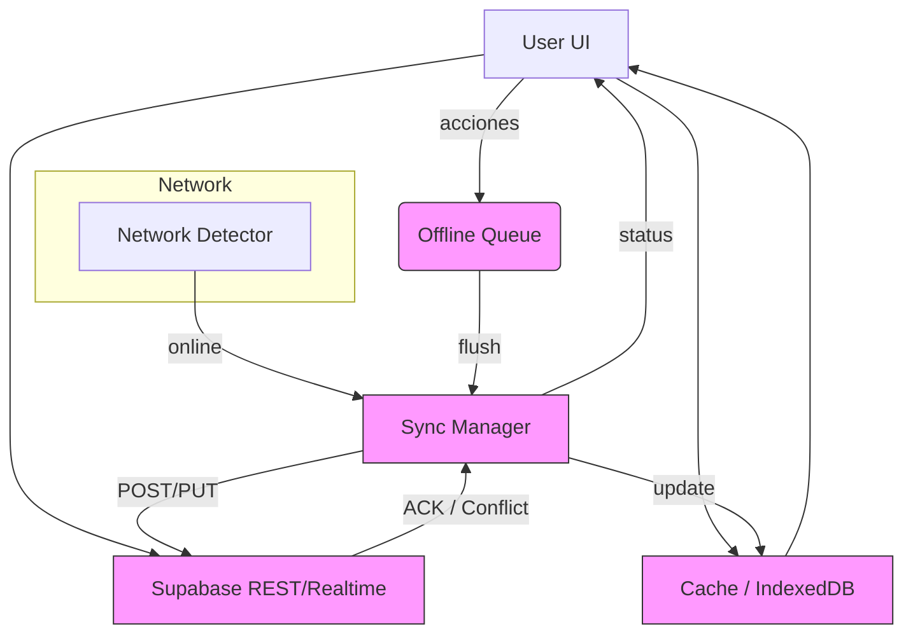

# Diseño visual: Offline-First para React + Supabase

¡Perfecto — te armé un diseño visual y técnico listo para implementar. Abajo vas a encontrar: un diagrama de flujo, descripción de componentes, esquema de la cola offline, políticas de reintento y ejemplos de código (hooks y manager) para que lo copies directo al proyecto.

> Humor rápido: piensa en esto como un seguro anti-caídas para tu app — elegante, silencioso y sólo te avisa con un *beep* cuando algo necesita atención.

---

## Diagrama general (Mermaid)



---

## Componentes y responsabilidades

- **Network Detector (**``**)**

  - Detecta `navigator.onLine`, mide latencia (ping), y calcula `connectionQuality` (0..1).
  - Expone `isOnline`, `connectionQuality`, `lastSeenOnline` y `recentFlaps`.

- **Offline Queue (persistente)**

  - Persistido en IndexedDB (recomendado `localForage` o `idb`), estructura basada en eventos con UUID.
  - Soporta: `enqueue()`, `peek()`, `dequeue()`, `markFailed()`, `retry()`.

- **Cache Local**

  - Vista rápida de datos (IndexedDB) para renderizado instantáneo.
  - Option: usar React Query + `cacheTime` + persist plugin.

- **Sync Manager**

  - Responsable de vaciar la cola cuando hay conexión estable.
  - Implementa debounce al detectar reconexiones para evitar flapping.
  - Reintentos exponenciales con límite y backoff jitter.
  - Asegura idempotencia (envía `clientId`/`operationId` en cada request).

- **Server (Supabase)**

  - Endpoints idempotentes que aceptan `operationId` y responden con `status`.
  - Webhooks / Realtime para propagar cambios del servidor a clientes.

- **UI/Feedback**

  - Header con semáforo: `isOnline` + `syncState` (`idle`, `syncing`, `error`, `paused`).
  - Badges en items que están en cola.

---

## Esquema de la cola (ejemplo JSON)

```json
{
  "id": "uuid-v4",
  "type": "mutation", // create|update|delete
  "resource": "orders",
  "payload": { /* body */ },
  "clientOperationId": "uuid-v4", // idempotency
  "status": "pending", // pending|in_progress|failed|done
  "attempts": 0,
  "createdAt": "2025-08-11T12:00:00Z",
  "lastAttemptAt": null
}
```

---

## Políticas para conexiones inestables (flapping)

1. **Debounce al reconectar**: esperar `RECONNECT_STABLE_MS = 5000ms` antes de iniciar el flush. Si la conexión cae dentro de ese window, resetear el timer.
2. **Reintentos exponenciales**: `attemptDelay = base * 2^attempts + jitter` (limitar a `maxDelay`, ej. 60s).
3. **Intentos máximos**: `maxAttempts = 5` luego marcar `failed` y notificar en UI.
4. **Envios atómicos y lock**: mientras un flush está en progreso, bloquear nuevos flushes concurrentes.
5. **Idempotencia**: cada operación incluye `clientOperationId` para que Supabase (o tu backend) pueda ignorar duplicados.
6. **Backpressure**: si la cola es muy grande (threshold), pausar envíos automáticos y mostrar alerta para que admin revise.

---

## Snippets clave (JS/TS)

### Hook `useOfflineStatus` (básico)

```ts
import { useEffect, useState } from 'react';

export function useOfflineStatus() {
  const [isOnline, setIsOnline] = useState(navigator.onLine);
  const [connectionQuality, setConnectionQuality] = useState(1);

  useEffect(() => {
    let alive = true;
    function update() { setIsOnline(navigator.onLine); }
    window.addEventListener('online', update);
    window.addEventListener('offline', update);

    // ping-based quality metric (simple)
    async function pingLoop() {
      while (alive) {
        try {
          const start = performance.now();
          await fetch('/_ping', { cache: 'no-store' });
          const latency = performance.now() - start;
          const q = Math.max(0, Math.min(1, 1 - latency / 1000));
          setConnectionQuality(q);
        } catch (e) { setConnectionQuality(0); }
        await new Promise(r => setTimeout(r, 5000));
      }
    }
    pingLoop();

    return () => { alive = false; window.removeEventListener('online', update); window.removeEventListener('offline', update); }
  }, []);

  return { isOnline, connectionQuality };
}
```

---

### OfflineQueue (simplificado usando localForage)

```ts
import localforage from 'localforage';
import { v4 as uuid } from 'uuid';

const QUEUE_KEY = 'offline_queue_v1';

export class OfflineQueue {
  async enqueue(item) {
    const q = (await localforage.getItem(QUEUE_KEY)) || [];
    q.push({ id: uuid(), ...item });
    await localforage.setItem(QUEUE_KEY, q);
  }
  async peek() { const q = (await localforage.getItem(QUEUE_KEY)) || []; return q[0]; }
  async dequeue() { const q = (await localforage.getItem(QUEUE_KEY)) || []; const first = q.shift(); await localforage.setItem(QUEUE_KEY, q); return first; }
  async all() { return (await localforage.getItem(QUEUE_KEY)) || []; }
  async replaceAll(arr) { await localforage.setItem(QUEUE_KEY, arr); }
}
```

---

### Sync Manager (core logic simplificado)

```ts
const RECONNECT_STABLE_MS = 5000;
let stableTimer = null;
let flushing = false;

export async function startSyncWhenStable(queue, sendFn) {
  // network watcher
  window.addEventListener('online', () => scheduleFlush(queue, sendFn));
  window.addEventListener('offline', () => {});
  // also call once at startup
  if (navigator.onLine) scheduleFlush(queue, sendFn);
}

function scheduleFlush(queue, sendFn) {
  if (stableTimer) clearTimeout(stableTimer);
  stableTimer = setTimeout(() => flushQueue(queue, sendFn), RECONNECT_STABLE_MS);
}

async function flushQueue(queue, sendFn) {
  if (flushing) return;
  flushing = true;
  try {
    let item;
    while ((item = await queue.peek())) {
      // lock single send
      try {
        await sendWithRetries(item, sendFn);
        await queue.dequeue();
      } catch (err) {
        // if permanent error, mark failed, break
        break;
      }
    }
  } finally { flushing = false; }
}

async function sendWithRetries(item, sendFn) {
  const maxAttempts = 5;
  let attempts = 0;
  while (attempts < maxAttempts) {
    try {
      await sendFn(item); // sendFn should include clientOperationId
      return;
    } catch (e) {
      attempts++;
      const delay = Math.min(60000, 1000 * Math.pow(2, attempts) + Math.random() * 300);
      await new Promise(r => setTimeout(r, delay));
    }
  }
  throw new Error('Max attempts reached');
}
```

---

### React Query + Mutations (optimistic + idempotency)

```ts
import { useMutation, useQueryClient } from '@tanstack/react-query';

function useCreateOrder(sendToServer, queue) {
  const qc = useQueryClient();
  return useMutation(async (order) => {
    const opId = uuid();
    const payload = { ...order, clientOperationId: opId };
    if (!navigator.onLine) {
      await queue.enqueue({ type: 'create', resource: 'orders', payload });
      return { optimistic: true, opId };
    }
    // online -> try send
    await sendToServer(payload);
  }, {
    onMutate: async (newOrder) => {
      // optimistic update in cache
      await qc.cancelQueries(['orders']);
      const previous = qc.getQueryData(['orders']);
      qc.setQueryData(['orders'], old => [...(old||[]), { ...newOrder, _optimistic: true }]);
      return { previous };
    },
    onError: (err, newOrder, ctx) => { qc.setQueryData(['orders'], ctx.previous); }
  });
}
```

---

## UI: Semáforo y mensajes (ejemplo)

- Header: `ConnectionBadge` que muestra color y texto corto.
- Item badge: pequeño punto azul si está `pending`.
- Toaster: notifica cuando la cola se vacía o si hay errores persistentes.

---

## Notas sobre Supabase

- Supabase Realtime es útil para propagar confirmaciones del servidor a clientes.
- Para idempotencia, crea endpoints que acepten `clientOperationId` y devuelvan si la operación ya fue aplicada.
- Si usás PostgREST, podés manejar idempotencia con una tabla `operations` y lógica en funciones SQL.

---

## Próximos pasos prácticos (lista corta)

1. Implementar `OfflineQueue` con `localForage`.
2. Implementar `useOfflineStatus` con ping y flapping detection.
3. Incorporar `Sync Manager` con debounce de reconexión y retries.
4. Adaptar mutaciones con React Query (optimistic updates + enqueue cuando offline).
5. Añadir `clientOperationId` en cada mutation y soporte en backend.
6. Limpiar UI: reemplazar pestañas duplicadas por un único flujo `Smart Mode`.

---

Si querés, puedo **generar archivos** listos (hook + queue + sync manager + badge) y un PR patch que puedas pegar en tu repo. ¿Querés que lo haga ahora y lo deje listo para copiar/pegar?

